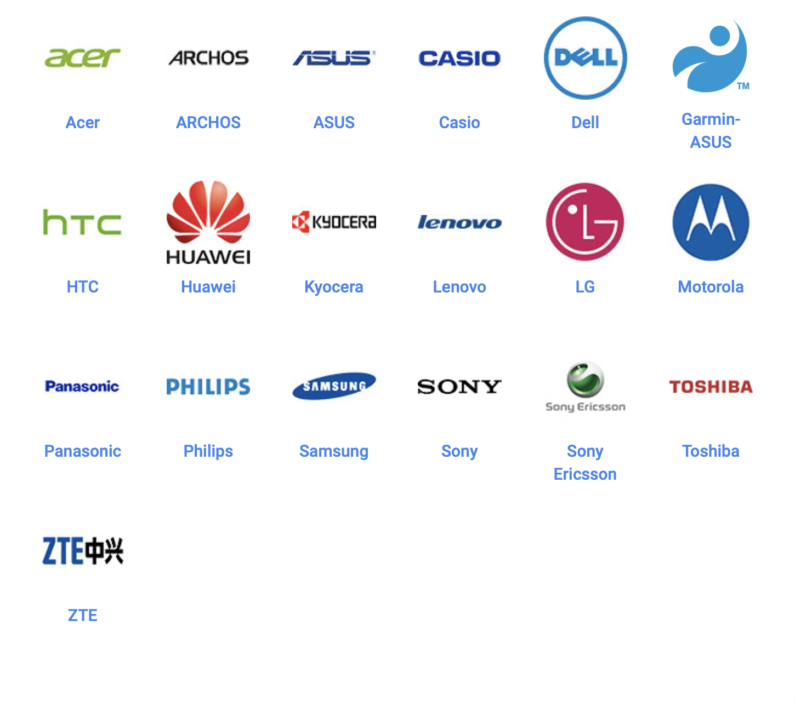
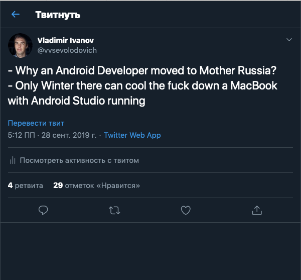
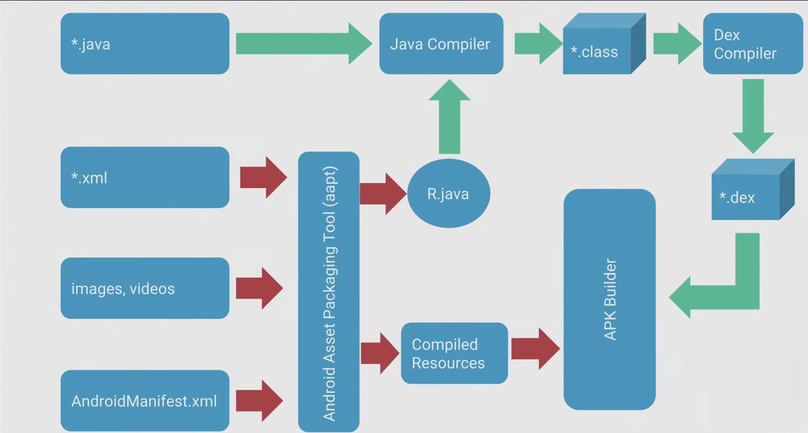
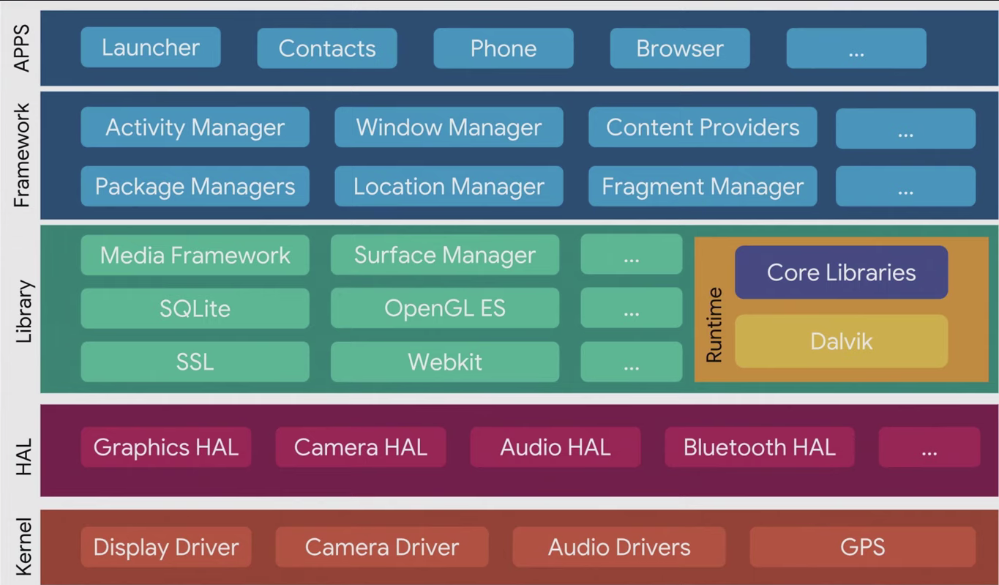

# [fit] Android

---

---

# Me

* Vladimir Ivanov
* EPAM Systems
* Head of PC of MobiusConf

---

# [fit] You

---

# First release on 
September 23, 2008

---

# Android naming

| First | Last |
| --- | --- |
| No name | KitKat |
| No name | Lollipop |
| Cupcake | Marshmallow
| Donut | Oreo |
| Eclair | Android 10 |

---

---

# First devices

---

---

---

# Latest devices

---

---

# There is one problem...

---

# And another one...

---

# Fragmentation

---

---

# Android is also not only the OS for smartphones...

---

# Android Wear
# Android TV
# Android Things(deprecated)
# Android Auto
# Android Automotive
# Android One
# Android Go

---

# Android Development

---

---

# Android Apps

---

# Language

* Java, Kotlin
* C++ for NDK

You can use js, lua and even php though

---

# Tools

* Android SDK
* Android Studio
* Emulators
* Gradle

---

# [fit] Works everywhere!

---

# Android Studio

---

---

# Android Studio

* Canary
* Beta
* Prod

---

---

# Android SDK

* Platform
* Emulators
* Build Tools
* ADB

---

# The build product 

* APK or app bundle
* mapping.txt

---

# Pipeline

---

---

---

# Google Play Services

Ads
Analytics
AppIndexing
AppInvite
AppState
Auth
Base
Basement
Cast
Drive

---

Fitness
Games
GCM
Identity
Location
Maps
Measurement
Nearby
Panorama
Plus
SafetyNet
Support Wearable
Vision
Wallet
Wearable

---

# Why it is f*cking important? 

* Provides almost all necessary platform integration points
* Shipped only with Licensed by Google Devices
* That's why Huawei is screwed

---

 

---

# Distribution

* Google Play
* Virtually any hosting 

---

# Prerequisites

* Google Account
* $25 once

---

# Publishing an app

* APK or app bundle
* Screenshots
* Description
* Rating
* Promobanner
* Supported countries
* Price(if any)

---

# Caveats

* Fast releases, frequent deployments, tons of manual work
* Fastlane and CI/CD services for the rescue 

---

---

# Security

* Apps are separated on paper, but...
* SDCard is shared
* Proper keystore support started from Lollipop
* Vulnerabilites(like DownloadManager)
* Untrusted sources
* No moderation is Google Play

---

# Android vs iOS

|| Android | iOS |
| --- | --- | --- |
|IDE| Android Studio | XCode |
|Build system| Gradle | Xcode build |
|Devices #| 10000+ devices | ~100 |
|Language | Java, Kotlin | Swift |
|Signing | Easy | Hell |
|Shit| Yes | Yes |

---

# News

* Google I/O
* Blogs of Android GDE
* Official Google Accounts
