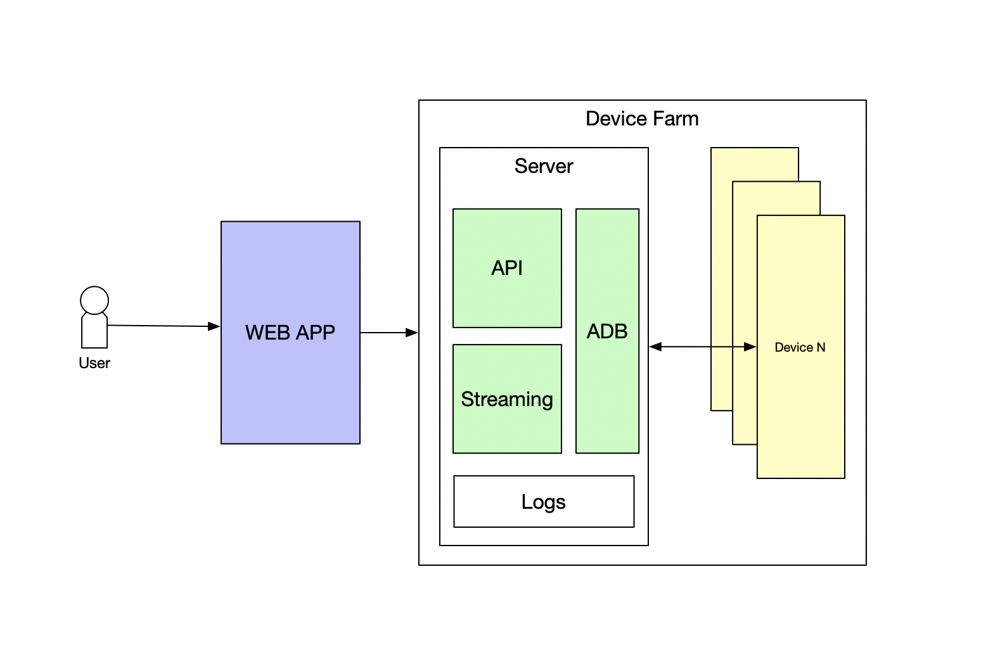
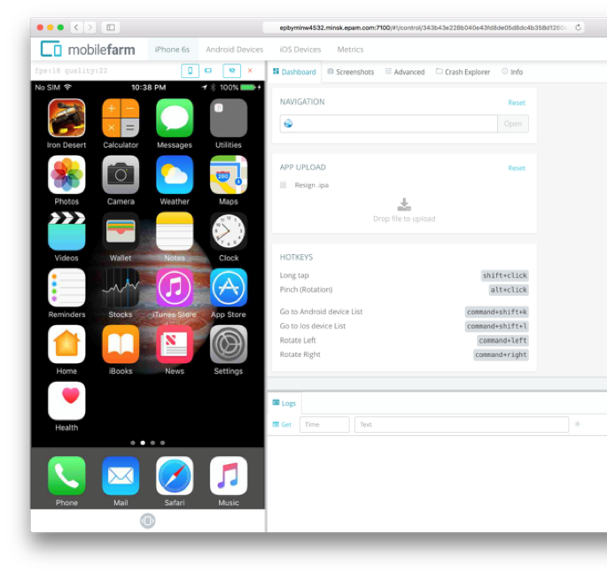
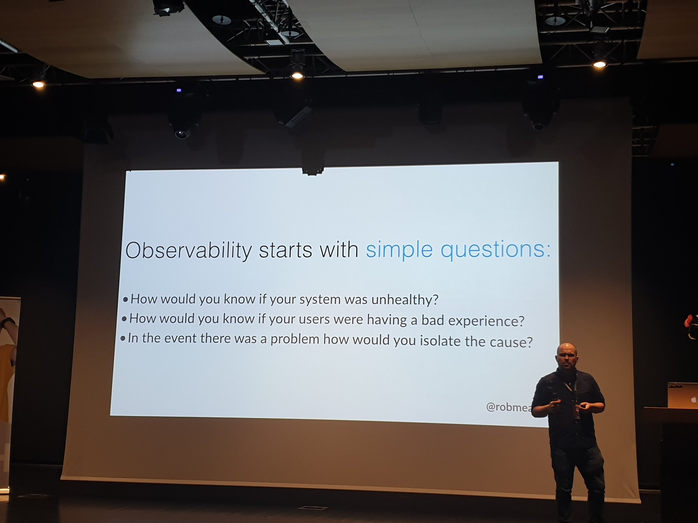
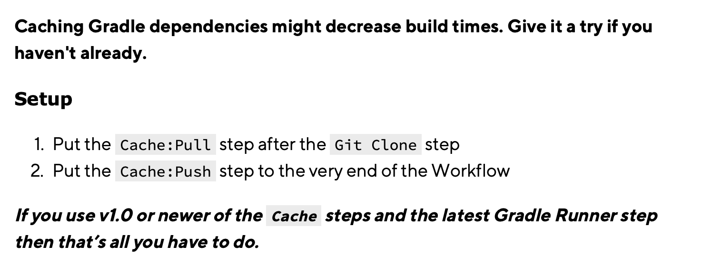
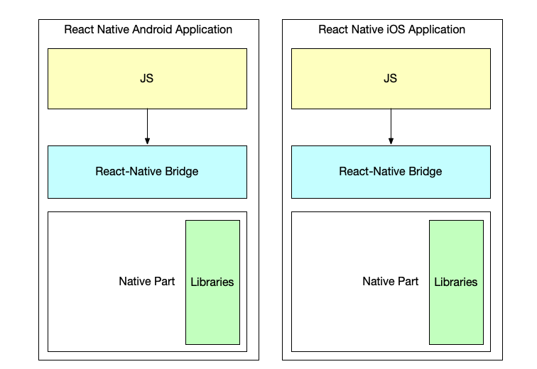
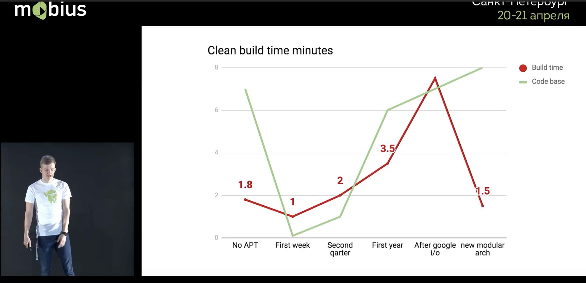
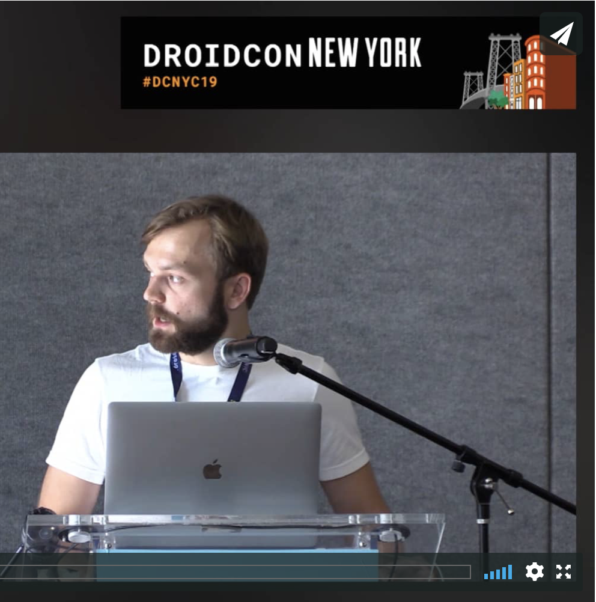

slidenumbers: true
autoscale: true
build-lists: true

# Mobile: DevOps or not DevOps

---

# Такие чудеса, Гораций, не снились нашим DevOps-ам. 

---

# My self

* Vladimir Ivanov
* EPAM Systems

---

# [fit]You

<!--

* run Lint/Static Analysis on the Code
* run Unit Tests
* maintain Build Numbers
* build the App from Code
* deploy the App 
* notify about status
* run e2e tests
* provide Logs, Artifacts & Build Reports
* and actually many more

---

-->

---

# Mobile Landscape

---

---

---

# DevOps Practices

* Continuous integration
* Continuous delivery
* Secured process
* Frequent releases(Canary/BG deployments)
* Automated testing
* Monitoring
* Automated rollback

---

# Alena

---

# Continuous Integration

---

# Deploy

---

---

---

# Rollouts

* Internal testing, Alpha and Beta channels in Google Play
* Internal testing, Public Testing in TestFlight
* Public releases support staged rollouts

---

# [fit]Sign

---

# [fit]Secured process

---

---

---

# Android Sign

* Keystore(Java Keystore)
* Store pass
* Key alias
* Key pass

---

---

---

---

# DevOps Practices

* Continuous integration :white_check_mark:
* Continuous delivery :white_check_mark: 
* Secured process :white_check_mark:
* Frequent releases(Canary/BG deployments)
* Automated testing
* Monitoring
* Automated rollback

[.build-lists: false]

---

# [fit]Review

---

# GP used to take 3-4 hours
# AppStore used to take 2 weeks

---

# GP takes 3-4 ~~hours~~ days
# AppStore used to take 2 ~~weeks~~ days

---

# DevOps Practices

* Continuous integration :white_check_mark:
* Continuous delivery :white_check_mark:
* Secured process :white_check_mark:
* Frequent releases(Canary/BG deployments) :white_check_mark:
* Automated testing
* Monitoring
* Automated rollback

[.build-lists: false]

---

# e2e tests

---

---

# Issues e2e tests

* Takes a lot of time
* Requires devices

---

# How to cope with devices?

* Buy our own(expensive)
* Test on Emulators(bad quality)
* Device Farms

---

---

# Device Farms

* AWS Device Farm
* Firebase device farm
* Azure Device Farm
* Others
* Your own

---

# [fit]Building your own

---

# What would you need

* Web Server
* Logs Storage
* Devices
* Media to connect to the devices(add, xcrun)

---

# Easy part...

* List of devices

	`$ adb devices`
	`$ xcrun simctl list`

---

---

# Easy part...

* List of devices

	`$ adb devices`
	`$ xcrun simctl list`

* Installation and uploading files

	`$ adb push selfie.png /sdcard0/Downloads`
	`$ adb install -r myCoolApp.apk`
	`$ xcrun altool --upload-app --type ios --file "path/to/application.ipa" --username "YOUR_ITMC_USER" --password "YOUR_ITMC_PASSWORD"`

---

# Complex thing

* Streaming

	Android: adb, scrcpy[^2] tool
	iOS: xcrun

[^2]: https://blog.rom1v.com/2018/03/introducing-scrcpy/

---

---

# In EPAM

* Mobile farm for Mobile CC
* Free for the projects at the moment
* Plans for commercial offerings

---

# DevOps Practices

* Continuous integration :white_check_mark:
* Continuous delivery :white_check_mark:
* Secured process :white_check_mark:
* Frequent releases(Canary/BG deployments) :white_check_mark:
* Automated testing :white_check_mark:
* Monitoring
* Automated rollback

[.build-lists: false]

---

---

# Observability

* Mobile apps run on the user devices and deployed through stores which make them unmanageable
* However observability is still in place

---

# Crash Reporting and Analytics

* Your own(with help of ACRA)
* Firebase Analytics
* AppCenter
* Sentry 
* Bugsnag

---

# What can be gathered

* Free device memory
* Free process memory
* Device, OS Version
* Active users
* Session lengths
* Thread dump
* Stacktrace
* Many more

---

---

# Martin

---

---

# Compilation/Obfuscation, my ass

---

---

---

---

---

---

# AppCenter

---

---

# DevOps Practices

* Continuous integration :white_check_mark:
* Continuous delivery :white_check_mark:
* Secured process :white_check_mark:
* Frequent releases(Canary/BG deployments) :white_check_mark:
* Automated testing :white_check_mark:
* Monitoring :white_check_mark:
* Automated rollback

[.build-lists: false]

---

# Unfortunately

---

## No rollbacks of unsuccessful releases  

---

## You need to build a new version and deploy it instead

---

---

# Possible solutions

* Feature flags and server configs
* Usage of React-Native or other js based technologies 

---

# DevOps Practices

* Continuous integration :white_check_mark:
* Continuous delivery :white_check_mark:
* Secured process :white_check_mark:
* Frequent releases(Canary/BG deployments) :white_check_mark:
* Automated testing :white_check_mark:
* Monitoring :white_check_mark:
* Automated rollback :x:

[.build-lists: false]

---

# Caveats

---

# Hardware

* Android can be built anywhere
* iOS - only on Mac machines

---

# Long buildtimes

---

# How to fight long build times

* Identifying slow code parts
* Caching dependencies
* Modularization
* Build systems hacks
* And more[^10]

[^10]: https://medium.com/@joshgare/8-tips-to-speed-up-your-swift-build-and-compile-times-in-xcode-73081e1d84ba

---

# Caching

---

# iOS

* CocoaPods
* Carthage
* SwiftPM

---

# iOS

* CocoaPods - source code based, own build spec
* Carthage - dynamic frameworks
* SwiftPM - built by Apple
	- no resources support
	- single language per package
	- problems having binary deps

---

# Android

* Gradle
* Bazel/BUCK for companies with BIG apps

---

---

## React-Native doesn't benefit from caching

---

## But does benefit from building two apps within a single run

---

---

* Checkout the code
* Install the dependencies
* Compile Android
* Compile iOS
* Sign both
* Deploy both

---

* Checkout the code
* Install the dependencies
* ~~Compile Android~~
* ~~Compile iOS~~
* ~~Sign both~~
* ~~Deploy both~~

[.build-lists: false]

---

## Modularization

---

---

# How to start

./gradlew clean assembleDebug --scan

---

# Gradle 

* Takes 1 minute to configure 1300 modules
* Due to IO and unlimited immutability

---

# Bazel

See the talk of Artem Zinnatullin[^1]

[^1]:https://www.droidcon.com/media-detail?video=362742329

---

## Your CI/CD pipeline should support it all!

---

# Approaches

---

# Approaches

* Install Jenkins/TeamCity/Whatever else
* Spawn a Jenkins VM/Container in a Cloud
* Use SaaS 

---

# Local Jenkins

* Free
* Great flexibility
* Agents system
* Decent plugin system
* For iOS: just install an agent on a Mac
* But no containerization out-of-the-box
* All support burden is on your shoulders

---

## It should be managed

---

---

---

---

# Pros

✨	More than 400 integrations
📖	100% open source under the MIT license
⚒	Runs on your machine, it's your app and your data
🖥	Supports iOS, Mac, and Android apps
🔧	Extendable

---

# When

* For education purposes and student projects
* For companies which already use Jenkins
* For security paranoids(debatable) 

---

# Jenkins in Cloud

* Solves the containerization issue
* Support burden is partially decreased
* Unclear how to solve Mac issue

---

# 3rd party services

---

# 3rd party services

* GitLab CI
* Circle CI
* Nevercode
* App Center
* Bitrise

---

# GitLab CI/Circle CI

* Very basic support(mac machines, xcode, gradle)
* Integration with the parent tool 
* Yaml editor as an interface
* Almost no mobile specific involved

---

# App Center

---

# App Center - Azure DevOps

* Part of the integrated environment(former TFS)
* Distribution destinations - GP, TestFlight, Internal
* Bitbucket, Github, VSTS, GitLab(!)
* Configuration as Code :white_check_mark:
* Mobile Apps as first class citizens :white_check_mark:
* Cloud based :white_check_mark:
* Allows for Machine Pools(which solves Mac issue)
* Webhooks

---

# App Center - Azure DevOps

* Support for ad-hoc git servers :x:
* SonarQube Support - :x:
* Local debug - :x:

---

# App Center - When

* You already have Azure DevOps/Azure subscription
* You're hosted in Bitbucket/Github
* You only want apps distribution solution

---

---

# Nevercode

* Mobile Centric CI/CD
* Distribution destinations - App Store Connect, Google Play, HockeyApp, Crashlytics, TestFairy
* Bitbucket, GitHub or GitLab
* Cloud based :white_check_mark:
* Mobile Apps as first class citizens :white_check_mark:
* Webhooks :white_check_mark:

---

# Nevercode

* Configuration as Code :x:
* Pricy :x:

---

# Nevercode - When

* Flutter apps

---

# Bitrise

* Mobile Centric CI/CD
* Distribution destinations - GP, TestFlight, TestFairy, App Center, Whatever
* Bitbucket, Github, Custom
* Configuration as Code :white_check_mark:
* Mobile Apps as first class citizens :white_check_mark:
* Cloud based :white_check_mark:
* Webhooks

---

# Bitrise

* Support for ad-hoc git servers :white_check_mark:
* Support CI job triggers on push to Any branch :white_check_mark:
* SonarQube Support with a community extension :white_check_mark:
* Local debug - :white_check_mark:
* Open source

---

---

# Bitrise

* Rather slow :x:
* No Flutter support(yet) :x:
* Flutter support(already) :white_check_mark:

---

# Services Comparison

| App Center | Nevercode | Bitrise |
| --- | --- | --- |
| Simplicity :white_check_mark: | Flutter :white_check_mark: | Flexible :white_check_mark: |
| Device Cloud :white_check_mark: | Build cache :white_check_mark: | Build cache :white_check_mark: |
| Crash Reporting :white_check_mark: | No Xamarin :x: | Different inf. stacks :white_check_mark: |
| Difficult customization :x: | No conf as service :x: | Open Source :white_check_mark: |
||Funny jokes |Slow :x:|

---

---

# DevOps Practices

* Secured process :white_check_mark:
* Continuous integration :white_check_mark:
* Continuous delivery :white_check_mark:
* Frequent releases(Canary/BG deployments) :white_check_mark:
* Automated testing :white_check_mark:
* Monitoring :white_check_mark:
* Automated rollback :x:

[.build-lists: false]

---

# Summary

* Mobile is a serious business requiring automation
* There are some caveats and issues which are overcomeable
* Except rollbacks

---

---

# Links

* Twitter, telegram: @vvsevolodovich
* Talks: http://speakerdeck.com/vlivanov
* Email: Vladimir_Ivanov4@epam.com 
* https://mobiusconf.com/

