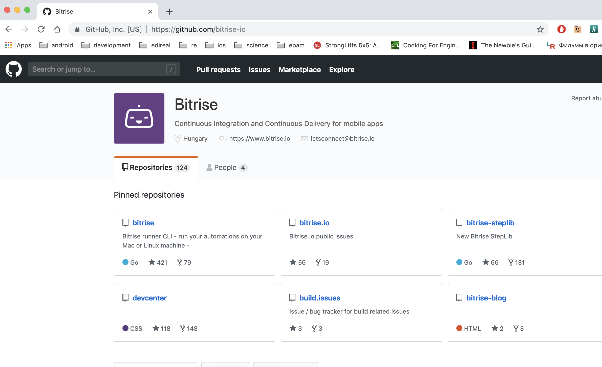

slidenumbers: true
autoscale: true
build-lists: true

# Mobile CI/CD in 2K19

---

* Vladimir Ivanov
* EPAM Systems
* Mobius Conf

---

---

---

---

---

# CD

---

---

---

---

# CI

---

# What do we love?

---

# Write code!

---

# What we dislike?

---

# Everything else!

---

# But still

* Code Quality
* Customer Transparency
* Developer Satisfaction 

---

# It is important!

---

# What should be done

---

* run Lint/Static Analysis on the Code
* run Unit Tests
* maintain Build Numbers
* build the App from Code
* deploy the App 
* notify about status
* provide Logs, Artifacts & Build Reports
* and actually many more

---

---

---

# Source code

---

# Source code

* Checkout from where?
* How to build?
* How to test?

---

# Checkout

---

# Git hostings

* Saas: Github, Bitbucket, Gitlab, Azure DevOps, AWS CodeCommit
* On-premise: Github Enterprise, Gitlab, Bitbucket Server
* Ad-Hoc

---

* Checkout different branches
* Trigger different builds on VCS commit/pull request
* Report build status to a VCS back

---

# Why it is important?

---

---

* Eslint
* swiftlint
* Java/Kotlin linters
* FindBugs

---

# Precommit hooks

---

---

## Validate code base on pull request/push

---

# Build

---

---

---

# Build should be 

* Reliable (isolated&clean)
* Fast (on performant machines)
* Locally reproducible (to debug)
* Customizable (for envs or other params)
* Secure (only allowed persons to create/edit/run builds)

---

# Sign

* Secure storage for provisioning profile/signing certificate/keystore
* Secure storage for password
* Account storage for pushing to Google Play/Test flight/3rd party services

---

# Deploy

---

---

---

# Deploy

* Connect to distribution services
* Manage upload secrets

---

# Testing

---

---

# Testing

* Unit/Module tests
* e2e tests

---

# Issues e2e tests

---

---

# Issues e2e tests

* Takes a lot of time
* Requires devices

---

# Miscellaneous

* Configuration as code
* Debug locally
* Centralized user management(SSO)
* Auto-configuration
* Extensions

---

## Your CI/CD pipeline should support it all!

---

# Approaches

---

# Approaches

* Install Jenkins/TeamCity/Whatever else
* Spawn a Jenkins VM/Container in a Cloud
* Use Saas 

---

# Local Jenkins

* Free
* Great flexibility
* Agents system
* Decent plugin system
* But no containerization out-of-the-box
* All support burden is on your shoulders

---

# When

* For education purposes and student projects
* For companies which already use Jenkins
* For security paranoids(debatable) 

---

# Jenkins in Cloud

* Solve the containirazion issue
* Support burden is partially decreased

---

# 3rd party services

---

# 3rd party services

* Circle CI
* GitLab CI
* Nevercode
* App Center
* Bitrise

---

# 3rd party services

* ~~Circle CI~~
* ~~GitLab CI~~
* Nevercode
* App Center
* Bitrise

[.build-lists: false]

---

# App Center

---

# App Center - Azure DevOps

* Part of the integrated environment(former TFS)
* Distribution destinations - GP, TestFlight, Internal
* Bitbucket, Github, VSTS 
* Configuration as Code :white_check_mark:
* Mobile Apps as first class citizens :white_check_mark:
* Cloud based :white_check_mark:
* Webhooks

---

# App Center - Azure DevOps

* Support for ad-hoc git servers :x:
* Support CI job triggers on push to Any branch :x:
* SonarQube Support - :x:
* Local debug - :x:

---

# App Center - When

* You already have Azure DevOps/Azure subscription
* You're hosted in Bitbucket/Github
* You only want apps distribution solution

---

---

# Nevercode

* Mobile Centric CI/CD
* Distribution destinations - App Store Connect, Google Play, HockeyApp, Crashlytics, TestFairy
* Bitbucket, GitHub or GitLab
* Cloud based :white_check_mark:
* Mobile Apps as first class citizens :white_check_mark:
* Webhooks :white_check_mark:

---

# Nevercode

* Configuration as Code :x:
* Pricy :x:

---

# Nevercode - When

* Flutter apps

---

# Bitrise

* Mobile Centric CI/CD
* Distribution destinations - GP, TestFlight, TestFairy, App Center, Whatever
* Bitbucket, Github, Custom
* Configuration as Code :white_check_mark:
* Mobile Apps as first class citizens :white_check_mark:
* Cloud based :white_check_mark:
* Webhooks

---

# Bitrise

* Support for ad-hoc git servers :white_check_mark:
* Support CI job triggers on push to Any branch :white_check_mark:
* SonarQube Support with a community extension :white_check_mark:
* Local debug - :white_check_mark:
* Open source

---

---

# Bitrise

* Rather slow :x:
* No Flutter support(yet) :x:

---

# Conclusions

| App Center | Nevercode | Bitrise |
| --- | --- | --- |
| Simplicity :white_check_mark: | Flutter :white_check_mark: | Flexible :white_check_mark: |
| Device Cloud :white_check_mark: | Build cache :white_check_mark: | Build cache :white_check_mark: |
| Crash Reporting :white_check_mark: | No Xamarin :x: | Different inf. stacks :white_check_mark: |
| Difficult customization :x: | No conf as service :x: | Open Source :white_check_mark: |
||Funny jokes |Slow :x:|

---

---

# Links

* https://twitter.com/vvsevolodovich :bird:
* https://medium.com/@dzigorium :pencil:
* https://mobiusconf.com/
* Vladimir_Ivanov4@epam.com

