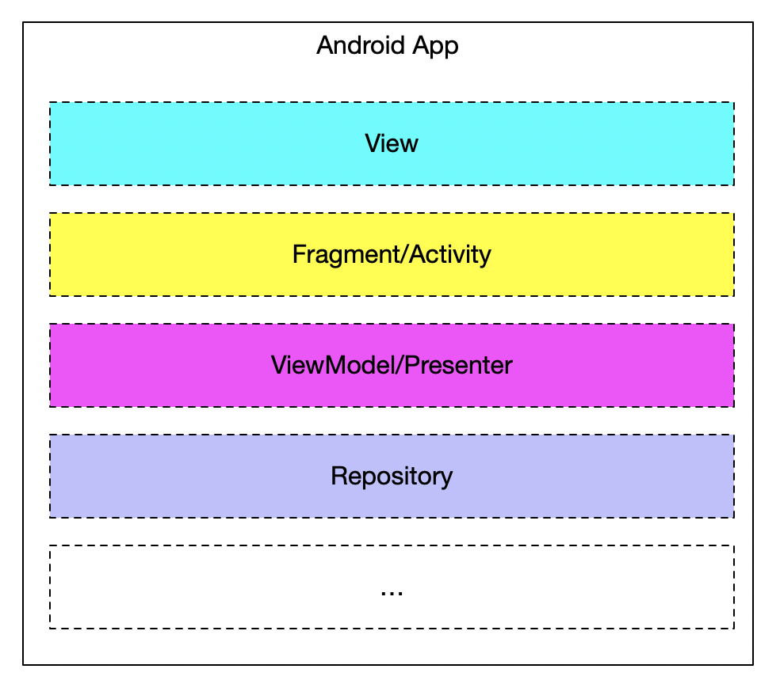
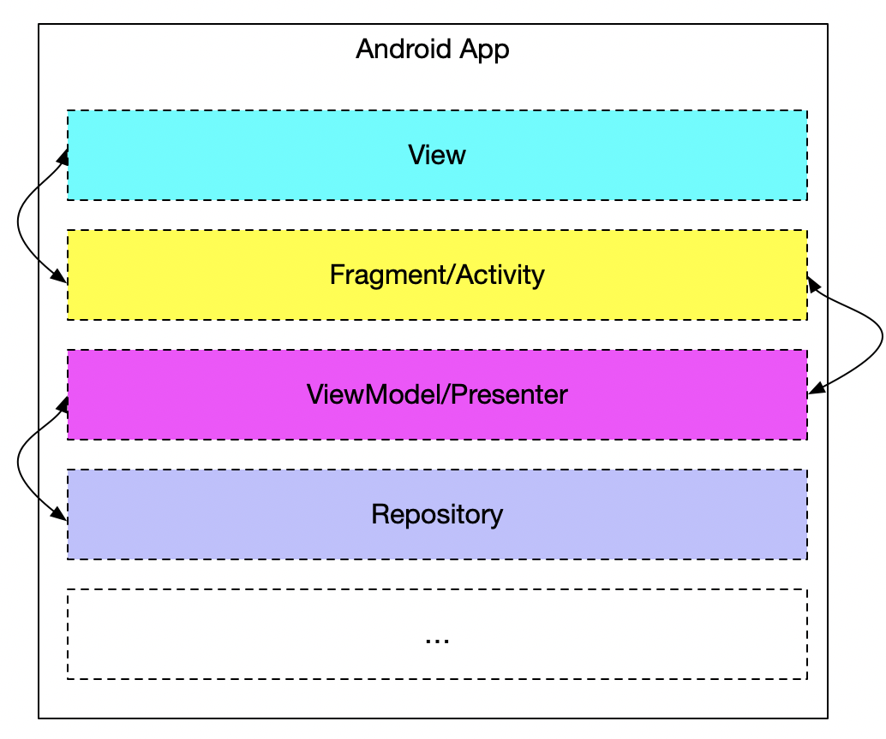
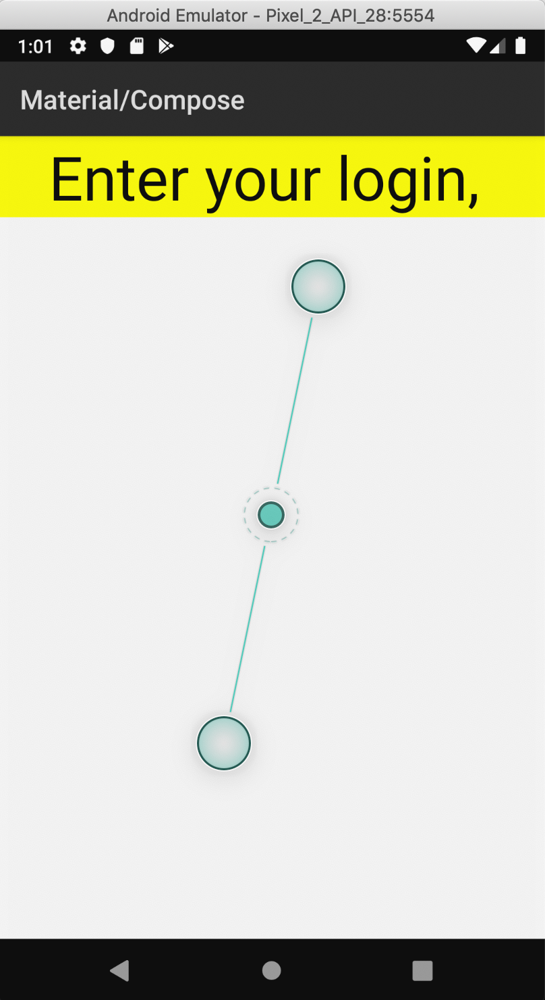
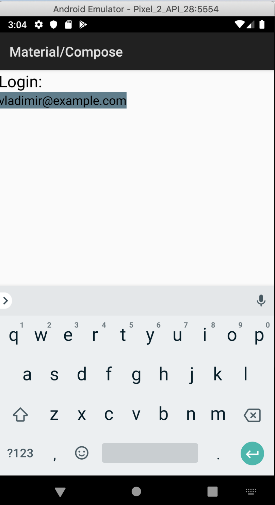
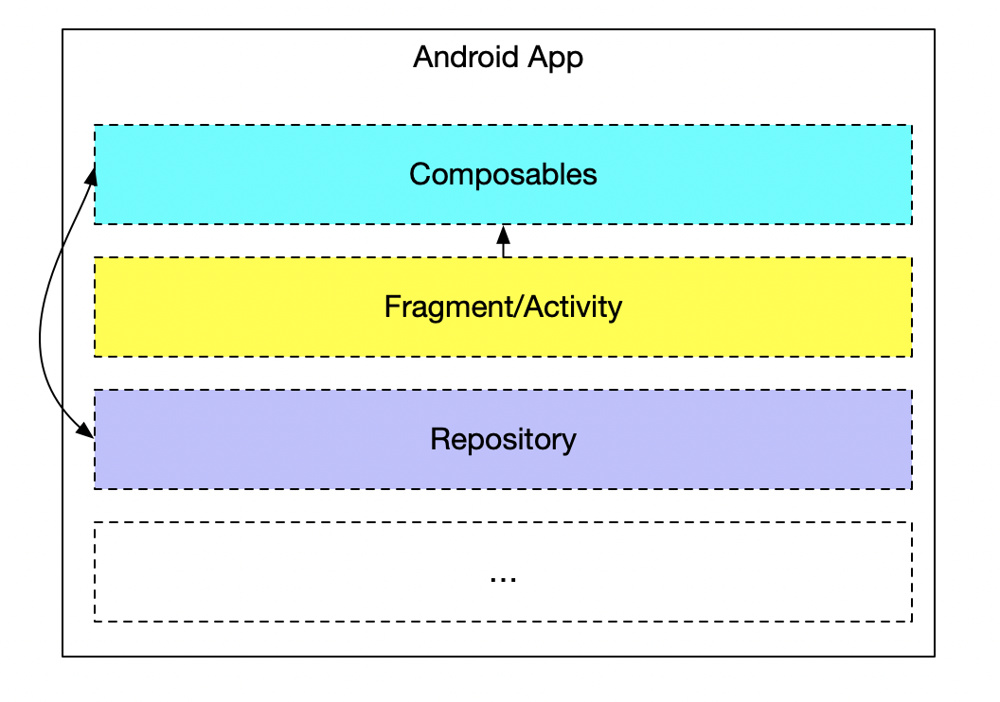

footer: *<EPAM>*
slidenumbers: true
slidecount: true
autoscale: true
build-lists: true


## Jetpack Compose: First Blood


---

# About me

* Vladimir Ivanov
* Designing Mobile-centric solutions for living
* Primary Skill: Android
* Certified Google Cloud Architect.


---

# What we usually do?

---

# Imperative programming

---


```kotlin

    override fun onViewCreated(view: View, savedInstanceState: Bundle?) {
        super.onViewCreated(view, savedInstanceState)
        emergency_call_layout.setOnClickListener { onEmergencyCallPressed() }

        filter_recycler_view.layoutManager = 
			LinearLayoutManager(context, LinearLayoutManager.HORIZONTAL, false)
        val filterAdapter = 
			FilterAdapter(arrayListOf("One", "Two", "Three"), null, this::onFilterSelected)
        filter_recycler_view.adapter = filterAdapter

        crisis_centers_list.layoutManager = LinearLayoutManager(context)
        viewModel.crisisCenters.observe(this, crisisCenterObserver)
    }

```

---


# What we usually do?

* XML
* Fragment
* Presenter/ViewModel
* styles
* attributes

---



---



---	

# Minuses

* Several places to right code
* Hard to debug
* Impossible to reuse

---

## Let's rethink the whole approach


---

## UI - is a tree-like data structure that changes overtime


---


---

# Declarative approach

* Make UI a pure function of State

---

# Pros

* Almost single place to write code
* Easy to test
* Easy to scale
* Unbundled implementation

--- 

## You know what? 
## The approach won!


---

* React
* Angular
* Vue.js
* SwiftUI
* And now: Jetpack Compose

---

# Jetpack compose

* Inspired by React and Flutter
* Pre-pre-alpha
* Part of AOSP

---

# Jetpack Compose

---

# Generally speaking

* Node for piece of UI, having children
* function to render a root Node
* functions to render primitives: Text, Image, etc.

---

# Then...

* we need to pass root Node down the branches 
* Which can be kinda harsh

---

# So...

```kotlin

interface Composer {
  // add node as a child to the current Node, execute
  // `content` with `node` as the current Node
  fun emit(node: Node, content: () -> Unit = {})
}

```

---

# Thus

* `ComposerImpl`
* top-level `compose` function
* call top level render function with compose invocation

---

All this can be hidden with the help of compiler and runtime
which Jetpack Compose happens to be 

---

* How to start: d.android.com/jetpack/compose[^1]
* How to start properly: Primer by raywenderlich.com[^2]

[^1]: https://developer.android.com/jetpack/compose

[^2]: https://www.raywenderlich.com/3604589-jetpack-compose-primer

---

# Start with

```kotlin

 override fun onCreate(savedInstanceState: Bundle?) {
    super.onCreate(savedInstanceState)
    setContent {
       CraneWrapper {
            MaterialTheme {
                EditAndSlider()
            }
       }
    }
 }

```

---

* Looks like DSL
* Looks like a tree
* Every record is a component

---

# Component is a function (...) -> Unit

---

## CraneWrapper - root composable
## MaterialTheme - some styling defaults

---

## SelectionsControlsDemo - invocation of our function

---

```kotlin

@Composable
fun EditAndSlider() {
    Text(text = "Enter your login")
}

```

---

# Composable component

* returns another function invocation
* has @Composable 
* basically yields piece of UI

---

# Why compiler is involved?

* Every @Composable should accept a Composer as a last argument 
* Think of @Composable as a keyword(like suspend)

---

```kotlin
@Composable
fun EditAndSlider() {
    Surface(color = Color(0xFFFFFF00.toInt())) {
        Text(text = "Enter your login, ")
    }
}

```

---


```kotlin
@Composable
fun EditAndSlider() {
    Surface(color = 
	Color(0xFFFFFF00.toInt())) {
        Text(text = "Enter your login, ")
    }
}

```


---

```kotlin

Text(
	text = "Enter your login, ", 
	style = TextStyle(fontSize = 120f)
)

```


---

```kotlin

Text(
  text = "Enter your login, ",
  style = TextStyle(fontSize = 120f),
  textAlign = TextAlign.Center
)


```



---

```kotlin, [.highlight: 3,4,5]

val progressState = +state { EditorState(text = "vladimir@example.com") }

EditableText(
	value = progressState.value,
	editorStyle = EditorStyle(TextStyle(fontSize = 48.toFloat())),
	onValueChange = { progressState.value = it }
)

```

---

```kotlin, [.highlight: 1, 6]

val progressState = +state { EditorState(text = "vladimir@example.com") }

EditableText(
	value = progressState.value,
	editorStyle = EditorStyle(TextStyle(fontSize = 48.toFloat())),
	onValueChange = { progressState.value = it }
)

```

---



---

# Reusability

---

```kotlin, [.highlight: 1-2]

@Composable
fun InputWithCaption(caption: String) {

    val labelStyle = +themeTextStyle { h6 }
    val progressState = +state { EditorState(text = "vladimir@example.com") }

    Column(crossAxisAlignment = CrossAxisAlignment.Start) {
        Text(caption, style = labelStyle)
        Surface(color = customColor3) {
            EditableText(
                    value = progressState.value,
                    editorStyle = EditorStyle(TextStyle(fontSize = 48.toFloat())),
                    onValueChange = { progressState.value = it }
            )
        }
    }
}

```


---

```kotlin, [.highlight: 4-5]

@Composable
fun InputWithCaption(caption: String) {

    val labelStyle = +themeTextStyle { h6 }
    val progressState = +state { EditorState(text = "vladimir@example.com") }

    Column(crossAxisAlignment = CrossAxisAlignment.Start) {
        Text(caption, style = labelStyle)
        Surface(color = customColor3) {
            EditableText(
                    value = progressState.value,
                    editorStyle = EditorStyle(TextStyle(fontSize = 48.toFloat())),
                    onValueChange = { progressState.value = it }
            )
        }
    }
}

```


---

```kotlin, [.highlight: 6-16]

@Composable
fun InputWithCaption(caption: String) {

    val labelStyle = +themeTextStyle { h6 }
    val progressState = +state { EditorState(text = "vladimir@example.com") }

    Column(crossAxisAlignment = CrossAxisAlignment.Start) {
        Text(caption, style = labelStyle)
        Surface(color = customColor3) {
            EditableText(
                    value = progressState.value,
                    editorStyle = EditorStyle(TextStyle(fontSize = 48.toFloat())),
                    onValueChange = { progressState.value = it }
            )
        }
    }
}

```

---

```kotlin
override fun onCreate(savedInstanceState: Bundle?) {
    super.onCreate(savedInstanceState)
    setContent {
        CraneWrapper {
            MaterialTheme {
                Column {
                    InputWithCaption("Login")
                    InputWithCaption("Password")
                }
            }
        }
    }
}
```


---

# Apply Kotlin constructions

```kotlin

    setContent {
        CraneWrapper {
            MaterialTheme {
                Column {
					for (1..10) {
						InputWithCaption("$it")
		    		}
                }
            }
        }
    }


```

---

# Pass lambdas

```kotlin

    fun onSubmit() {
      Toast.makeText(this, "Hello!", LENGTH_LONG).show()
    } 

    setContent {
        CraneWrapper {
            MaterialTheme {
				InputWithCaption("Login", onSubmit)
            }
        }
    }


```

---

# Reuse styles

```kotlin

    val h6: TextStyle = TextStyle(
        fontFamily = FontFamily("Roboto"),
        fontWeight = FontWeight.w500,
        fontSize = 20f),


```
---



---

# Opened questions

---

# Lists support

* RecyclerView analog in development

---

# Unit tests

---

```kotlin
fun testRendersTheTitleAsPartOfTheRallyAppBarComponent() {
   val title = "Any title"
   
   val component = RallyApp(title)
   
   assertEquals(title, component.title.text)
}

fun testRendersTheRallyAppBarComponent() {
   val component = RallyApp(title )
   
   component.matchWithSnapshot()
}

@Composable
fun RallyAppBar(title: String) {
    Row {
        Text(text = title, style = +themeTextStyle { h4 })
    }
}

```

---

# However

> IMO this is a bit of a jump in logic. The assumption here is that asserting on the returned “virtual DOM” of components is the right and only way to test those components. I disagree on both counts.

> With the right APIs exposed, Compose will be as testable as anything else and we will push you into the “pit of success” of testing the public API of components instead of their implementation details.

-- Leland Richardson

---

# State management

* Redux is far in the future

---

# Multithreading

* Would be awesome to accept suspend functions, but current Kotlin-compose compiler plugin doesn't support it
* You're possible to change the +state object from any thread safely
* if you have a Frame object in current thread
* Frame exists in UI thread
* Frames are in-memory observable non-durable transactions
* Frame to be renamed to Transaction
* Batches already supported

---

# Feedback loop

* No preview
* Hot reloading is warm at the moment(~30 seconds on my machine)
* Faster, tenant hot reloading to come

---

# Lifecycle

---


---

# Addressed by callbacks

* `onActive`
* `onDispose`
* `onCommit`

---

```kotlin

@Composable
fun UserProfile(userId: Int) {
   val user = +state<User?>(userId) { null }
   +onCommit(userId) {
       val cancellationToken = UserAPI.get(userId) {
           user.value = it
       }
       onDispose {
           UserAPI.cancel(cancellationToken)
       }
   }
   if (user == null)  {
     Loading()
     return
   }
  Text(text=user.name)
  Image(src=user.photo)
}

```

---

# Compatibility

* You can use @Composable functions as views
* You can use Views inside @Composable

---

* d.android.com/jetpack/compose
* kotlinlang.slack.com
* https://blog.karumi.com/android-jetpack-compose-review/

---

# The end


---


