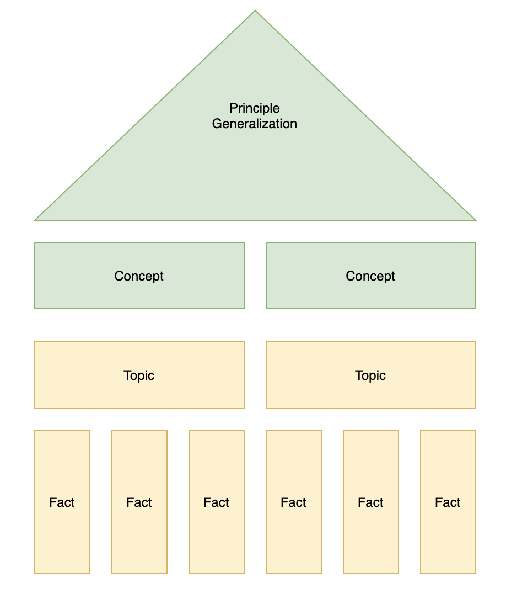
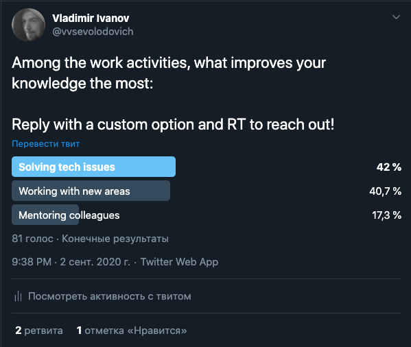

slidenumbers: true
autoscale: true
build-lists: true

# [fit] Continuous Learning: How to keep up with Progress

---

> How do you motivate yourself to learn? You don't, stay in shit.
-- One famous Russian designer

---

# [fit] Vladimir

# [fit] Ivanov

---

* Got interested in programming in school
* Went to Saint-Petersburg State Politechnical University(GPU)

---

# Started working with Symbian and Java ME (C)

---

---

# [fit] Switched to Java backend

graduated ~same time, got married ~same time

---

---

#[fit] Switch to Android. Joined EPAM

---

---

# [fit] began the Public Speaker career

---

---

* Solution Architect @ EPAM Systems
* Google Cloud Certified Architect
* EPAM Impact Award 2018, 2019
* Plays Guitar
* Speaks 3,5 non-programming languages

---

# [fit] Quick look around

---

---

---

# [fit] We know more as a species everyday.

# [fit] Exponentially.

---

---

 _88%_ of the U.S. workers feel they need more training[^0]

[^0]: https://www.spherion.com/ugc/documents/Spherion_2018_Executive-Summary.pdf

---

# [fit] If you don't learn, you know less compared to the ones who do.

---

---

# [fit] But you should care about learning

---

# [fit] Are you satisfied with your compensation(salary, bonuses, perks, etc)?

---

# [fit] Your compensation depends on 3 things

---

# 3 things impacting your compensation[^1]

* Knowledge and skills
* Problems to be solved
* Responsibility

[^1]: Korn Ferry

---

## Knowledge and skills

---

# [fit] Knowledge and skills

---

---

# [fit] How do you learn

---

---

# You try to learn something new...

---

# Memory types

* Sensory memory
* Short term 
* Long term

---

---

# Short term memory(working)

* Small capacity
* Small period of time

---

# What is the maximum recommended number of function arguments?

---

#[fit] 7

---

#[fit] 7+-2

---

# 2-30 seconds

---

---

# How many items fit in a short term memory?

---

# Long-term memory

* minutes to decades
* Encodes with semantic or visual

---

# Long-term memory types[^2]

* Procedural
* Semantic(declarative)
* Episodic(declarative)

[^2]:https://www.simplypsychology.org/long-term-memory.html

---

# [fit] Remember the last time your were learning something new. 

---

# [fit] What was a more efficient way to learn anything?

---

# You need to understand something to properly store it.

---

# [fit] Conceptualization Theory

---

# Conceptualization Theory

* Conceptualization
* Construction
* Dialogue

---

# The important assumptions

* Learning comes when you're applying some new information while performing a task
* Understanding is enhanced by peers and tutors

---

# [fit] __learn__, __practice__ and __get feedback__

---

---

# Chunks

---

# Chunks

* Chunk is a concise small meaningful piece of information

---

# Chunks

* Couple of words of a foreign language
* Small idea

---

# In order to learn anything you need to transfer a chunk from short term memory to a long term.

---

# Learning issues

* Hard to start learning 
* Hard to remember

---

# Learning is hard because it's literally a pain to brain

---

# Procrastination

---

---

# Interval reminders.

---

# Sleep

---

# Sleep

* Lack of sleep cost you attention and memory deduction
* Lack of sleep cause you consolidation deduction

---

---

# How to learn anything in 5 easy steps

* Sleep well
* Break the topic down in chunks
* Schedule learning sessions periodically
* Practice a topic several times using increasing intervals
* Sleep well again 

---

# Ways of how we can learn

* Universities
* Main Job and Side Projects
* Mentoring programs
* Online programs
* Professional certifications
* Books
* Conferences

---

# Universities

---

# Universities

* :thumbsup: Systemic
* :thumbsdown: Old fashioned(at least in Russia)
* :thumbsdown: Government-regulated thus non-efficient
* :thumbsdown: Not tailored according to the market realities
* :thumbsdown: Force you to pick the specialty right away
* :thumbsdown: Force you to invest 4 to 6 years 

---

# [fit] Main Job and Side Projects

---

# Main Job and Side Projects

* Solving issues
* New project with new tech
* During mentoring others

---

---

# Main Job and Side Projects

* :thumbsup: Real life problems
* :thumbsup: May provide deep insights into technologies
* :thumbsup: No system whatsoever
* :thumbsdown: staying on the same project for long time may stop your progress

---

# Mentoring programs

* :thumbsup: Well thought
* :thumbsup: Real life demand
* :thumbsup: Practice
* :thumbsup: Internal recognition
* :thumbsup: Beneficial for mentors as well
* :thumbsdown: May be too focused on a particular tech
* :thumbsdown: Requires significant time

---

# Online courses and online programs

* :thumbsup: Start to replace the universities nowadays
* :thumbsup: Fully remote
* :thumbsdown: heavily depends on particular tutor
* :thumbsdown: expensive

---

# Professional certifications

* Paid
* External recognition

---

---

# Books

---

# Books

* :thumbsup: Systematic
* :thumbsdown: Most of them are outdated at the moment of publishing

---

# Conferences

* :thumbsup: Lots of content
* :thumbsup: Technology updates
* :thumbsup: Networking

---

# Special thanks to...

https://twitter.com/asm0di0

---

# Special thanks to...

https://twitter.com/igrekde

---

* https://vvsevolodovich.dev
* https://twitter.com/vvsevolodovich
* https://www.coursera.org/learn/learning-how-to-learn
* https://udemy.com
* https://coursera.com

---

QA

