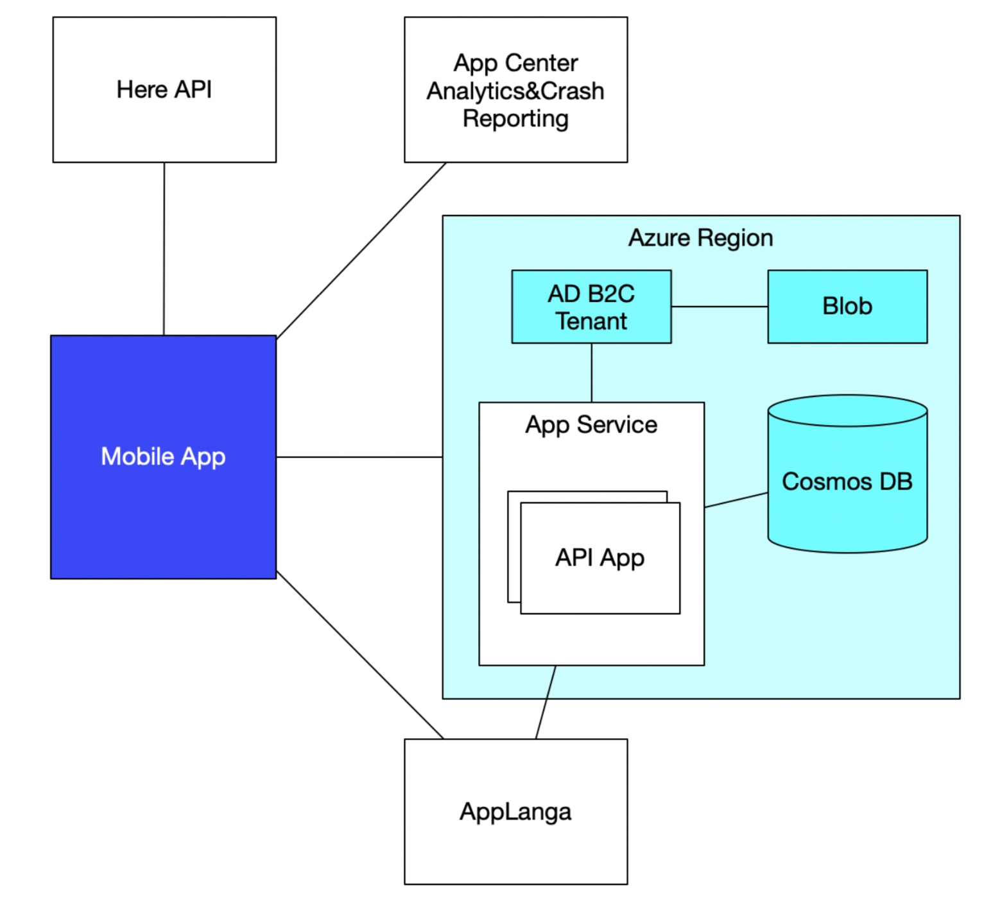
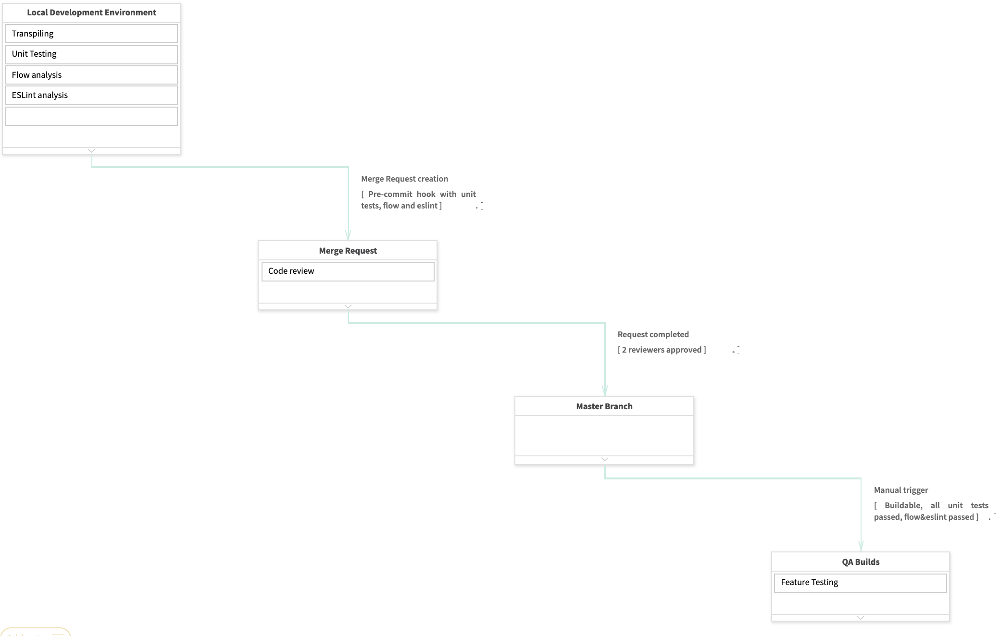

# Delivery Manager School - Final Exam

---

# M-Hub

---

* Inglass SPA is a Molding machines manufacturer
* Molding machines to create plastic parts for cars and other vehicles
* The market of such parts is obscure, so that
* Finding a manufacturer or a molding machine is hard
* Most of the manufactures and machine holders are in Europe and China

---

* Inglass idea is to create a market place for molding machines
* Inglass doesn't have Software Development expertise
* So

---

# Challenge
## Create a full solution to create and manage molding machines owning companies allowing for searching and contacting such companies for further collaboration. 

---

# Technology Challenge

* Mobile App with geocoding and autocomplete
* Implementation of security policies regarding user sign-up and sign-in
* Availability in China

---

# The project

* Not a PDS
* End-2-end
* T&M

---

# Stakeholders

| Side	| Role	| Name	| Contacts | 
| --- | --- | --- | --- |
| INglass | Sponsor, President | Maurizio Bazzo | Maurizio.Bazzo@inglass.it | 
| INglass | Project Manager | Andrea Tellan | Andrea.T ellan@inglass.it | 
| INglass | Product Owner |	Riccardo Villa |	Riccardo.Villa@inglass.it |
| INglass | UX, Marketing | Andrea Modolo | Andrea.Modolo@inglass.it |
| INglass | Solution Architect | Massimo Demarch | Massimo.Demarch@inglass.it |
| INglass | Legal | Valentina Brugnera | Valentia.Brugnera@inglass.it |
| INglass | Security | Davide Gastaldon | Davide.Gastaldon@inglass.it |

---

# Project phases

* RFP
* Engagement
* Discovery
* Construction
* Transition

---

# Engagement&Discovery artifacts

* SOW
* SAD

---

---

# Current phase: Construction

---

# Construction is being done

* With Scrum and 2-weeks iterations

---

* Communication plan is set up
* Risks are reviewed and updated weekly

---

# EngX

* CI/CD pipeline is setup for mobile apps(Android, iOS) and serverside.
* Every merge request is reviewed by 2 persons.
* Every commit is protected with pre-commit hooks(static analysis).
* Only unit tests are introduced.

---

---

# What to improve:

* Add all checks on Merge Request 
* Automation tools for QA
* Resolve Autocomplete issues for China
* Improve development velocity by introducing user-stories checklists   
* Lower uncertainty from the customer side

