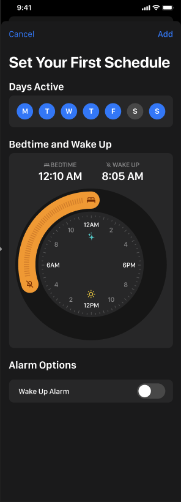
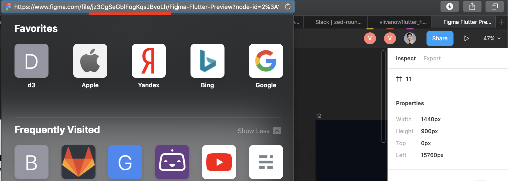

slidenumbers: true
autoscale: true
build-lists: true
footer: @vvsevolodovich

#[fit] Jetpack Compose, Figma and Feedback Loop.
## and more!

---

# [fit] Vladimir Ivanov

* Solution Architect @ Tinkoff
* Experience with native Android, React-Native, Flutter, etc.


---

# Joe

## Delivery Manager


---


---

### Value stream

# [fit] sequence of steps taken by the organization 
# [fit] to __continuously__ bring __value__ to the users[^1]

[^1]: https://www.cloudbees.com/blog/value-stream-management-software-delivery-visibility-and-insight

---

# Jane

## [fit] Android developer


---

Screen design&requirements



---

Screen design&requirements
:arrow_down:
Code


---

Screen design&requirements
:arrow_down:
Code
:arrow_down:
Unit tests


---

Screen design&requirements
:arrow_down:
Code
:arrow_down:
Unit tests
:arrow_down:
Merge request


---

Screen design&requirements
:arrow_down:
Code
:arrow_down:
Unit tests
:arrow_down:
Merge request
:arrow_down:
Functional & Design Test


---


---


---

# Issues

* Manual design verification :thumbsdown:
* Context Switch :thumbsdown:

---


---

> Each extra task or ‘context’ you switch between eats up 20–80% of your overall productivity
-- Gerald Weinberg


---

Challenge!

Guess how many times I switched between tasks during preparing this talk

---

# Ideas 

* Introduce Storybook


---


---

#[fit] https://github.com/airbnb/Showkase

---


---

```kotlin
@Preview(
	name = "Custom name", 
	group = "Custom group name"
)
@Composable
fun MyComponent() { ... }
```

---

```kotlin
@ShowkaseComposable(
	name = "Name of component", 
	group = "Group Name"
)
@Composable
fun MyComponent() { ... }
```

---

```dart
List<Story> stories = [
  HomeStory(),
  SignInScreenStory()
];

void main() {
  runApp(StoryboardApp(stories));
}
```

---

```dart
import 'package:mypackage/contacts.dart';
import 'package:storyboard/storyboard.dart';

class ContactsListStory extends Story {

  @override
  List<Widget> get storyContent {
    return [ContactsList()];
  }
}
```

---

# Benefits 

Fast Debug of a component 
Easy way to share for design review
:arrow_down:
Reduced Feedback loop :thumbsup:

---

# Pixel perfect is still hardly achievable :thumbsdown:


---


---

## Jetpack Compose Figma Preview

---

```kotlin

@Preview
@Composable
fun figmaPreviewPreview() {
    FigmaPreview(
	fileId = "yourfileid", 
	id = "1:405", 
	token = "blablablayourtoken"
    )
}

```

---

# Flutter Figma Preview

---

[.code-highlight: 0-100]
[.code-highlight: 5-10]
[.code-highlight: 6]
[.code-highlight: 7]
[.code-highlight: 10]

```dart

      Title(
        title: "Full Screen Example - 2911:367",
        color: Colors.black,
        child: SafeArea(
          child: FigmaPreview(
              id: '1:295',
              figmaToken: '1234567890xabcde',
              fileId: fileId,
              isFullScreen: true,
              child: IncomingCallScreen(type: CallType.voice),
        ),
      )
```

---

# Flutter Figma Preview

* Component Id
* File Id
* Auth token

---


---


---


---



---

# Search for ids


---

# Take aways

* Feedback loop decreases your velocity
* Use Storyboards to help your designer
* Use JC Figma Preview/Flutter Figma Preview for an immediate feedback


---

# [fit] Vladimir Ivanov

* https://pub.dev/packages/flutter_figma_preview
* https://vvsevolodovich.dev :pencil:
* https://twitter.com/vvsevolodovich :bird:


