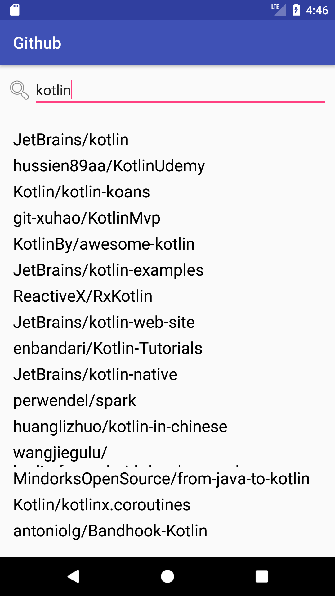

slidenumbers: true
autoscale: true
build-lists: true


## [fit] Flow, StateFlow.


---

## Vladimir Ivanov


## Solution Architect
## @ EPAM Systems


---

# Search

* EditText
* Search by query
* Search only by last value
* Has timeout for change



---

## [fit] RxJava


---

```kotlin

	publishSubject
			.debounce(300, TimeUnit.MILLISECONDS)
			.distinctUntilChanged()
			.switchMap { searchQuery -> 
apiClientRxImpl.searchRepositories(searchQuery) }
			.subscribeOn(Schedulers.io())
			.observeOn(AndroidSchedulers.mainThread())
			.subscribe {
			repos.adapter = ReposAdapter(
					it.map { it.full_name },
					this@RepositoriesActivity)
			}

```

---

```kotlin, [.highlight: 1]

	publishSubject
			.debounce(300, TimeUnit.MILLISECONDS)
			.distinctUntilChanged()
			.switchMap { searchQuery -> 
apiClientRxImpl.searchRepositories(searchQuery) }
			.subscribeOn(Schedulers.io())
			.observeOn(AndroidSchedulers.mainThread())
			.subscribe {
			repos.adapter = ReposAdapter(
					it.map { it.full_name },
					this@RepositoriesActivity)
			}

```

---

```kotlin, [.highlight: 4-5]

	publishSubject
			.debounce(300, TimeUnit.MILLISECONDS)
			.distinctUntilChanged()
			.switchMap { searchQuery -> 
apiClientRxImpl.searchRepositories(searchQuery) }
			.subscribeOn(Schedulers.io())
			.observeOn(AndroidSchedulers.mainThread())
			.subscribe {
			repos.adapter = ReposAdapter(
					it.map { it.full_name },
					this@RepositoriesActivity)
			}

```

---

```kotlin, [.highlight: 9-11]

	publishSubject
			.debounce(300, TimeUnit.MILLISECONDS)
			.distinctUntilChanged()
			.switchMap { searchQuery -> 
apiClientRxImpl.searchRepositories(searchQuery) }
			.subscribeOn(Schedulers.io())
			.observeOn(AndroidSchedulers.mainThread())
			.subscribe {
			repos.adapter = ReposAdapter(
					it.map { it.full_name },
					this@RepositoriesActivity)
			}

```
---

# [fit] BroadcastChannel


---

```kotlin

val broadcast = ConflatedBroadcastChannel<String>()

```

---

```kotlin

launch {
		broadcast.consumeEach { query ->
			delay(300)
			val foundRepositories = apiClient.searchRepositories(query).await()
			repos.adapter = ReposAdapter(
				foundRepositories.map { it.full_name },
				this@RepositoriesActivity
			)
		}
}

```

---

# But...

* Distinct until changed is missing

---

# [fit] Flow


---


```kotlin

	broadcast.asFlow().collect() {
		...
	}
	
```

```kotlin
	@OptIn(ExperimentalCoroutinesApi::class)
	override fun onStop() {
		super.onStop()
		broadcast.cancel()
	}
```

---

# [fit] StateFlow

A Flow that represents a read-only state with a single updatable data value that emits updates to the value to its collectors. 


---

# Usage

```kotlin

searchFlow = MutableStateFlow("")

launch {
	searchFlow.collect {
		val foundRepositories = apiClient.searchRepositories(it).await()
		repos.adapter = ReposAdapter(
			foundRepositories.map { it.full_name },
			this@RepositoriesActivity)
	}
}


```

---

```kotlin
searchQuery.addTextChangedListener(object: TextWatcher {

	override fun afterTextChanged(s: Editable?) {
		searchFlow.value = s.toString()
	}
}
```

---

# StateFlow vs BroadcastChannel

* Interface segregation
* Default value
* .equals based comparison

---

## Strong equality-based conflation

# [fit] ```a.equals(b)```

---

# [fit] Backpressure

---

# Take away

StateFlow is a convenient way of reactive programming in Kotlin Coroutines world

---

# Links

* https://github.com/vlivanov/github-kotlin-coroutines
* https://twitter.com/vvsevolodovich :bird:
* https://vvsevolodovich.dev/ :pencil:


