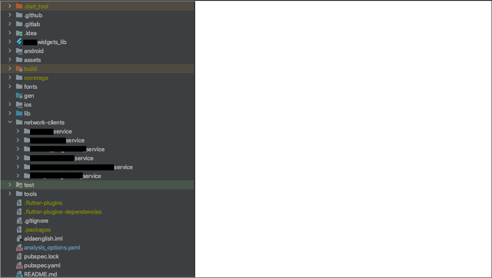
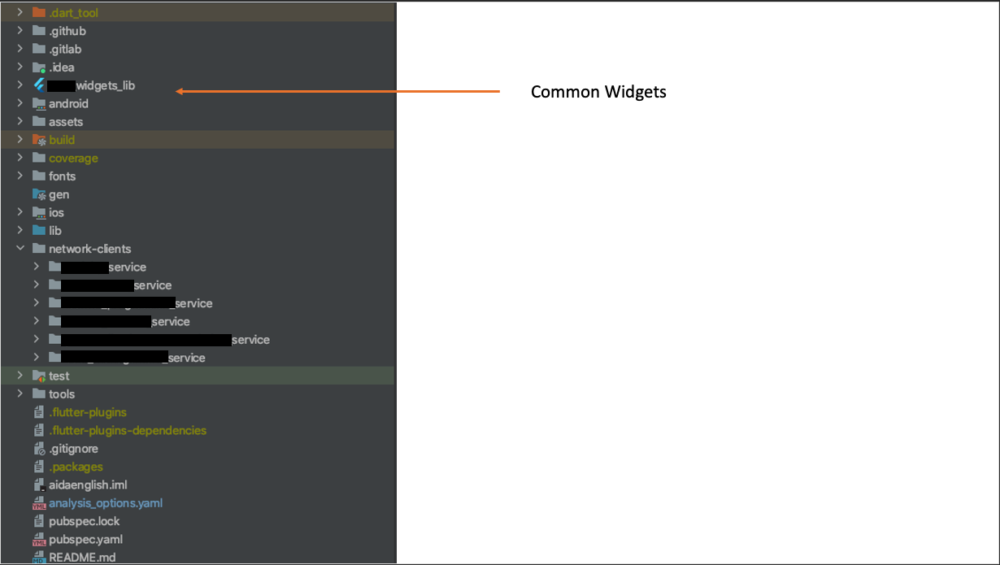
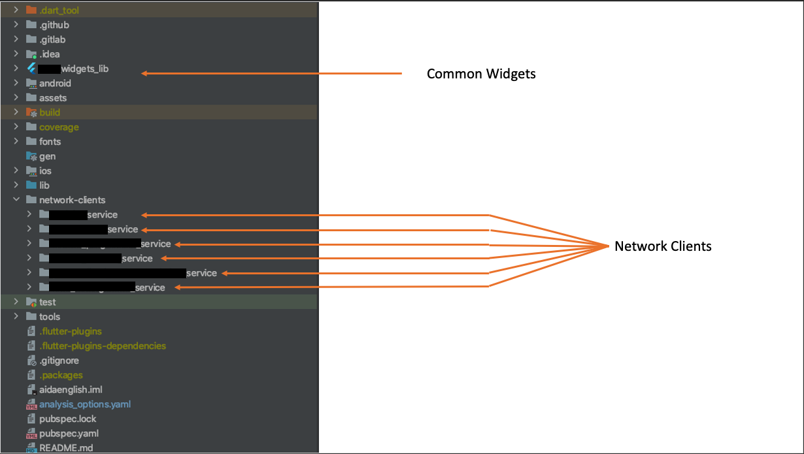
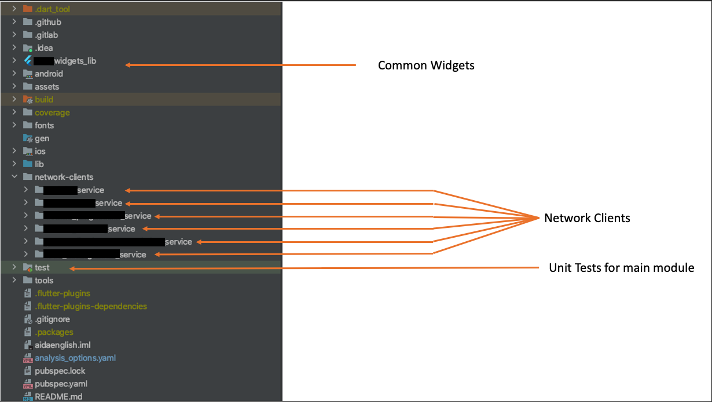
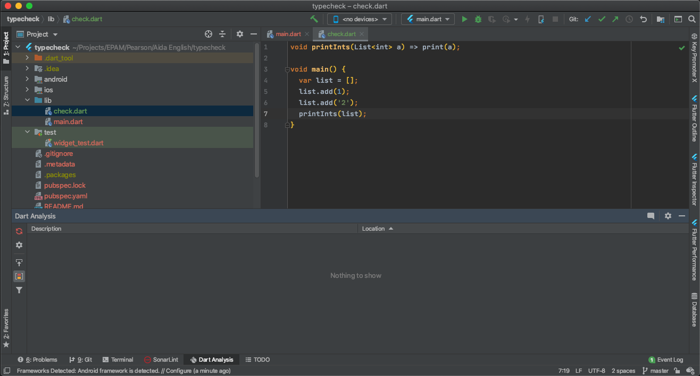
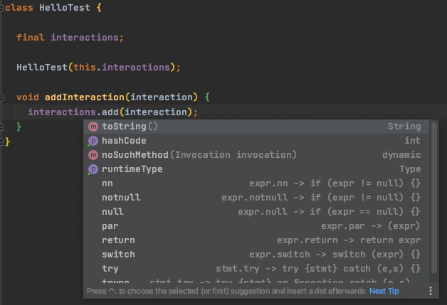
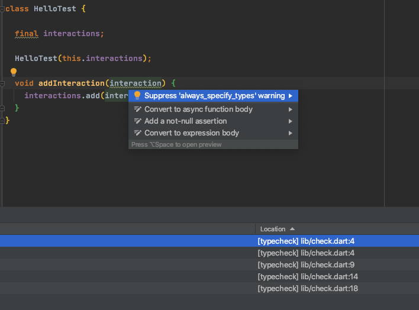
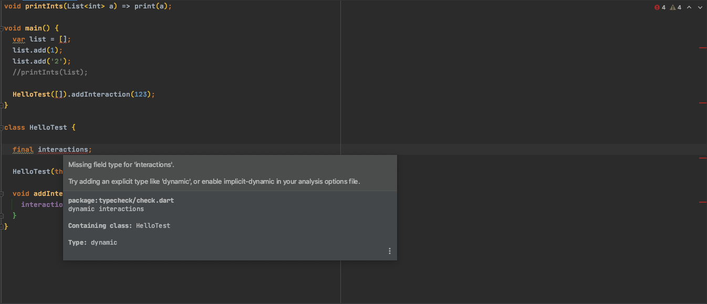
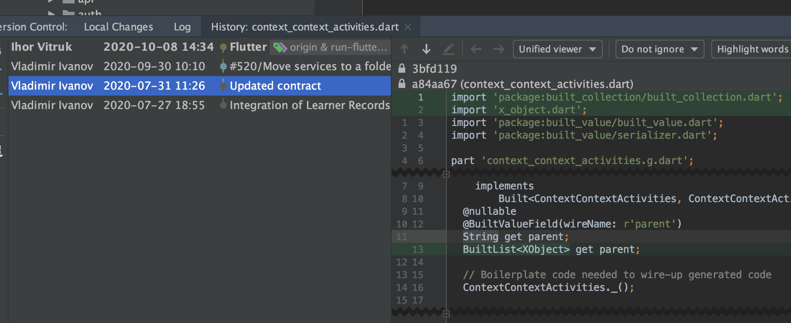
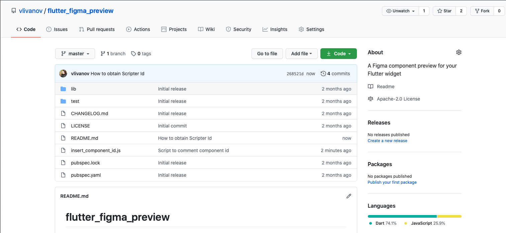

slidenumbers: true
autoscale: true
build-lists: true

# Fried chicken: prepare Flutter for the commercial development


---

# [fit] Vladimir


# [fit] Ivanov

* Solution Architect @ EPAM Systems
* Experienced in native Android, React-Native, Flutter


---

# Introduction about Flutter

* Cross-platform framework
* Uses Dart 
* Inspired by React and other declarative UI frameworks

---

# Our project

- An application to learn English in a easy, convenient and innovative way.
- AI for scoring your pronunciation
- You go through a story, not just doing exercises
- Rich Video and Audio content

---

# Project specifics

- High number of integrations
- Top requirements for design
- Rich media
- Grew from 3 to 7 flutter devs over the course of 4 months
- The first people had no prior flutter experience

---

# Application architecture

---


---

# How the project is organized

---



---



---



---



---

# Engineering Excellence

* Single Code style
* Static Code analysis
* Unit test runs
* Code coverage 
* Quality gates on merge requests and builds


---

# We also had to support pixel perfect implementation

---

# The problems we faced(and you might too!)

* Relied on default style/code analysis
* Test coverage 
* Code generation
* Test runs for multimodules
* Supporting several environments
* Long time design verification


---

# Dart and typing

> The Dart language is type safe: it uses a combination of static type checking and runtime checks to ensure that a variable’s value always matches the variable’s static type, sometimes referred to as sound typing. 
-- https://dart.dev/guides/language/type-system

---

# However... 

---

# You don't get anything by default! 

---

```dart

void printInts(List<int> a) => print(a);

void main() {
  var list = [];
  list.add(1);
  list.add('2');
  printInts(list);
}

```

---


---



---

```sh

flutter analyze
Analyzing typecheck...                                                  
No issues found! (ran in 2.1s)


```

---

```

Unhandled exception:
type 'List<dynamic>' is not a subtype of type 'List<int>'


```

---

```dart

class HelloTest {

  final interactions;

  HelloTest(this.interactions);

  void addInteraction(interaction) {
    interactions.add(interaction);
  }
}

```

---



---



---

# Advice #1 - use analysis_options.yaml

---

```yaml

analyzer:
  strong-mode:
    implicit-dynamic: false

```

---



---

# Advice #2 - use it from the beginning

* Currently we have ~2500 info messages

---

# BTW

* flutter analyze returns 1 for info messages

---

# Advice #3 - wrap the flutter analyze

```sh

#!/bin/sh
OUTPUT="$(flutter analyze)"
echo "$OUTPUT"
echo
if grep -q "error •" <<< "$OUTPUT"; then
    echo "flutter analyze found errors"
    exit 1
else
    echo "flutter analyze didn't find any errors"
    exit 0
fi

```

---


---

# Code generation

* API Surface is big, we needed code generation(+ serialization)
* Went for openapi generators

---

# OpenAPI

> The OpenAPI Specification (OAS) defines a standard, language-agnostic interface to RESTful APIs which allows both humans and computers to discover and understand the capabilities of the service without access to source code, documentation, or through network traffic inspection

-- https://swagger.io/specification/

---

# OpenAPI 

* JSON or Yaml specification
* Data structures
* Methods
* Error codes
* Examples

---

```yaml

{
  "/pets": {
    "get": {
      "description": "Returns all pets from the system that the user has access to",
      "responses": {
        "200": {          
          "description": "A list of pets.",
          "content": {
            "application/json": {
              "schema": {
                "type": "array",
                "items": {
                  "$ref": "#/components/schemas/pet"
  }}}}}}}}
}


```

---


```yaml
components:
  schemas:
    GeneralError:
      type: object
      properties:
        code:
          type: integer
          format: int32
        message:
          type: string

```

---

# code generation

```sh
java -jar openapi-generator-cli-4.3.1.jar generate -i openapi.yaml -g dart-dio -o newversion

```

---

# Options

* 'dart' uses http package as client. You get dart PODOs with toJson and fromJson.
* 'dart-dio' uses Dio network client and built_value serialization.
* 'dart-jaguar' uses jaguar-retrofit and jaguar-serializer

---

# Outputs

* Model files
* default_api.dart file
* serializers.dart file
* Documentation in MD format
* Model tests

---

# Code generation

* Generators are buggy
* Had to patch and commit the code
* Required for each module you have openapi.yaml

---

# What to do with generated code?

---

# Committing code - pros

* 100% repeatable behavior :thumbsup:
* Full control :thumbsup:
* Easier and faster CI :thumbsup:

---

# Committing code - cons

* Heavier repo :thumbsdown:
* Noisy MRs :thumbsup:
* Weird merge conflicts(true story) :thumbsdown:

---


---

# Also

Your openapi.yaml can not have 'Object' description, guess why

---



---

# Code generation - what to do

* Try to avoid generation if you can or at least limit it
* if you use built_value help yourself with a script in case of changes

---

# Script example

---

```sh
#!/usr/bin/env bash

# fail if any commands fails
set -e
# debug log
set -x

flutter pub get
flutter packages pub run build_runner build --delete-conflicting-outputs
pwd
cd network-clients/service1 && flutter pub get
flutter pub run build_runner build --delete-conflicting-outputs
pwd
cd ../
cd service2 && flutter pub get
flutter pub run build_runner build --delete-conflicting-outputs
pwd
cd ../
cd service3 && flutter pub get
flutter pub run build_runner build --delete-conflicting-outputs
pwd
cd ../
cd service4 && flutter pub get
flutter pub run build_runner build --delete-conflicting-outputs

```

---

# What would be nice to have

* Automated download of latest API spec and generating the code

---

# [fit] Test runs

---

| Fluttter | Dart |
| --- | --- |
| `flutter test` | `flutter pub run test ./test` | 

---

# Test runs

* flutter test doesn't run tests for submodules
* Separate coverage for modules
* Coverage report may require additional steps

---

# Test coverage

* Flutter generates lcov.info file
* The file is properly read by Github/Gitlab, but not by bitrise(it gets junit though)
* To display coverage we need an html format
* We also want to monitor for the test coverage dropping below some threshold
* Test coverage is calculated only against files under tests
* Test coverage doesn't work for function and branch coverage

---


---

# [fit] What we do

---

# flutter "test" doesn't generate json

---

flutter "pub" "global" "activate" "junitreport"
flutter "test" "--machine" | tojunit "--output" "./flutter_junit_test_results.xml"

---

# lcov version incompatibility

brew "reinstall" "lcov"

---

# How to maintain minimal coverage

* Or not less than previous coverage(how do you even do it?)
* Minimal coverage

---

# Shell script to check minimal coverage

```sh

#!/usr/bin/env bash

readonly minLineCoverage=20
readonly minBranchCoverage=0
readonly minFunctionCoverage=0

flutter pub run remove_from_coverage -f coverage/lcov.info -r \
 '.g.dart,lib/widgets/*,lib/screens/*,lib/components/*,lib/stories/*,lib/localization/*,main.dart,SizeConfig.dart'
genhtml -o coverage/html coverage/lcov.info
flutter pub run check_coverage -f coverage/lcov.info --min-line-coverage ${minLineCoverage} \
 --min-branch-coverage ${minBranchCoverage} --min-function-coverage ${minFunctionCoverage}
rm coverage/lcov.info

```

---

# Exclude the files you don't need to cover 

```sh
flutter pub run remove_from_coverage -f coverage/lcov.info -r \
 '.g.dart,lib/widgets/*,lib/screens/*,lib/components/*,lib/stories/*,lib/localization/

```

---

# Generate html report to see the coverage

```sh
genhtml -o coverage/html coverage/lcov.info
```

---

```sh
flutter pub run check_coverage -f coverage/lcov.info --min-line-coverage ${minLineCoverage} \
 --min-branch-coverage ${minBranchCoverage} --min-function-coverage ${minFunctionCoverage}

```

---

# You need to have check_coverage package[^1]

[^1]: which we developed on our own, hope to open source it

---

# Tightening the feedback cycle

* We have pull request verification workflow, which runs test, flutter analyze, checks coverage and compiles android and iOS :thumbsup:
* It takes time (up to 30 minutes) :thumbsdown:
* Design is verified manually(which takes days) :thumbsdown::thumbsdown::thumbsdown:

---

# Git hook

---

[.code-highlight: 1]
[.code-highlight: 2-4]
[.code-highlight: 6-8]
[.code-highlight: all]

```sh

./tools/flutter_analyze.sh
if [ $? -ne 0 ]; then
  exit 1
fi

flutter test
if [ $? -ne 0 ]; then
  exit 1
fi

```

---

# Improving Design Feedback loop

---

# Working with design

* Code generation
* Figma integration

---

# Figma plugin for Flutter code generator

* Generates the whole component tree
* Have to patch a lot, making it not usable

---

# Flutter Figma preview

* Figma has a reach API
* Authentication via X-FIGMA-AUTH token
* You have to know file id and component id

---



---

[.code-highlight: 1-2]
[.code-highlight: 4-6]
[.code-highlight: 9-15]

```dart
  @override
  List<Widget> get storyContent {

    return [
      Title(
        title: "Full Screen Example - 2911:367",
        color: Colors.black,
        child: SafeArea(
          child: FigmaPreview(
              id: '2911:367',
              fileId: fileId,
              isFullScreen: true,
              child: MyComponent()),
        ),
      ),
    ];
  }

```

---

# What we would like to have

* Styles imports
* Icons imports

---

# However there is no working dart generator for it

---

# Several environments

* iOS schemes
* Android flavors

---

# Libraries to handle different variables

Wrap up
