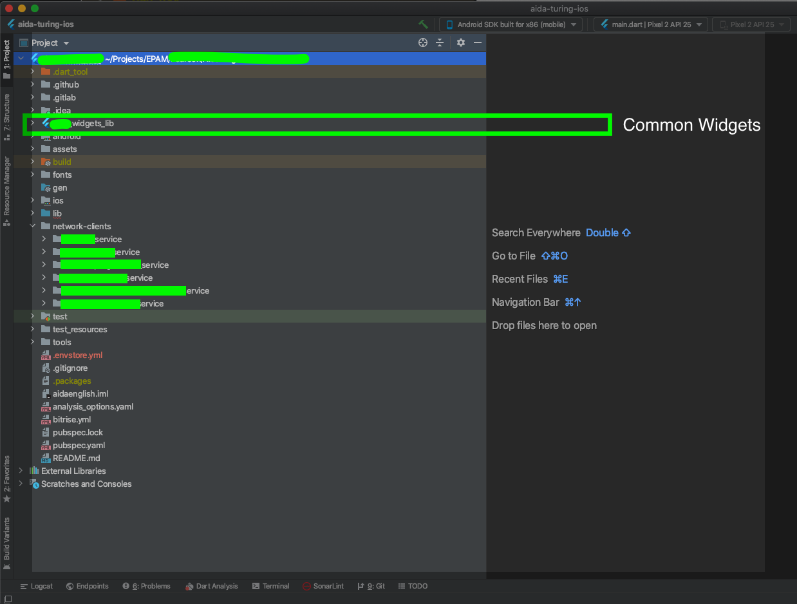
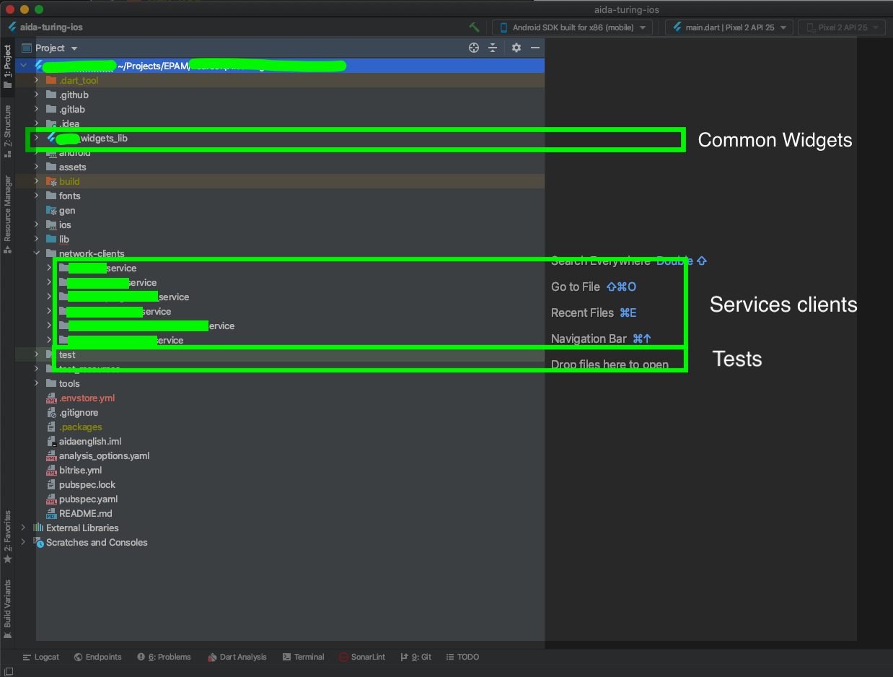
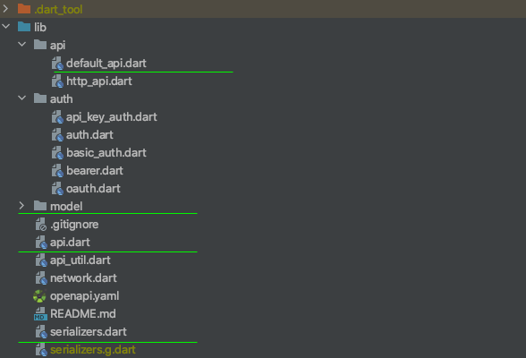
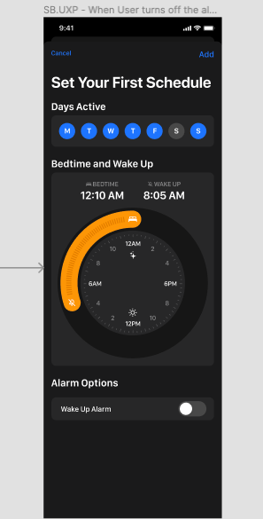
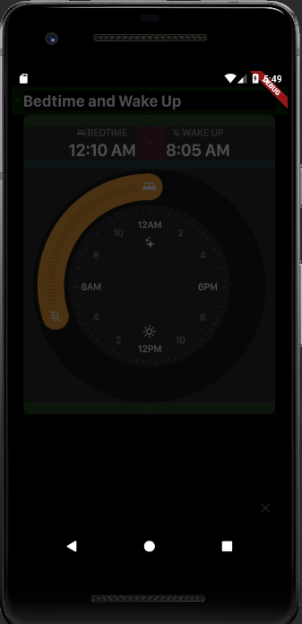

slidenumbers: true
autoscale: true
build-lists: true
slide-transition: true

# Жареная птичка: 
## готовим Flutter к коммерческой разработке


---

# [fit] Владимир Иванов

* Solution Architect @ EPAM Systems
* Опыт в Android, React-Native и Flutter


---

# Сегодня мы

- Вспоминаем, что за Flutter
- Узнаем про стандарты качества EPAM
- Знакомимся с проектом
- Разбираем трудности
- Делаем выводы

---

# Что такое Flutter

* Кроссплатформенный фреймворк для Android, iOS, Веб и Десктопа
* Использует Dart в качестве языка программирования 
* Вдохновлен Реактом и другими декларативными UI фреймворками


---

# Наши стандарты - Engineering Excellence

* Единый стиль кода
* Статический анализ
* Юнит тесты
* Покрытие тестами 
* Гейты качества при пул реквестах и сборках


---

# Наш проект

- Инновационный способ изучения Английского языка.
- AI для помощи в обучении


---

# Специфика

- Высокое число интеграций
- Высокие требования к дизайну
- Первоначальная команда не имела опыта Flutter, только React-Native

---

## Выбрали Флаттер. Почему[^1]?

- Обещание идеальной производительности :thumbsup:
- Зрелый тулсет :thumbsup:
- Нет вопросов по безопасности :thumbsup:
- Имеет устойчивую архитектуру, в сравнении с RN :thumbsup:
- Вопросы с разработчиками решали обучением :thumbsup:

[^1]: https://vvsevolodovich.dev/flutter-vs-react-native-comparison-in-depth/

---

# Организация проекта

---



---



---

# С чем столкнулись

* Положились на стиль кода/анализ кода по умолчанию
* Не увидели, как мерять покрытие тестами
* Разбирались с кодогенерацией
* Не поняли, как запускать тесты для нескольких модулей сразу
* Долго принимали сверстанные экраны


---

# Кейс 1
## типизация и анализ кода 

---

# Dart и типизация

> The Dart language is type safe: it uses a combination of static type checking and runtime checks to ensure that a variable’s value always matches the variable’s static type, sometimes referred to as sound typing. 
-- https://dart.dev/guides/language/type-system

---

## По умолчанию вы не получаете ничего! 

---

```dart

void printInts(List<int> a) => print(a);

void main() {
  var list = [];
  list.add(1);
  list.add('2');
  printInts(list);
}

```

---


---


---

```sh

flutter analyze
Analyzing typecheck...                                                  
No issues found! (ran in 2.1s)


```

---

```

Unhandled exception:
type 'List<dynamic>' is not a subtype of type 'List<int>'


```

---

```dart

class HelloTest {

  final interactions;

  HelloTest(this.interactions);

  void addInteraction(interaction) {
    interactions.add(interaction);
  }
}

```

---


---


---

```yaml

analyzer:
  strong-mode:
    implicit-dynamic: false

```

---


---

# BTW

* flutter analyze падает с кодом 1 для info

---

```sh

#!/bin/sh
OUTPUT="$(flutter analyze)"
echo "$OUTPUT"
echo
if grep -q "error •" <<< "$OUTPUT"; then
    echo "flutter analyze found errors"
    exit 1
else
    echo "flutter analyze didn't find any errors"
    exit 0
fi

```

---

# Кейс 1 - выводы

* используйте analysis_options.yaml c самого начала
* оборачивайте flutter analyze, чтобы не падать с info

---

# Кейс 2
## Кодогенерация

---


---

## Проблема

##[fit] 5+ сервисов
##[fit] 50+ типов на сервис 

---

# OpenAPI

> The OpenAPI Specification (OAS) defines a standard, language-agnostic interface to RESTful APIs which allows both humans and computers to discover and understand the capabilities of the service without access to source code, documentation, or through network traffic inspection

-- https://swagger.io/specification/

---

# OpenAPI 

```yaml

{
  "/pets": {
    "get": {
      "description": "Returns all pets from the system that the user has access to",
      "responses": {
        "200": {          
          "description": "A list of pets.",
          "content": {
            "application/json": {
              "schema": {
                "type": "array",
                "items": {
                  "$ref": "#/components/schemas/pet"
  }}}}}}}}
}


```

---


```yaml
components:
  schemas:
    GeneralError:
      type: object
      properties:
        code:
          type: integer
          format: int32
        message:
          type: string

```

---

# Скрипт кодогенерации OpenAPI

[.code-highlight: 1]
[.code-highlight: 2]
[.code-highlight: 3]
[.code-highlight: 4]

```sh

java -jar openapi-generator-cli-4.3.1.jar generate 
	-i openapi.yaml 
	-g dart-dio 
	-o newversion

```

---

# Опции

* 'dart' - пакет 'http' + dart PODOs(toJson/fromJson).
* 'dart-dio' - пакет Dio + built_value.
* 'dart-jaguar' - пакет jaguar-retrofit + jaguar-serializer

---

# На выходе

---



---

# Ожидание

---


---

# Реальность

* Генераторы с багами(с серьезными)
* Нужно патчить такой код и коммитить 
* При изменении openapi.yaml патчи нужно повторять

---


---

## Что делать 
## с генеренным кодом?

---

# Коммитить

* 100% воспроизводимое поведение :thumbsup:
* Полный контроль :thumbsup:
* CI проще и быстрее :thumbsup:

---

# Или не коммитить из-за

* Тяжелее репозиторий :thumbsdown:
* Пулреквесты с шумом :thumbsdown:
* Странные конфликты с мержем(true story) :thumbsdown:

---


---

# И еще

Вы не можете в openapi.yaml создать тип 'Object' 

## Угадайте, почему?

---


---

# Кейс #2 - выводы

* попробуйте избегать кодогенерации
* автоматизируйте кодогенерацию

---

# Автоматизация openapi[^2]

* Скачать джарник
* Скачать openapi.yml
* Сгенерить файлы
* Пропатчить импорты
* Выполнить build_runner build

[^2]: https://vvsevolodovich.dev/working-with-openapi-in-flutter-fully-automatically/

---

## Автоматизация build_runner

---

```sh
#!/usr/bin/env bash

# fail if any commands fails
set -e
# debug log
set -x

flutter pub get
flutter packages pub run build_runner build --delete-conflicting-outputs
pwd
cd network-clients/service1 && flutter pub get
flutter pub run build_runner build --delete-conflicting-outputs
pwd
cd ../
cd service2 && flutter pub get
flutter pub run build_runner build --delete-conflicting-outputs
pwd
cd ../
cd service3 && flutter pub get
flutter pub run build_runner build --delete-conflicting-outputs
pwd
cd ../
cd service4 && flutter pub get
flutter pub run build_runner build --delete-conflicting-outputs

```

---

# Кейс 3 
## Тесты

---

| Fluttter | Dart |
| --- | --- |
| `flutter test` | `flutter pub run test ./test` | 

---

# Тесты

* flutter test не запускает тесты для сабмодулей(в отличии от pub get)
* Отдельные покрытия тестами для каждого модуля
* Само покрытие требует дополнительных шагов

---

# Тестовое покрытие

* Flutter генерирует lcov.info
* Файл жрется Github/Gitlab, но не bitrise(хотя ест junit)
* Показ покрытия доступен в html
* Уровень покрытия не должен падать ниже уровня(сейчас - 45%)
* Покрытие не работает для ветвлений и функций


---


---

# [fit] Какие вводные

- flutter "test" не генерирует json
- зато есть спец ключ
- и есть утилита для конвертации в junit формат

---

# Реализуем

```sh

// ставим junit тулзу 
flutter "pub" "global" "activate" "junitreport"
// выполняем тесты и кормим тулзу результатами
flutter "test" "--machine" | tojunit "--output" "./flutter_junit_test_results.xml"
// еще нам понадобиться тулза lcov
brew "reinstall" "lcov"
```

---

# Как поддерживать минимальный уровень

* Не меньше предыдущего(как это делать вообще?)
* Не меньше заданного

---

# Скрипт для проверки уровня

```sh

#!/usr/bin/env bash

readonly minLineCoverage=20
readonly minBranchCoverage=0
readonly minFunctionCoverage=0

flutter pub run remove_from_coverage -f coverage/lcov.info -r \
 '.g.dart,lib/widgets/*,lib/screens/*,lib/components/*,lib/stories/*,lib/localization/*,main.dart,SizeConfig.dart'
genhtml -o coverage/html coverage/lcov.info
flutter pub run check_coverage -f coverage/lcov.info --min-line-coverage ${minLineCoverage} \
 --min-branch-coverage ${minBranchCoverage} --min-function-coverage ${minFunctionCoverage}
rm coverage/lcov.info

```

---

# Исключаем лишние файлы

```sh
flutter pub run remove_from_coverage -f coverage/lcov.info -r \
 '.g.dart,lib/widgets/*,lib/screens/*,lib/components/*,lib/stories/*,lib/localization/

```

---

# Создаем отчет

```sh
genhtml -o coverage/html coverage/lcov.info
```

---

```sh
flutter pub run check_coverage -f coverage/lcov.info --min-line-coverage ${minLineCoverage} \
 --min-branch-coverage ${minBranchCoverage} --min-function-coverage ${minFunctionCoverage}

```

---

## Вам нужен пакет check_coverage[^3]

[^3]: мы его сами сделали, но планируем поделиться

---

# Затягивая петлю цикла проверки

* У нас есть флоу на CI для тестов, стат. анализа, покрытия и сборки под Android/iOS :thumbsup:
* Он долгий (до 30 минут) :thumbsdown:
* Верстку проверяем руками(до нескольких дней) :thumbsdown::thumbsdown::thumbsdown:

---

# Гит хук

---

[.code-highlight: 1]
[.code-highlight: 2-4]
[.code-highlight: 6-8]
[.code-highlight: all]

```sh

./tools/flutter_analyze.sh
if [ $? -ne 0 ]; then
  exit 1
fi

flutter test
if [ $? -ne 0 ]; then
  exit 1
fi

```

---

# Кейс #3 - выводы

* Меряйте покрытие кода
* Следите, чтобы покрытие не падало
* Используйте гит хуки для получения более быстрого фидбэка 

---

# Кейс #4
## Верстка

---

# Что делать с версткой?

* Кодогенерация
* Интеграция

---

# Figma плагин для генерации Flutter кода

* Создаем все дерево :thumbsup:
* Надо много переделывать  :thumbsdown:

---

# Flutter Figma preview

* у Figma отличный API
* Аутентификация через X-FIGMA-AUTH
* Надо знать file id и id компонента

---


---

[.code-highlight: 1-2]
[.code-highlight: 4-6]
[.code-highlight: 9-15]

```dart
  @override
  List<Widget> get storyContent {

    return [
      Title(
        title: "Full Screen Example - 2911:367",
        color: Colors.black,
        child: SafeArea(
          child: FigmaPreview(
              id: '2911:367',
              fileId: fileId,
              isFullScreen: true,
              child: MyComponent()),
        ),
      ),
    ];
  }

```

---



---

# Что нам еще хотелось бы иметь

* Styles imports
* Icons imports

---


---

# Кейс #4 - выводы

* Автоматизируйте проверку дизайна

---

# Кейс 5
## поддержка разных окружений

---

# Поддержка разных окружений

* Надо тестировать приложение с разными окружениями
* Нужны разные файлы для аналитики

---

# Ожидание

Flavors всех спасут

---

# Реальность

Настроить флейворы больно

---

# Android

* Добавить в build.gradle
* Добавить папку в src
* Готово!


---

# iOS

* Скопировать таргет
* Скопировать схему
* Скопировать конфигурации
* Убедиться, что схема названа в Upper-case
* Убедиться, что схема настроена на нужную конфигурацию
* Убедиться, что схема shared в Runner.xcproject(не воркспейс!)
* Убедиться, что в конфигурации для всех таргетов выставлен bundle id и provisioning profile
* Проверить через flutter build ios --flavor=<flavor-name>


---

# Кейс #5 - выводы

* Если нужно только поменять хост апи, вас спасет --dart-define
* Если нет, можно делать через flavors, но смотрите в чек-лист

---

# Что мы сегодня узнали

* Как настраивать код-стайл и типизацию
* Как работать с кодогенерацией
* Как работать с тестами и покрытием
* Как укорачивать фидбеклуп
* Как настраивать приложение под различные окружения

---

# Выводы

* Flutter готов к промышленному использованию
* Его можно докрутить, чтобы удовлетворять высокие стандарты качества
* Больше инфы - у меня в тви и в блоге! 

---

# [fit] Vladimir Ivanov

* https://vvsevolodovich.dev :pencil:
* https://twitter.com/vvsevolodovich :bird:


