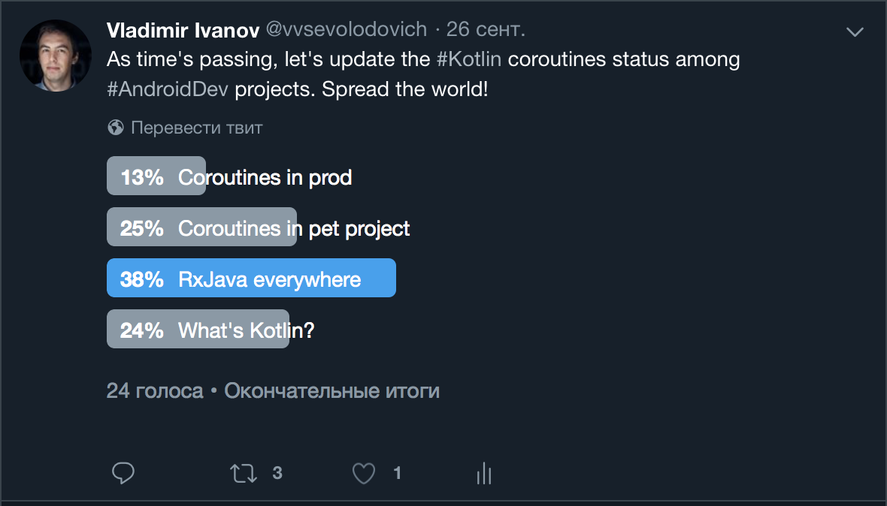

footer: *<EPAM>*
slidenumbers: true
slidecount: true
autoscale: true
build-lists: true


## How to have Kotlin Coroutines in Production and sleep well 

---

## Disclaimer

Everything presented here is a product of production experience and research findings and provided AS IS without any guarantees.

---

# About me

* Lead Software Engineer
* Primary Skill: Android
* Doing some Solution Architecture from time to time.
* Certified Google Cloud Architect.

---

[.build-lists: false]

# About me

* Lead Software Engineer
* Primary Skill: Android
* Doing some Solution Architecture from time to time.
* Certified Google Cloud Architect.


---

# About you

* Android developers? 
* Did you use coroutines?
* Do you have them in prod?


---


---

# Kotlin coroutines adoption



---

# Earlier in the series

* RxJava is too complex for the most cases
* Moving from RxJava to Kotlin Coroutines

---

## Let's recall why coroutines in a first place...

---

# RxJava 2 implementation

```kotlin

interface ApiClientRx {

	fun login(auth: Authorization) 
		: Single<GithubUser>
	fun getRepositories
		(reposUrl: String, auth: Authorization) 
		: Single<List<GithubRepository>>

}

```

---

```kotlin, [.highlight: 3]
private fun attemptLoginRx() {
	showProgress(true)
	compositeDisposable.add(apiClient.login(auth)
			.flatMap { 
				user -> apiClient.getRepositories(user.repos_url, auth) 
			}
			.map { 
				list -> list.map { it.full_name } 
			}
			.subscribeOn(Schedulers.io())
			.observeOn(AndroidSchedulers.mainThread())
			.doFinally { showProgress(false) }
			.subscribe(
					{ list -> showRepositories(this, list)    },
					{ error -> Log.e("TAG", "Failed to show repos", error) }
			))
}

```

---

```kotlin, [.highlight: 4-6]
private fun attemptLoginRx() {
	showProgress(true)
	compositeDisposable.add(apiClient.login(auth)
			.flatMap { 
				user -> apiClient.getRepositories(user.repos_url, auth) 
			}
			.map { 
				list -> list.map { it.full_name } 
			}
			.subscribeOn(Schedulers.io())
			.observeOn(AndroidSchedulers.mainThread())
			.doFinally { showProgress(false) }
			.subscribe(
					{ list -> showRepositories(this, list)    },
					{ error -> Log.e("TAG", "Failed to show repos", error) }
			))
}

```
---

```kotlin, [.highlight: 9-11]
private fun attemptLoginRx() {
	showProgress(true)
	compositeDisposable.add(apiClient.login(auth)
			.flatMap { 
				user -> apiClient.getRepositories(user.repos_url, auth) 
			}
			.map { 
				list -> list.map { it.full_name } 
			}
			.subscribeOn(Schedulers.io())
			.observeOn(AndroidSchedulers.mainThread())
			.doFinally { showProgress(false) }
			.subscribe(
					{ list -> showRepositories(this, list)    },
					{ error -> Log.e("TAG", "Failed to show repos", error) }
			))
}

```
---

```kotlin, [.highlight: 13-17]
private fun attemptLoginRx() {
	showProgress(true)
	compositeDisposable.add(apiClient.login(auth)
			.flatMap { 
				user -> apiClient.getRepositories(user.repos_url, auth) 
			}
			.map { 
				list -> list.map { it.full_name } 
			}
			.subscribeOn(Schedulers.io())
			.observeOn(AndroidSchedulers.mainThread())
			.doFinally { showProgress(false) }
			.subscribe(
					{ list -> showRepositories(this, list)    },
					{ error -> Log.e("TAG", "Failed to show repos", error) }
			))
}

```

---

# Caveats

* Complex
* Unrelated stack traces
* Performance overhead(may be?)

---

# Using coroutines 
## (before 0.26)

---

# Base interface

```kotlin

interface ApiClient {

	suspend fun login(auth: Authorization) : GithubUser
	suspend fun getRepositories
		(reposUrl: String, auth: Authorization) 
		: List<GithubRepository>

}

```

---

```kotlin

private fun attemptLogin() {
	launch(UI) {
		val auth = BasicAuthorization(login, pass)
		try {
			showProgress(true)
			val userInfo = async { apiClient.login(auth) }.await()
			val repoUrl = userInfo.repos_url
			val list = async { apiClient.getRepositories(repoUrl, auth) }.await()
			showRepositories(
				this, 
				list.map { it -> it.full_name }
			)
		} catch (e: RuntimeException) {
			showToast("Oops!")
		} finally {
			showProgress(false)
		}
	}
}


```
---

```kotlin, [.highlight: 4-8]

private fun attemptLogin() {
	launch(UI) {
		val auth = BasicAuthorization(login, pass)
		try {
			showProgress(true)
			val userInfo = async { apiClient.login(auth) }.await()
			val repoUrl = userInfo.repos_url
			val list = async { apiClient.getRepositories(repoUrl, auth) }.await()
			showRepositories(
				this, 
				list.map { it -> it.full_name }
			)
		} catch (e: RuntimeException) {
			showToast("Oops!")
		} finally {
			showProgress(false)
		}
	}
}

```

---

```kotlin, [.highlight: 9-12]

private fun attemptLogin() {
	launch(UI) {
		val auth = BasicAuthorization(login, pass)
		try {
			showProgress(true)
			val userInfo = async { apiClient.login(auth) }.await()
			val repoUrl = userInfo.repos_url
			val list = async { apiClient.getRepositories(repoUrl, auth) }.await()
			showRepositories(
				this, 
				list.map { it -> it.full_name }
			)
		} catch (e: RuntimeException) {
			showToast("Oops!")
		} finally {
			showProgress(false)
		}
	}
}

```

---

# Why coroutines? 

* Simpler
* Same performance or better
* Tests are easy

---

# Step aside...

---

# withContext vs launch/async

* launch/async may create new Coroutine context
* withContext reuses an existing one

---

* Use withContext whether is semantically fits you. Async/await - for parallel execuction. [^1]

[^1]: https://stackoverflow.com/questions/50230466/kotlin-withcontext-vs-async-await

---

# Step aside... again

---

# Refactoring a really complex rx...

```kotlin

  observable1.getSubject().zipWith(observable2.getSubject(), (t1, t2) -> { 
		// side effects
		return true;
	}).doOnError {
		// handle errors
	}
	.zipWith(observable3.getSubject(), (t3, t4) -> {
		// side effects
		return true;
	}).doOnComplete {
		// gather data
	}
	.subscribe()

```

---

# Basically with coroutines it becomes

```kotlin

 try {
	val firstChunkJob = async { call1 }
	val secondChunkJob = async { call2 }
        val thirdChunkJob = async { call3 }
	return Result(
		firstChunkJob.await(), 
		secondChunkJob.await(), 
		thirdChunkJob.await())
 } catch (e: Exception) {
	// handle errors
 }

  
```

---


# Why wouldn't you use coroutines in prod? 

---


---

* Lifecycle management
* Lack of complex tasks experience
* Lack of tools
* No understanding of testing

---

# 1. Lifecycle management

---

# 1. Lifecycle management

* Coroutine can leak as well as disposable, AsyncTask
* So we need to stop them

---

[.build-lists: false]

# Stopping

* Thread.stop()

---

[.build-lists: false]

# Stopping

* ~~Thread.stop()~~

---

[.build-lists: false]

# Stopping

* ~~Thread.stop()~~
* How do we cancel with Rx? 
* CompositeDisposable!

---

# RxJava way

```kotlin

private val compositeDisposable = CompositeDisposable()

```

---

# RxJava way

```kotlin, [.highlight: 4,5,8]

private val compositeDisposable = CompositeDisposable()

fun requestSmth() {
  compositeDisposable.add(
	apiClientRx.requestSomething()
	.subscribeOn(Schedulers.io())
	.observeOn(AndroidSchedulers.mainThread())
	.subscribe(result -> {})
} 

```

---

# RxJava way

```kotlin, [.highlight: 10-13]

private val compositeDisposable = CompositeDisposable()

fun requestSmth() {
  compositeDisposable.add(
	apiClientRx.requestSomething()
	.subscribeOn(Schedulers.io())
	.observeOn(AndroidSchedulers.mainThread())
	.subscribe(result -> {})
} 

override fun onDestroy() {
  compositeDisposable.dispose()
} 

```

---

# Coroutines way

```kotlin

private val job: Job? = null


```

---


# Coroutines way

```kotlin

private val job: Job? = null

fun requestSmth() {
  job = launch(UI) { 
	val user = apiClient.requestSomething()
	...
  } 
} 

```

---

# Coroutines way

```kotlin

private val job: Job? = null

fun requestSmth() {
  job = launch(UI) { 
	val user = apiClient.requestSomething()
	...
  } 
} 

override fun onDestroy() {
  job?.cancel()
} 

```

---

# Issues?

* Cloning fields for every possible job
* Sustaining a registry for jobs
* Duplicating code 


---

# Alternatives

* CompositeJob
* Lifecycle


---

# CompositeJob

---

# CompositeJob

```kotlin

private val job: CompositeJob = CompositeJob()

fun requestSmth() {
  job.add(launch(UI) { 
	val user = apiClient.requestSomething()
	...
  	})
} 

override fun onDestroy() {
  job.cancel()
} 

```

---


# CompositeJob

```kotlin, [.highlight: 1-2]


class CompositeJob {

	private val map = hashMapOf<String, Job>()

	fun add(job: Job, key: String = job.hashCode().toString()) 
		= map.put(key, job)?.cancel()

	fun cancel(key: String) = map[key]?.cancel()

	fun cancel() = map.forEach { _, u -> u.cancel() }
}

```

---

# CompositeJob

```kotlin, [.highlight: 4]


class CompositeJob {

	private val map = hashMapOf<String, Job>()

	fun add(job: Job, key: String = job.hashCode().toString()) 
		= map.put(key, job)?.cancel()

	fun cancel(key: String) = map[key]?.cancel()

	fun cancel() = map.forEach { _, u -> u.cancel() }
}

```

---

# CompositeJob

```kotlin, [.highlight: 6-7]


class CompositeJob {

	private val map = hashMapOf<String, Job>()

	fun add(job: Job, key: String = job.hashCode().toString()) 
		= map.put(key, job)?.cancel()

	fun cancel(key: String) = map[key]?.cancel()

	fun cancel() = map.forEach { _, u -> u.cancel() }
}

```
---

# CompositeJob

```kotlin, [.highlight: 9]


class CompositeJob {

	private val map = hashMapOf<String, Job>()

	fun add(job: Job, key: String = job.hashCode().toString()) 
		= map.put(key, job)?.cancel()

	fun cancel(key: String) = map[key]?.cancel()

	fun cancel() = map.forEach { _, u -> u.cancel() }
}

```

---


# CompositeJob

```kotlin, [.highlight: 11]


class CompositeJob {

	private val map = hashMapOf<String, Job>()

	fun add(job: Job, key: String = job.hashCode().toString()) 
		= map.put(key, job)?.cancel()

	fun cancel(key: String) = map[key]?.cancel()

	fun cancel() = map.forEach { _, u -> u.cancel() }
}

```


---


# Lifecycle-aware job

---


---

```java
public class MyObserver implements LifecycleObserver {
    @OnLifecycleEvent(Lifecycle.Event.ON_RESUME)
    public void connectListener() {
        ...
    }

    @OnLifecycleEvent(Lifecycle.Event.ON_PAUSE)
    public void disconnectListener() {
        ...
    }
}
```

---

```kotlin
class AndroidJob(lifecycle: Lifecycle) : Job by Job(), LifecycleObserver {

    init {
        lifecycle.addObserver(this)
    }

    @OnLifecycleEvent(Lifecycle.Event.ON_DESTROY)
    fun destroy() {
        Log.d("AndroidJob", "Cancelling a coroutine")
        cancel()
    }
}
```

---

```kotlin
private var parentJob = AndroidJob(lifecycle)

fun do() {
	job = launch(UI, parent = parentJob) {
		// code
	}
}

```

---

# 2. Complex use-cases

---

# Complex use-cases

* Operators
* Error-handling
* Caching

---

# Repeat - RxJava


```kotlin

repeatWhen()

```
---

# Repeat - Coroutines

```kotlin

suspend fun <T> retryDeferredWithDelay(
		deferred: () -> Deferred<T>, 
		tries: Int = 3, 
		timeDelay: Long = 1000L
	): T {

	for (i in 1..tries) {
		try {
			return deferred().await()
		} catch (e: Exception) {
			if (i < tries) delay(timeDelay) else throw e
		}
	}
	throw UnsupportedOperationException()
}

```

---

# Zip - coroutines


```kotlin


suspend fun <T1, T2, R> zip(
	source1: Deferred<T1>, 
	source2: Deferred<T2>, 
	zipper: BiFunction<T1, T2, R>): R {
    return zipper.apply(source1.await(), source2.await())
}

suspend fun <T1, T2, R> Deferred<T1>.zipWith(
	other: Deferred<T2>, 
	zipper: BiFunction<T1, T2, R>): R {
    return zip(this, other, zipper)
}


```

---

# Cache

---


---

# Cache

* Network Source
* In-memory cache
* Persistent cache(with expiration)

---

# Cache

```kotlin

launch(UI) {
	var data = withContext(dispatcher) { persistence.getData() }
	if (data == null) {
		data = withContext(dispatcher) { memory.getData() }
		if (data == null) {
			data = withContext(dispatcher) { network.getData() }
			memory.cache(url, data)
			persistence.cache(url, data)
		}
	}
}

```

---

# Rx has RxCache

---

# Declaration

```kotlin

public interface FeatureConfigCacheProvider {
    
	@ProviderKey("features")
    @LifeCache(duration = 15, timeUnit = TimeUnit.MINUTES)
    fun getFeatures(
			result: Observable<Features>, 
			cacheName: DynamicKey 
		): Observable<Reply<Features>> 

} 
  

```
---

# Usage

```kotlin, [.highlight: 1]

 val restObservable = configServiceRestApi.getFeatures()
 val features = 
	featureConfigCacheProvider.getFeatures(
		restObservable, 
		DynamicKey(CACHE_KEY)
	)
    

```

---

# Usage

```kotlin, [.highlight: 2-7]

 val restObservable = configServiceRestApi.getFeatures()
 val features = 
	featureConfigCacheProvider.getFeatures(
		restObservable, 
		DynamicKey(CACHE_KEY)
	)
    

```

---

# Coroutine Cache in development! 

---

# Will look smth like that:

```kotlin

 val restFunction = configServiceRestApi.getFeatures()
 val features = withCache(CACHE_KEY) { restFunction() }
    

```

---


---

# Error handling

* Simple error handling is done with try-catch-finally
* In production you have nested try-catches

---

# What to do? 

* CoroutineExceptionHandler
* Result classes

---

## Coroutine Exception Handler

---

# Handler example

```kotlin, [.highlight: 1-3]
val handler = CoroutineExceptionHandler(handler = { , error ->
	hideProgressDialog()
	val defaultErrorMsg = "Something went wrong"
	val errorMsg = when (error) {
		is ConnectionException -> 
			userFriendlyErrorMessage(error, defaultErrorMsg)
		is HttpResponseException -> 
			userFriendlyErrorMessage(Endpoint.EndpointType.ENDPOINT_SYNCPLICITY, error)
		is EncodingException -> 
			"Failed to decode data, please try again"
		else -> defaultErrorMsg
	}
	Toast.makeText(context, errorMsg, Toast.LENGTH_SHORT).show()
})

```

---

# Handler example

```kotlin, [.highlight: 4-12]
val handler = CoroutineExceptionHandler(handler = { , error ->
	hideProgressDialog()
	val defaultErrorMsg = "Something went wrong"
	val errorMsg = when (error) {
		is ConnectionException -> 
			userFriendlyErrorMessage(error, defaultErrorMsg)
		is HttpResponseException -> 
			userFriendlyErrorMessage(Endpoint.EndpointType.ENDPOINT_SYNCPLICITY, error)
		is EncodingException -> 
			"Failed to decode data, please try again"
		else -> defaultErrorMsg
	}
	Toast.makeText(context, errorMsg, Toast.LENGTH_SHORT).show()
})

```

---

# Handler example

```kotlin, [.highlight: 13]
val handler = CoroutineExceptionHandler(handler = { , error ->
	hideProgressDialog()
	val defaultErrorMsg = "Something went wrong"
	val errorMsg = when (error) {
		is ConnectionException -> 
			userFriendlyErrorMessage(error, defaultErrorMsg)
		is HttpResponseException -> 
			userFriendlyErrorMessage(Endpoint.EndpointType.ENDPOINT_SYNCPLICITY, error)
		is EncodingException -> 
			"Failed to decode data, please try again"
		else -> defaultErrorMsg
	}
	Toast.makeText(context, errorMsg, Toast.LENGTH_SHORT).show()
})

```

---


# Usage

```kotlin

launch(uiDispatcher + handler) {
	...
}

```

---

# Result approach

```kotlin

sealed class Result {

	data class Success(val payload: String) 
		: Result()
	
	data class Error(val exception: Exception)
		: Result()
}

```

---

# Result usage

```kotlin

override suspend fun doTask(): Result = withContext(CommonPool) {
	if ( !isSessionValidForTask() ) {
		return@withContext Result.Error(Exception())
	}
		...

	try {
		Result.Success(restApi.call())
	} catch (e: Exception) {
		Result.Error(e)
	}
}

```

---

# 3. Testing

* Replacing context
* Mocking coroutines

---

# Your presenter

```kotlin

val login() {
	launch(UI) {
		...
	}
}

```

---

# Your better presenter

```kotlin

val login(val coroutineContext = UI) {
	launch(coroutineContext) {
		...
	}
}

```

---

```kotlin

# Presenter test

fun testLogin() {
	val presenter = LoginPresenter()
	presenter.login(Unconfined)

}

```

---

# Mocking coroutines

---

# Mockk

```kotlin

coEvery { 
	apiClient.login(any()) 
} returns githubUser

```

---

# Mockito-kotlin
```kotlin

given { 
	runBlocking { 
		apiClient.login(any()) 
	} 
}.willReturn (githubUser)

```

---

# Presenter test

```kotlin

fun testLogin() {
	val githubUser = GithubUser('login')
	val presenter = LoginPresenter(mockApi)
	presenter.login(Unconfined)
	assertEquals(githubUser, presenter.user())
}

```

---

# Summary

* You can refactor Rx easily
* You can cover your code with tests easily
* The coroutines don't generate crashes
* Just do it!

---


---


# Useful links - 1

* Coroutine receipts: 
	https://proandroiddev.com/android-coroutine-recipes-33467a4302e9
* Coroutines guide: 
	https://github.com/Kotlin/kotlinx.coroutines/blob/master/coroutines-guide.md
* Codelab:
	https://codelabs.developers.google.com/codelabs/kotlin-coroutines/index.html#0

---

# Useful links - 2

* https://twitter.com/vvsevolodovich :bird:
* https://medium.com/@dzigorium :pencil:
* https://mobiusconf.com/

---


