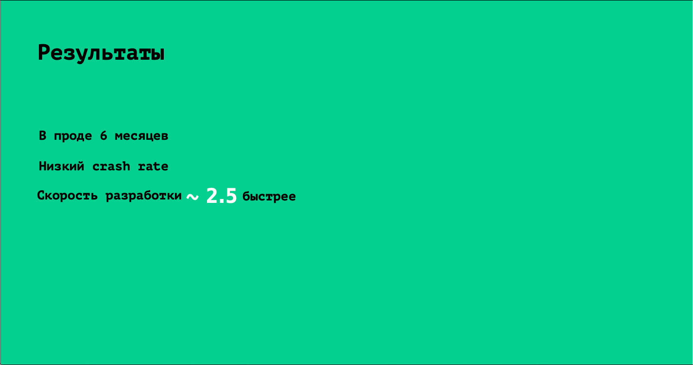

slidenumbers: true
autoscale: true
build-lists: true
footer: @vvsevolodovich

## Как продать кроссплатформу своему CTO

---

# [fit] Vladimir Ivanov

* Архитектор решений @ EPAM Systems
* Certified Google Cloud Architect
* React-Native/Flutter person

---

# Сегодня Узнаем 

* О чем думает CTO
* Как продавать технологические решения
* Как продать конкретную кросс-платформу
* Как работать с возражениями

---

# О чем думает CTO

* Успех на рынке
* Объяснения C-level коллегам
* Как технологии помогут отрыть новые продукты и бизнес-линии
* Найм и развитие команды
* Продуктивность разработки

---

# Как технология помогает бизнесу

* Удовлетворение НФТ 
* Создание новых продуктов 
* Ограничения технологии
* ROI

---

# Найм и развитие

* Сколько профессионалов есть на рынке?
* Насколько трудно обучать новых? 
* Насколько легко переучивать людей? 

---

# Продуктивность разработки

* Цикл обратной связи
* Инструменты качества
* Инструменты НФТ

---

# [fit] Как продавать технологические решения

---

# Как в принципе продавать

* У всех есть проблемы
* Люди покупают решение проблем

---

# СTO тоже покупает решение проблемы

---

---

# Понять задачу

---

## Понять, сколько стоит задача

---

## Понять, сколько стоит решение

---

# Показать альтернативы

---

# Показать риски

---

# Показать сравнение

---

# Говорить на языке целевой аудитории

---

# Опираться на факты, а не эмоции

---

# Использовать техники убеждения

---

# Продаем Flutter

---

# Задача

## Добавлять фичи и нести ценность для клиентов

---

# Сколько стоит решение

* 2 нативных приложения
* 2 kotlin девелопера
* 2 swift девелопера
* 2 тестировщика
* 1 Mobile Lead 
* 2 :lemon: рублей в месяц

---

# Альтернативы

* Flutter
* React-Native
* Xamarin
* Kotlin Multiplatform

---

# Преимущества Flutter :thumbsup:

| Разработчик | CTO |
| --- | --- | --- |
| Короткий цикл обратной связи | Скорость вывода фич на рынок |
| Кроссплатформа | Меньше стоимость разработки |
| Стабильность решения | Выше удовлетворенность пользователей |

---

# Скорость вывода фич на рынок

2x-5x за счет Declarative UI и кросслплатформы[^1]

[^1]: https://mobius-piter.ru/2020/spb/talks/2rkyh7ykrikv9jafwljmid/

---

---

# Стоимость разработки

* 2 кроссплатформенных приложения
* 2 Flutter developer
* 1 Mobile Lead
* 2 тестироващика
* 1,5 :lemon: в месяц

---

# Экономия 6 :lemon: в год на зарплатах

---

# Недостатки Flutter :thumbsdown:

| Разработчик | CTO |
| --- | --- | --- |
| Dart | Сложно нанимать людей |
| Dart | Недостаток тулинга и библиотек |
| Возраст | Скорость и стоимость вывода фич |

---

# Риски

* Библиотеки
* Тулинг
* Специалисты/найм/обучение

---

## Как будем митигировать?

---

# Митигирование рисков

* Нет библиотеки - напишем
* Тулинг - добавим?
* Специалистов - научим

 

---

# Оценка рисков

* P(i) - Вероятность срабатывания риска
* S(i) - Стоимость митигирования риска  

$$
RC = \left( \sum_{i=1}^n P(i)*S(i) \right)
$$

---

## Вероятность и стоимость митигирования зависит от конкретного проекта и компании

---

# Будущие возможности

* Можно ли будет сделать веб?
* Что-то еще?  

---

# Как будет принимать решение CTO?

---

* SC - Экономия на разработке
* F - прибыль от будущих возможностей
* RC - Стоимость всех рисков
* T - Стоимость перехода  

## SC + F - (RC + T) > 0

---

# Принципы убеждения

* Взаимность
* Постоянство
* Социальная опора
* Симпатия
* Авторитет
* Недостаток

---

---

---

---

---

---

---

# Расскажите историю

---

# Удачи

---

# [fit] Vladimir Ivanov

* https://vvsevolodovich.dev :pencil:
* https://twitter.com/vvsevolodovich :bird:

