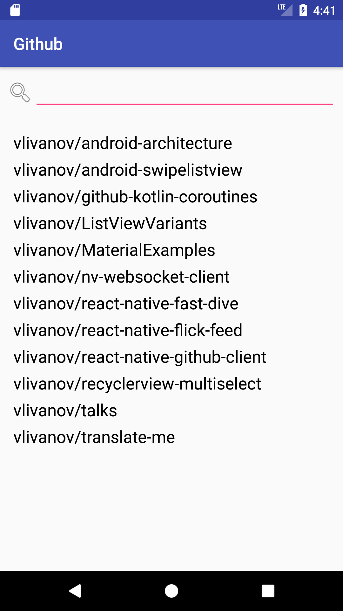
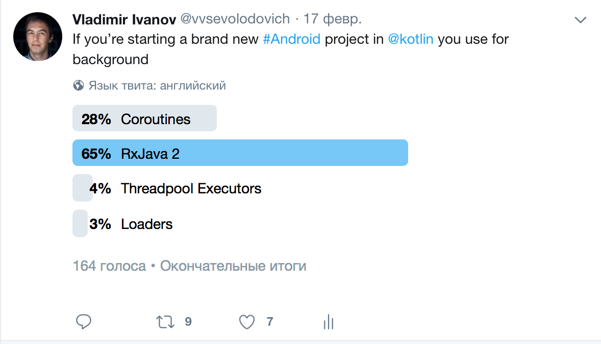
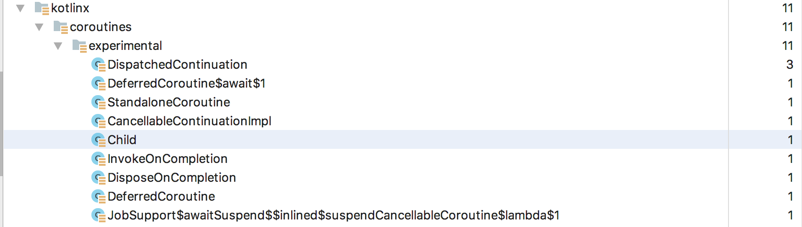

slidenumbers: true
autoscale: true
build-lists: true

## Скрипач не нужен: отказываемся от  RxJava в пользу корутин в Kotlin

---

# Disclaimer

Все сказанное здесь является продуктом боевого и исследовательского опыта. Возможны допущения, опечатки, неточности или ошибки. Проверяйте все сами.

---

# О докладчике

* Владимир Иванов(EPAM Systems)
* Android приложения: > 15 опубликованных, > 7 лет опыта
* Широкий интерес в мобильных технологиях

---

# .NET? 

---

# JS? 


---


---

# Async/await

---

```js
export const loginAsync = async (login, password) => {
    let auth = `Basic ${base64(login:password)}`
    try {
        let result = await fetch('https://api.github.com/user', auth)
        if (result.status === 200) {
            return { result.body }
        } else {
            return { error: `Failed to login with ${result.status}` }
        }
    } catch (error) {
        return { error: `Failed to login with ${error}` }
    }
}

```
---

# Легко читается?

---

# Kotlin может также!

---

# Что мы с вами делаем сейчас?

---

# Github login application

* Login to github
* Get user’s repositories

---


---



---



---


---


# RxJava 2 implementation

```kotlin

interface ApiClientRx {

	fun login(auth: Authorization) 
		: Single<GithubUser>
	fun getRepositories
		(reposUrl: String, auth: Authorization) 
		: Single<List<GithubRepository>>

}

```

---

# RxJava 2 implementation

```kotlin, [.highlight: 4, 7]

interface ApiClientRx {

	fun login(auth: Authorization) 
		: Single<GithubUser>
	fun getRepositories
		(reposUrl: String, auth: Authorization) 
		: Single<List<GithubRepository>>

}

```

---

# RxJava 2 implementation

```kotlin

	override fun login(auth: Authorization) 
		: Single<GithubUser?> = Single.fromCallable {
		val response = get("https://api.github.com/user", auth = auth)
		if (response.statusCode != 200) {
			throw RuntimeException("Incorrect login or password")
		}

		val jsonObject = response.jsonObject
		with(jsonObject) {
			return@with GithubUser(getString("login"), getInt("id"),
					getString("repos_url"), getString("name"))
		}
	}
```
---

# RxJava 2 implementation

```kotlin

	override fun getRepositories
		(repoUrl: String, authorization: Authorization)
		: Single<List<GithubRepository>> {

		return Single.fromCallable({
				toRepos(get(repoUrl, auth = authorization).jsonArray)
		})
	}
```
---

```kotlin
private fun attemptLoginRx() {
	showProgress(true)
	apiClient.login(auth)
			.flatMap { 
				user -> apiClient.getRepositories(user.repos_url, auth) 
			}
			.map { 
				list -> list.map { it.full_name } 
			}
			.subscribeOn(Schedulers.io())
			.observeOn(AndroidSchedulers.mainThread())
			.doFinally { showProgress(false) }
			.subscribe(
					{ list -> showRepositories(this, list)    },
					{ error -> Log.e("TAG", "Failed to show repos", error) }
			)
}

```

---

```kotlin, [.highlight: 3-6]

private fun attemptLoginRx() {
	showProgress(true)
	apiClient.login(auth)
			.flatMap { 
				user -> apiClient.getRepositories(user.repos_url, auth) 
			}
			.map { 
				list -> list.map { it.full_name } 
			}
			.subscribeOn(Schedulers.io())
			.observeOn(AndroidSchedulers.mainThread())
			.doFinally { showProgress(false) }
			.subscribe(
					{ list -> showRepositories(this, list)    },
					{ error -> Log.e("TAG", "Failed to show repos", error) }
			)

}

```

---


```kotlin, [.highlight: 7-9]

private fun attemptLoginRx() {
	showProgress(true)
	apiClient.login(auth)
			.flatMap { 
				user -> apiClient.getRepositories(user.repos_url, auth) 
			}
			.map { 
				list -> list.map { it.full_name } 
			}
			.subscribeOn(Schedulers.io())
			.observeOn(AndroidSchedulers.mainThread())
			.doFinally { showProgress(false) }
			.subscribe(
					{ list -> showRepositories(this, list)    },
					{ error -> Log.e("TAG", "Failed to show repos", error) }
			)

}
```

---

```kotlin, [.highlight: 10-19]

private fun attemptLoginRx() {
	showProgress(true)
	apiClient.login(auth)
			.flatMap { 
				user -> apiClient.getRepositories(user.repos_url, auth) 
			}
			.map { 
				list -> list.map { it.full_name } 
			}
			.subscribeOn(Schedulers.io())
			.observeOn(AndroidSchedulers.mainThread())
			.doFinally { showProgress(false) }
			.subscribe(
					{ list -> showRepositories(this, list)    },
					{ error -> Log.e("TAG", "Failed to show repos", error) }
			)
}

```

---

# Сложности?

---

# Сложности?

* Большое количество обьектов под капотом
* Неясный стектрейс
* Крутая кривая обучения

---


---

```kotlin

// new SingleFlatMap()
val flatMap = apiClient.login(auth)
		.flatMap { apiClient.getRepositories(it.repos_url, auth) }
// new SingleMap
val map = flatMap
		.map { list -> list.map { it.full_name } }
// new SingleSubscribeOn
val subscribeOn = map
		.subscribeOn(Schedulers.io())
// new SingleObserveOn
val observeOn = subscribeOn
		.observeOn(AndroidSchedulers.mainThread())
// new SingleDoFinally
val doFinally = observeOn
		.doFinally { showProgress(false) }
// new ConsumerSingleObserver
val subscribe = doFinally
		.subscribe(
				{ list -> showRepositories(this, list) },
				{ error -> Log.e("TAG", "Failed to show repos", error) }
		)
	}

```

---

```kotlin
   
at com.epam.talks.github.model.ApiClientRx$ApiClientRxImpl$login$1.call(ApiClientRx.kt:16)
   at io.reactivex.internal.operators.single.SingleFromCallable.subscribeActual(SingleFromCallable.java:44)
   at io.reactivex.Single.subscribe(Single.java:3096)
   at io.reactivex.internal.operators.single.SingleFlatMap.subscribeActual(SingleFlatMap.java:36)
   at io.reactivex.Single.subscribe(Single.java:3096)
   at io.reactivex.internal.operators.single.SingleMap.subscribeActual(SingleMap.java:34)
   at io.reactivex.Single.subscribe(Single.java:3096)
   at io.reactivex.internal.operators.single.SingleSubscribeOn$SubscribeOnObserver.run(SingleSubscribeOn.java:89)
   at io.reactivex.Scheduler$DisposeTask.run(Scheduler.java:463)
   at io.reactivex.internal.schedulers.ScheduledRunnable.run(ScheduledRunnable.java:66)
   at io.reactivex.internal.schedulers.ScheduledRunnable.call(ScheduledRunnable.java:57)
   at java.util.concurrent.FutureTask.run(FutureTask.java:266)
   at java.util.concurrent.ScheduledThreadPoolExecutor$ScheduledFutureTask.run(ScheduledThreadPoolExecutor.java:301)
   at java.util.concurrent.ThreadPoolExecutor.runWorker(ThreadPoolExecutor.java:1162)
   at java.util.concurrent.ThreadPoolExecutor$Worker.run(ThreadPoolExecutor.java:636)
   at java.lang.Thread.run(Thread.java:764)
	
```

---


---

# Корутины в Котлине

* Доступны с kotlin 1.1
* Статус experimental, но апи стабилизировано

---

# Реализация на корутинах

```kotlin

interface ApiClient {

	fun login(auth: Authorization) 
		: Deferred<GithubUser>
	fun getRepositories
		(reposUrl: String, auth: Authorization) 
		: Deferred<List<GithubRepository>>

}

```


---

# Реализация на корутинах

```kotlin, [.highlight: 4,7]

interface ApiClient {

	fun login(auth: Authorization) 
		: Deferred<GithubUser>
	fun getRepositories
		(reposUrl: String, auth: Authorization) 
		: Deferred<List<GithubRepository>>

}

```
---

```kotlin

private fun attemptLogin() {
	launch(UI) {
		val auth = BasicAuthorization(login, pass)
		try {
			showProgress(true)
			val userInfo = apiClient.login(auth).await()
			val repoUrl = userInfo.repos_url
			val list = apiClient.getRepositories(repoUrl, auth).await()
			showRepositories(
				this, 
				list.map { it -> it.full_name }
			)
		} catch (e: RuntimeException) {
			showToast("Oops!")
		} finally {
			showProgress(false)
		}
	}
}


```
---

```kotlin, [.highlight: 2, 6, 8]

private fun attemptLogin() {
	launch(UI) {
		val auth = BasicAuthorization(login, pass)
		try {
			showProgress(true)
			val userInfo = apiClient.login(auth).await()
			val repoUrl = userInfo.repos_url
			val list = apiClient.getRepositories(repoUrl, auth).await()
			showRepositories(
				this, 
				list.map { it -> it.full_name }
			)
		} catch (e: RuntimeException) {
			showToast("Oops!")
		} finally {
			showProgress(false)
		}
	}
}

```
---

# Плюсы

* Легко читается, ибо
* Асинхронный код написан в direct-стиле
* Обработка ошибок, как для синхронного кода(try-catch-finally)

---

# Как насчет минусов RxJava?

---


# Обьекты?

---



---

# 19 -> 11

---

# Стектрейс?

---

```kotlin

at com.epam.talks.github.model.ApiClient$ApiClientImpl$login$1.doResume(ApiClient.kt:27)
   at kotlin.coroutines.experimental.jvm.internal.CoroutineImpl.resume(CoroutineImpl.kt:54)
   at kotlinx.coroutines.experimental.DispatchedTask$DefaultImpls.run(Dispatched.kt:161)
   at kotlinx.coroutines.experimental.DispatchedContinuation.run(Dispatched.kt:25)
   at java.util.concurrent.ForkJoinTask$RunnableExecuteAction.exec(ForkJoinTask.java:1412)
   at java.util.concurrent.ForkJoinTask.doExec(ForkJoinTask.java:285)
   at java.util.concurrent.ForkJoinPool$WorkQueue.runTask(ForkJoinPool.java:1152)
   at java.util.concurrent.ForkJoinPool.scan(ForkJoinPool.java:1990)
   at java.util.concurrent.ForkJoinPool.runWorker(ForkJoinPool.java:1938)
   at java.util.concurrent.ForkJoinWorkerThread.run(ForkJoinWorkerThread.java:157)

```

---

| RxJava 2 | Coroutines |
| --- | --- |
| at com.epam.talks.github.model.ApiClientRx$ApiClientRxImpl$login$1.call(ApiClientRx.kt:16)io.reactivex.internal.operators.single.SingleFromCallable.subscribeActual(SingleFromCallable.java:44)io.reactivex.Single.subscribe(Single.java:3096)io.reactivex.internal.operators.single.SingleFlatMap.subscribeActual(SingleFlatMap.java:36)io.reactivex.Single.subscribe(Single.java:3096)io.reactivex.internal.operators.single.SingleMap.subscribeActual(SingleMap.java:34)io.reactivex.Single.subscribe(Single.java:3096)io.reactivex.internal.operators.single.SingleSubscribeOn$SubscribeOnObserver.run(SingleSubscribeOn.java:89)io.reactivex.Scheduler$DisposeTask.run(Scheduler.java:463)io.reactivex.internal.schedulers.ScheduledRunnable.run(ScheduledRunnable.java:66)io.reactivex.internal.schedulers.ScheduledRunnable.call(ScheduledRunnable.java:57)java.util.concurrent.FutureTask.run(FutureTask.java:266)java.util.concurrent.ScheduledThreadPoolExecutor$ScheduledFutureTask.run(ScheduledThreadPoolExecutor.java:301)java.util.concurrent.ThreadPoolExecutor.runWorker(ThreadPoolExecutor.java:1162)java.util.concurrent.ThreadPoolExecutor$Worker.run(ThreadPoolExecutor.java:636)java.lang.Thread.run(Thread.java:764) | at com.epam.talks.github.model.ApiClient$ApiClientImpl$login$1.doResume(ApiClient.kt:27) kotlin.coroutines.experimental.jvm.internal.CoroutineImpl.resume(CoroutineImpl.kt:54) kotlinx.coroutines.experimental.DispatchedTask$DefaultImpls.run(Dispatched.kt:161) kotlinx.coroutines.experimental.DispatchedContinuation.run(Dispatched.kt:25) java.util.concurrent.ForkJoinTask$RunnableExecuteAction.exec(ForkJoinTask.java:1412) java.util.concurrent.ForkJoinTask.doExec(ForkJoinTask.java:285) java.util.concurrent.ForkJoinPool$WorkQueue.runTask(ForkJoinPool.java:1152) java.util.concurrent.ForkJoinPool.scan(ForkJoinPool.java:1990) java.util.concurrent.ForkJoinPool.runWorker(ForkJoinPool.java:1938) java.util.concurrent.ForkJoinWorkerThread.run(ForkJoinWorkerThread.java:157) | 

---

# Прямой стиль кода

```kotlin, [.highlight: 5, 11, 9, 13]

private fun attemptLogin() {
	launch(UI) {
		val auth = BasicAuthorization(login, pass)
		try {
			showProgress(true)
			val userInfo = login(auth).await()
			val repoUrl = userInfo!!.repos_url
			val list = getRepositories(repoUrl, auth).await()
			showRepositories(this, list.map { it -> it.full_name })
		} catch (e: RuntimeException) {
			showToast("Oops!")
		} finally {
			showProgress(false)
		}
	}
}


```

---

## Обработка ошибок средствами языка(не методами библиотеки)

```kotlin, [.highlight: 4,10-14]

private fun attemptLogin() {
	launch(UI) {
		val auth = BasicAuthorization(login, pass)
		try {
			showProgress(true)
			val userInfo = login(auth).await()
			val repoUrl = userInfo!!.repos_url
			val list = getRepositories(repoUrl, auth).await()
			showRepositories(this, list.map { it -> it.full_name })
		} catch (e: RuntimeException) {
			showToast("Oops!")
		} finally {
			showProgress(false)
		}
	}
}


```
---

## Использование stdlib

```kotlin, [.highlight: 5,7,8-10]
launch(UI) {
	showProgress(true)
	val auth = BasicAuthorization(login, pass)
	try {
		val userInfo = apiClient.login(auth).await()
		val repoUrl = userInfo!!.repos_url
		val repos = apiClient.getRepositories(repoUrl, auth).await()
		repeat(list.size, {
			apiClient.getRepoFollowers().await()
		})
		showRepositories(this, repos!!.map { it -> it.full_name })
	} catch (e: RuntimeException) {
		showToast("Oops!")
	} finally {
		showProgress(false)
	}
}

```
---

# Реализация асинхронной функции

```kotlin
override fun login(auth: Authorization) : Deferred<GithubUser?> = async {
	val response = get("https://api.github.com/user", auth = auth)
	if (response.statusCode != 200) {
		throw RuntimeException("Incorrect login or password")
	}

	val jsonObject = response.jsonObject
	with (jsonObject) {
		return@async GithubUser(getString("login"), getInt("id"),
				getString("repos_url"), getString("name"))
	}
}
```
---

# Реализация асинхронной функции

```kotlin, [.highlight: 2-11]
override fun login(auth: Authorization) : Deferred<GithubUser?> = async {
	val response = get("https://api.github.com/user", auth = auth)
	if (response.statusCode != 200) {
		throw RuntimeException("Incorrect login or password")
	}

	val jsonObject = response.jsonObject
	with (jsonObject) {
		return@async GithubUser(getString("login"), getInt("id"),
				getString("repos_url"), getString("name"))
	}
}
```
---

# Использование ФВП Async

```kotlin
fun login(...) : Deferred<GithubUser?> = async {
		

        return@async GithubUser(…)
}

```


---

# Что такое Async?

---

# Билдер для корутины


* launch
* async
* runBlocking
* withContext

---

# Launch возвращает Job

```kotlin 

interface Job : CoroutineContext.Element {

	public val isActive: Boolean
    public val isCompleted: Boolean
    public val isCancelled: Boolean
    public fun getCancellationException(): CancellationException
    public fun start(): Boolean
}

```
---

# Async возвращает Deferred<T>

```kotlin

public actual interface Deferred<out T> : Job {

	public suspend fun await(): T
}

```

---

# Deferred это Future


---


---

# Deferred is Future

---


---


# Deferred is Future

* неблокирующее
* отменяемое

---

## Await - extension-функция

---

## Await - extension-функция

* Как Future.get(), только неблокирующая

---

# Suspension

---


---


---


---

# Suspending

* приостановка выполнения
* то есть, выполнение может быть восстановлено
* Приостановка случается только в определенных местах
* При вызове функций с  модификатором ```suspend```!


---

# Где же suspend?


---

```kotlin

public expect fun <T> async(
    context: CoroutineContext = DefaultDispatcher,
    start: CoroutineStart = CoroutineStart.DEFAULT,
    parent: Job? = null,
    block: suspend CoroutineScope.() -> T
): Deferred<T>


```
---

```kotlin, [.highlight: 5]

public expect fun <T> async(
    context: CoroutineContext = DefaultDispatcher,
    start: CoroutineStart = CoroutineStart.DEFAULT,
    parent: Job? = null,
    block: suspend CoroutineScope.() -> T
): Deferred<T>


```
---

# Отмена

---

## Отмена всегда кооперативна

---

# RxJava 2

---
 
## Отмена в RxJava в целом ок, но может требовать доступ к текущей подписке

---

## Отмена в корутинах тоже ок

---


## Как проверить отмену?

---

```kotlin
launch(UI) {
	showProgress(true)
	…
	try {
		val userInfo = apiClient.login(auth).await()
		if (!isActive) {
			return@launch
		}
	…
}
```
---

```kotlin, [.highlight: 6-9]
launch(UI) {
	showProgress(true)
	…
	try {
		val userInfo = apiClient.login(auth).await()
		if (!isActive) {
			return@launch
		}
	…
}
```

---

# Пишем тесты!

---

# Тест на RxJava

```kotlin

	@Test
	fun login() {
		val apiClientImpl = ApiClientRx.ApiClientRxImpl()
		val genericResponse = mockLoginResponse()

		staticMockk("khttp.KHttp").use {
			every { get("https://api.github.com/user", auth = any()) } 
				returns genericResponse

			val githubUser =
					apiClientImpl
							.login(BasicAuthorization("login", "pass"))

			githubUser.subscribe({ githubUser ->
				assertNotNull(githubUser)
				assertEquals("name", githubUser.name)
				assertEquals("url", githubUser.repos_url)
			})

		}
	}
```
---

# Тест на RxJava

```kotlin

	@Test
	fun login() {
		…

			val githubUser =
					apiClientImpl
							.login(BasicAuthorization("login", "pass"))

			githubUser.subscribe({ githubUser ->
				assertNotNull(githubUser)
				assertEquals("name", githubUser.name)
				assertEquals("url", githubUser.repos_url)
			})

		…
	}
```

---

# Тест на корутины

```kotlin
@Test
fun login() {
	val apiClientImpl = ApiClient.ApiClientImpl()
	val genericResponse = mockLoginResponse()

	staticMockk("khttp.KHttp").use {
		every { get("https://api.github.com/user", auth = any()) } 
			returns genericResponse

		runBlocking {
			val githubUser =
					apiClientImpl
						.login(BasicAuthorization("login", "pass"))
						.await()

			assertNotNull(githubUser)
			assertEquals("name", githubUser.name)
			assertEquals("url", githubUser.repos_url)
		}
	}
}
```
---

# Тест на корутины

```kotlin, [.highlight: 4,12]
@Test
fun login() {
…
	runBlocking {
		val githubUser =
			apiClientImpl
				.login(BasicAuthorization("login", "pass"))
				.await()

		
		assertEquals("name", githubUser.name)
	}
}
	
```
---

# Тест на корутины

```kotlin, [.highlight: 4,12, 6-8]
@Test
fun login() {
…
	runBlocking {
		val githubUser =
			apiClientImpl
				.login(BasicAuthorization("login", "pass"))
				.await()

		
		assertEquals("name", githubUser.name)
	}
}
	
```

---

## Тесты пока выглядят одинаково

---

## А можно лучше?


---

``` kotlin
interface SuspendingApiClient {


	suspend fun login(auth: Authorization) 
		: GithubUser

	suspend fun getRepositories(reposUrl: String, auth: Authorization) 
		: List<GithubRepository>

	suspend fun searchRepositories(searchQuery: String) 
		: List<GithubRepository>


}
```

---

``` kotlin
class SuspendingApiClientImpl : SuspendingApiClient {

	override suspend fun searchRepositories(query: String) 
			: List<GithubRepository> =

			get("https://api.github.com/search/repositories?q=${query}")
			.jsonObject
			.getJSONArray("items")
			.toRepos()
}
```
---

``` kotlin, [.highlight: 7, 9]
private fun attemptLoginSuspending() {
	val apiClient = SuspendingApiClient.SuspendingApiClientImpl()
	launch(UI) {
		showProgress(true)
		val auth = BasicAuthorization(login, pass)
		try {
			val userInfo = async { apiClient.login(auth) }.await()
			val repoUrl = userInfo!!.repos_url
			val list = async { apiClient.getRepositories(repoUrl, auth) }.await()
			showRepositories(this, list!!.map { it -> it.full_name })
		} catch (e: RuntimeException) {
			showToast("Oops!")
		} finally {
			showProgress(false)
		}
	}
}
```

---

```kotlin
@Test
fun login() = runBlocking {
	val apiClientImpl = SuspendingApiClient.SuspendingApiClientImpl()
	val genericResponse = mockLoginResponse()

	staticMockk("khttp.KHttp").use {
		every { get("https://api.github.com/user", auth = any()) } 
			returns genericResponse

		val githubUser =
				apiClientImpl
					.login(BasicAuthorization("login", "pass"))

		assertNotNull(githubUser)
		assertEquals("name", githubUser.name)
		assertEquals("url", githubUser.repos_url)
	}
}
```

---

```kotlin, [.highlight: 2, 10-16]
@Test
fun login() = runBlocking {
	val apiClientImpl = SuspendingApiClient.SuspendingApiClientImpl()
	val genericResponse = mockLoginResponse()

	staticMockk("khttp.KHttp").use {
		every { get("https://api.github.com/user", auth = any()) } 
			returns genericResponse

		val githubUser =
				apiClientImpl
					.login(BasicAuthorization("login", "pass"))

		assertNotNull(githubUser)
		assertEquals("name", githubUser.name)
		assertEquals("url", githubUser.repos_url)
	}
}
```
---

```kotlin

@Test
fun testLogin() = runBlocking {
	val apiClient = mockk<SuspendingApiClient.SuspendingApiClientImpl>()
	val githubUser = GithubUser("login", 1, "url", "name")
	val repositories = GithubRepository(1, "repos_name", "full_repos_name")

	coEvery { apiClient.login(any()) } returns githubUser
	coEvery { apiClient.getRepositories(any(), any()) } returns Arrays.asList(repositories)

	val loginPresenterImpl = SuspendingLoginPresenterImpl(apiClient, CommonPool)
	runBlocking {
		val repos = loginPresenterImpl.doLogin("login", "password")
		assertNotNull(repos)
	}
}

```
---

```kotlin, [.highlight: 7,8]

@Test
fun testLogin() = runBlocking {
	val apiClient = mockk<SuspendingApiClient.SuspendingApiClientImpl>()
	val githubUser = GithubUser("login", 1, "url", "name")
	val repositories = GithubRepository(1, "repos_name", "full_repos_name")

	coEvery { apiClient.login(any()) } returns githubUser
	coEvery { apiClient.getRepositories(any(), any()) } returns Arrays.asList(repositories)

	val loginPresenterImpl = SuspendingLoginPresenterImpl(apiClient, CommonPool)
	runBlocking {
		val repos = loginPresenterImpl.doLogin("login", "password")
		assertNotNull(repos)
	}
}

```

---

```kotlin, [.highlight: 9-14]

@Test
fun testLogin() = runBlocking {
	val apiClient = mockk<SuspendingApiClient.SuspendingApiClientImpl>()
	val githubUser = GithubUser("login", 1, "url", "name")
	val repositories = GithubRepository(1, "repos_name", "full_repos_name")

	coEvery { apiClient.login(any()) } returns githubUser
	coEvery { apiClient.getRepositories(any(), any()) } returns Arrays.asList(repositories)

	val loginPresenterImpl = SuspendingLoginPresenterImpl(apiClient, CommonPool)
	runBlocking {
		val repos = loginPresenterImpl.doLogin("login", "password")
		assertNotNull(repos)
	}
}

```
---

# Mockk

```kotlin

coEvery { 
	apiClient.login(any()) 
} returns githubUser

```

---

# Mockito-kotlin
```kotlin

given { 
	runBlocking { 
		apiClient.login(any()) 
	} 
}.willReturn (githubUser)

```
---


# Промежуточные итоги

* Стектрейс стал меньше, но все равно неясный
* Объектов под капотом создается меньше
* Код проще писать
* Интерфейс чище
* Тесты чище

---


---

## Лирическое отступление

---

## Обработка ошибок

---

## Обработка ошибок
* По умолчанию исключение в корутине роняет приложение
* Если это нежелательно, то нужно менять контекст

---

## CoroutineExceptionHandler

```kotlin

val errorHandler = CoroutineExceptionHandler { _, e -> 
    // Handle the exception gracefully
}

```

---

## CoroutineExceptionHandler

```kotlin

val errorHandler = CoroutineExceptionHandler { _, e -> 
    // Handle the exception gracefully
}

val context = UI + errorHandler

launch(UI) {
	…
}

```

---


---

## Зачем нужна RxJava?

---


---

# Реализация поиска с RxJava 2

```kotlin

publishSubject
	.debounce(300, TimeUnit.MILLISECONDS)
	.distinctUntilChanged()
	.switchMap { 
		searchQuery -> apiClientRxImpl.searchRepositories(searchQuery) 
	}
	.subscribeOn(Schedulers.io())
	.observeOn(AndroidSchedulers.mainThread())
	.subscribe({
		repos.adapter = ReposAdapter(
			it.map { it.full_name },
			this@RepositoriesActivity)
	})

```
---

# Реализация поиска с RxJava 2

```kotlin, [.highlight: 5]

publishSubject
	.debounce(300, TimeUnit.MILLISECONDS)
	.distinctUntilChanged()
	.switchMap { 
		searchQuery -> apiClientRxImpl.searchRepositories(searchQuery) 
	}
	.subscribeOn(Schedulers.io())
	.observeOn(AndroidSchedulers.mainThread())
	.subscribe({
		repos.adapter = ReposAdapter(
			it.map { it.full_name },
			this@RepositoriesActivity)
	})

```
---

# Реализация поиска с RxJava 2

```kotlin, [.highlight: 9-13]

publishSubject
	.debounce(300, TimeUnit.MILLISECONDS)
	.distinctUntilChanged()
	.switchMap { 
		searchQuery -> apiClientRxImpl.searchRepositories(searchQuery) 
	}
	.subscribeOn(Schedulers.io())
	.observeOn(AndroidSchedulers.mainThread())
	.subscribe({
		repos.adapter = ReposAdapter(
			it.map { it.full_name },
			this@RepositoriesActivity)
	})

```
---

# Что классно?

---

# Реализация поиска с RxJava 2

```kotlin, [.highlight: 2-4]

publishSubject
	.debounce(300, TimeUnit.MILLISECONDS)
	.distinctUntilChanged()
	.switchMap { 
		searchQuery -> apiClientRxImpl.searchRepositories(searchQuery) 
	}
	.subscribeOn(Schedulers.io())
	.observeOn(AndroidSchedulers.mainThread())
	.subscribe({
		repos.adapter = ReposAdapter(
			it.map { it.full_name },
			this@RepositoriesActivity)
	})

```

---

# Корутины тоже могут… 

---

# …с каналами

---

# Реализация поиска с каналами

```kotlin

launch(UI) {
	broadcast.consumeEach {
		delay(300)
		val foundRepositories = 
				apiClient.searchRepositories(it).await()
		repos.adapter = ReposAdapter(
							foundRepositories.map { it.full_name },
							this@RepositoriesActivity
		)
	}
}

```
---

# Реализация поиска с каналами

```kotlin, [.highlight: 4,5]

launch(UI) {
	broadcast.consumeEach {
		delay(300)
		val foundRepositories = 
				apiClient.searchRepositories(it).await()
		repos.adapter = ReposAdapter(
							foundRepositories.map { it.full_name },
							this@RepositoriesActivity
		)
	}
}

```
---


# Реализация поиска с каналами

```kotlin, [.highlight: 6-9]

launch(UI) {
	broadcast.consumeEach {
		delay(300)
		val foundRepositories = 
				apiClient.searchRepositories(it).await()
		repos.adapter = ReposAdapter(
							foundRepositories.map { it.full_name },
							this@RepositoriesActivity
		)
	}
}

```
---

# Что такое броадкаст? 

---

# Реализация поиска с каналами

```kotlin, [.highlight: 2]

launch(UI) {
	broadcast.consumeEach {
		delay(300)
		val foundRepositories = 
				apiClient.searchRepositories(it).await()
		repos.adapter = ReposAdapter(
							foundRepositories.map { it.full_name },
							this@RepositoriesActivity
		)
	}
}

```
---

```kotlin

val broadcast = ConflatedBroadcastChannel<String>()


```
---

```kotlin

val broadcast = ConflatedBroadcastChannel<String>()

searchQuery.addTextChangedListener(object: TextWatcher {

	override fun afterTextChanged(text: Editable?) {
			broadcast.offer(text.toString())
		}
	})
}

```

---

# Вопросы к этому коду


---

* Что за каналы?
* Что за BroadcastChannel?
* Что за conflated ?

---

# Что за каналы?

---


---

## Канал - блокирующая очередь 

---

## но не совсем

---

| BlockingQueue | Channel |
| --- | --- |
| put | send | 
| take | receive | 

---

```kotlin

public suspend fun send(element: E)

public suspend fun receive(): E

```

---

## BroadcastChannel?

---

## BroadcastChannel - Subject

---

## но не совсем


---

| Subject | BroadcastChannel |
| --- | --- |
| `Subject<T> extends Observable<T> implements Observer<T>` | `BroadcastChannel<E> : SendChannel<E>` | 
| - | `public fun openSubscription(): SubscriptionReceiveChannel<E>` |

---

## Что такое conflated channel?

---

## BroadcastChannel, но с потерей элементов

---

TBD: add more code examples for channels

---

## Неубедительно! Скрипач нужен!


---

## Неубедительно! Скрипач нужен!?[^1]

[^1]: конечно, нужен, вы же не можете заменить огромную либу одной фичей языка

---

## Kotlin корутины на самом деле поддерживают Rx…

---

## c kotlinx-coroutines-rx2 

---

| Name	| Result	| Scope	| Description | 
| --- | --- | --- | --- |
| rxCompletable	| Completable	| CoroutineScope	| Cold completable that starts coroutine on subscribe | 
| rxMaybe	| Maybe	| CoroutineScope | 	Cold maybe that starts coroutine on subscribe | 
| rxSingle	| Single	| CoroutineScope | Cold single that starts coroutine on subscribe | 
| rxObservable	| Observable	| ProducerScope	| Cold observable that starts coroutine on subscribe | 
| rxFlowable	| Flowable	| ProducerScope | 	Cold observable that starts coroutine on subscribe with backpressure support | 

---

| Name	| Description| 
| --- | --- |
| Job.asCompletable	| Converts job to hot completable| 
| Deferred.asSingle	| Converts deferred value to hot single| 
| ReceiveChannel.asObservable	| Converts streaming channel to hot observable| 
| Scheduler.asCoroutineDispatcher	| Converts scheduler to CoroutineDispatcher| 

---

## Где применимы конвертеры?

---

* Использование библиотек с Rx-адаптером
* Написание библиотек на корутиных для использования в приложениях, построенных на Rx

---

# Links

* https://github.com/Kotlin/kotlinx.coroutines :computer:
* https://github.com/vlivanov/github-kotlin-coroutines :computer:
* https://twitter.com/vvsevolodovich :bird:
* https://medium.com/@dzigorium :pencil:

