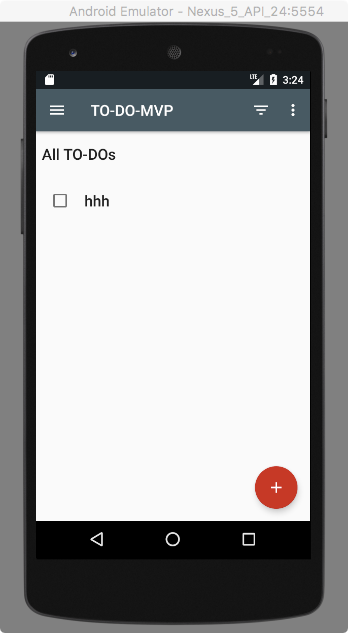

## Kotlin couroutines: Android Async v.5

---

# About me

* Vladimir Ivanov - Lead Software Engineer in EPAM
* Android apps: > 15 published, > 7 years
* Wide expertise in Mobile

---

# .NET? 

---

# JS? 


---


---

# Async/await

---

## Let’s start with practical thing

---

# Android architecture examples

```kotlin

interface TasksDataSource {

    interface LoadTasksCallback {
        fun onTasksLoaded(tasks: List<Task>)
        fun onDataNotAvailable()
    }

    interface GetTaskCallback {
        fun onTaskLoaded(task: Task)
        fun onDataNotAvailable()
    }

    fun getTasks(callback: LoadTasksCallback)
    fun getTask(taskId: String, callback: GetTaskCallback)
…
}


```

---

# Android architecture examples

```kotlin

interface TasksDataSource {

    suspend fun getTasks(): List<Task>?
    suspend fun getTask(taskId: String): Task?
	…
}

```

---

# Suspension

---


---


---


---

# Suspending

* means pause of executing
* which means ability to resume
* But suspend may happen only in predefined places
* When calling functions with ```suspend``` modifier!

---

## Google architecture kotlin-todo-mvp


---




---

# Let’s code

```kotlin

interface TasksDataSource {

	fun getTasks(callback: LoadTasksCallback)

}

```
---

# TaskRepository

```kotlin
    override fun getTasks(callback: TasksDataSource.LoadTasksCallback) {
        // Respond immediately with cache if available and not dirty
        if (cachedTasks.isNotEmpty() && !cacheIsDirty) {
            callback.onTasksLoaded(ArrayList(cachedTasks.values))
            return
        }

        if (cacheIsDirty) {
            // If the cache is dirty we need to fetch new data from the network.
            getTasksFromRemoteDataSource(callback)
        } else {
            // Query the local storage if available. If not, query the network.
            tasksLocalDataSource.getTasks(object : TasksDataSource.LoadTasksCallback {
                override fun onTasksLoaded(tasks: List<Task>) {
                    refreshCache(tasks)
                    callback.onTasksLoaded(ArrayList(cachedTasks.values))
                }

                override fun onDataNotAvailable() {
                    getTasksFromRemoteDataSource(callback)
                }
            })
        }
    }

```
---

# TaskRepository

```kotlin
    override fun getTasks(callback: TasksDataSource.LoadTasksCallback) {

        tasksLocalDataSource.getTasks(object : TasksDataSource.LoadTasksCallback {
            override fun onTasksLoaded(tasks: List<Task>) {
                refreshCache(tasks)
                callback.onTasksLoaded(ArrayList(cachedTasks.values))
            }

            override fun onDataNotAvailable() {
                getTasksFromRemoteDataSource(callback)
            }
        })
        
    }

```

---

# Let’s code

```kotlin
    override fun getTasks(callback: LoadTasksCallback) {

        if (cachedTasks.isNotEmpty() && !cacheIsDirty) {
            callback.onTasksLoaded(ArrayList(cachedTasks.values))
            return
        }

    }

```
---

# Let’s code

```kotlin
   override suspend fun getTasks() : List<Task> {
 
        if (cachedTasks.isNotEmpty() && !cacheIsDirty) {
            return ArrayList(cachedTasks.values))
        }
   }

```
---

# Let’s code

```kotlin, [.highlight: 1-4]
        if (cacheIsDirty) {
            // If the cache is dirty we need to fetch new data from the network.
            return getTasksFromRemoteDataSource()
        } else {
            // Query the local storage if available. If not, query the network.
            var tasks : List<Task>
            try {
                tasks = tasksLocalDataSource.getTasks()
            } catch (e : DataNotAvailableException) {
                tasks = tasksRemoteDataSource.getTasks()
            }
            refreshCache(tasks)
            return tasks
        }

```
---

# Let’s code

```kotlin, [.highlight: 5-14]
        if (cacheIsDirty) {
            // If the cache is dirty we need to fetch new data from the network.
            return getTasksFromRemoteDataSource()
        } else {
            // Query the local storage if available. If not, query the network.
            var tasks : List<Task>
            try {
                tasks = tasksLocalDataSource.getTasks()
            } catch (e : DataNotAvailableException) {
                tasks = tasksRemoteDataSource.getTasks()
            }
            refreshCache(tasks)
            return tasks
        }

```

---

# Local Repository

```kotlin, [.highlight: 1-15]

    override suspend fun getTasks(): List<Task> {
        return async {
            return@async tasksDao.getTasks()
        }.await()
    }

```
---

# Local Repository

```kotlin, [.highlight: 3]

    override suspend fun getTasks(): List<Task> {
        return async {
            return@async tasksDao.getTasks()
        }.await()
    }

```

---

# Coroutine builders

```kotlin
launch
async
runBlocking

```


---

## Coroutine builders - for coroutine context

```kotlin 
public interface CoroutineContext {

	public operator fun <E : Element> get(key: Key<E>): E?
	public fun <R> fold(initial: R, operation: (R, Element) -> R): R
	public operator fun plus(context: CoroutineContext): CoroutineContext
	public fun minusKey(key: Key<*>): CoroutineContext
}
```

---

## Coroutine Context


---

## Launch returns Job

---

# Job

```kotlin

public actual interface Job : CoroutineContext.Element {

	public actual fun start(): Boolean
	public actual fun cancel(cause: Throwable? = null): Boolean
	public actual suspend fun join()
}

```

---

# Async returns Deferred<T>

```kotlin

public actual interface Deferred<out T> : Job {
}

```

---

# Deffered is Future

---

# Deffered is Future

* Non-blocking
* Cancellable


---

# Local Repository

```kotlin

    override suspend fun getTasks(): List<Task> {
        return async {
            return@async tasksDao.getTasks()
        }.await()
    }

```

---

## Await - extension function


