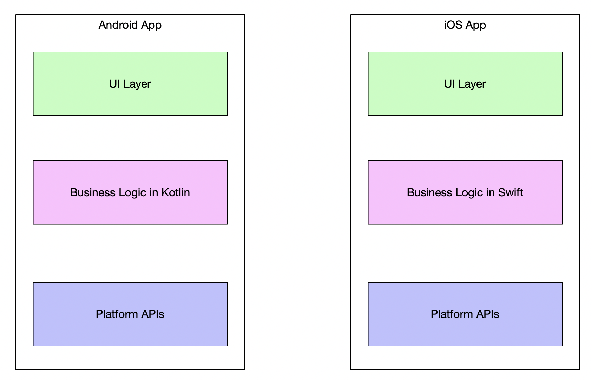
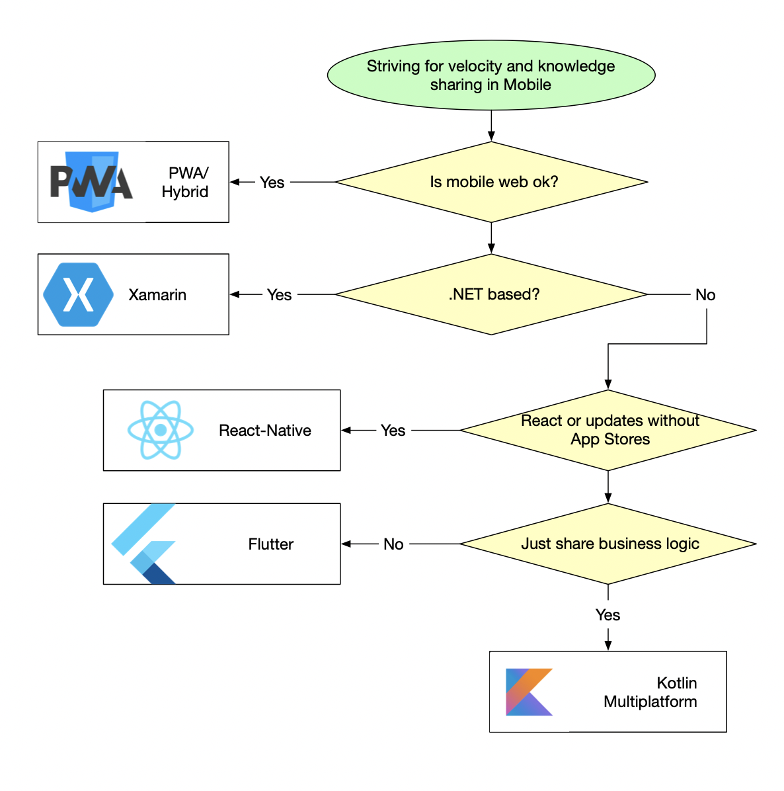

slidenumbers: true
autoscale: true
build-lists: true
footer: @vvsevolodovich

---

# [fit] Vladimir Ivanov

* Solution Architect @ EPAM Systems
* Certified Google Cloud Architect
* Experience with native Android, React-Native, Flutter, etc.

---

# Today we learn

* Why choosing cross-platform 
* Differences between the technologies
* How to decide

---

# Jane

## [fit] Solution Architect

---

# A new learning applicaton

* Rich animation
* Play audios and videos
* Record audio input

---

# We need

* Knowledge sharing between platforms
* High velocity
* Streamlined staffing
* Potentially going web

---

---

---

# Pros

* Single Team :thumbsup:
* Only web skills :thumbsup:
* Easy to staff :thumbsup:
* Web out of the box :thumbsup:

---

# Cons

* Storage limited to 5 MB :thumbsdown:
* No Push Notifications on iOS :thumbsdown:
* Suboptimal UX :thumbsdown:
* Limited service worker support :thumbsdown:
* People are searching for apps in stores :thumbsdown:  

---

---

# Privacy

---

---

# [fit] a site inside WebView hosted in native application

---

# Frameworks

* Appcelerator
* Ionic
* Apache Cordova

---

# Pros 

* High velocity :thumbsup:
* True cross platform :thumbsup:
* Potentially all the native capabilities are available :thumbsup:

---

# Cons

* Suboptimal UX(it's still web!)
* Narrow community

---

# Native Cross-platform

* Xamarin
* React-Native 
* Flutter

---

# Xamarin

---

# Xamarin

## [fit] .NET based

---

* Xamarin Forms -> MAUI
* Xamarin -> .NET 5.0

---

---

# Pros 

* Easy to learn for Microsoft technologies-oriented companies :thumbsup:
* Truly cross-platform :thumbsup:
* Possibilty for code sharing with desktop apps :thumbsup:

---

# Cons

* custom tooling :thumbsdown:
* limitation to Xamarin libraries :thumbsdown:
* Bundle size increased with mono runtime :thumbsdown:

---

## [fit] .NET doesn't sound amazing

---

---

# React-Native

* JS/TS
* 90k :star:
* Used by half a million of repositories

---

---

# Pros 

* Wide community :thumbsup:
* Used by Skype, Discord, Shopify, Uber Eats, Artsy etc. :thumbsup:
* Usage of React :thumbsup:
* Integration with native capabilities :thumbsup:

---

# Cons

* Startup time[^1] :thumbsdown:
* Implementation of app extensions and background work requires native code :thumbsdown:
* Internal rearchitecture :thumbsdown:

[^1]: should be addressed by Hermes JS VM

---

---

# Flutter

* Dart
* High Google Support
* 100k :star: 

---

# Kotlin Multiplatform

---

---

---

# Pros

* Natural for Android Devs :thumbsup:
* Can be read by iOS devs :thumbsup:
* Single tooling for Android&iOS :thumbsup:
* Shared on Android, iOS&Web :thumbsup:

---

# Cons

* Very young technology(Alpha)[^2] :thumbsdown:
* Only business logic can be shared, not UI :thumbsdown:

[^2]:https://kotlinlang.org/docs/reference/evolution/components-stability.html

---

# Decision Tree

---

---

# Take aways

* Different options of sharing code
* No one-size-fits-all
* Choose wisely

---

# [fit] Vladimir Ivanov

* https://vvsevolodovich.dev :pencil:
* https://twitter.com/vvsevolodovich :bird:

