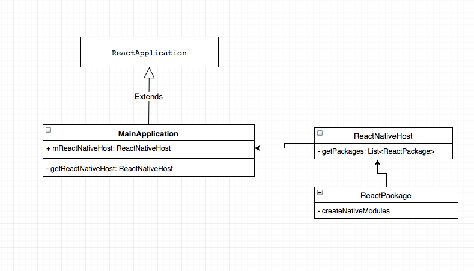
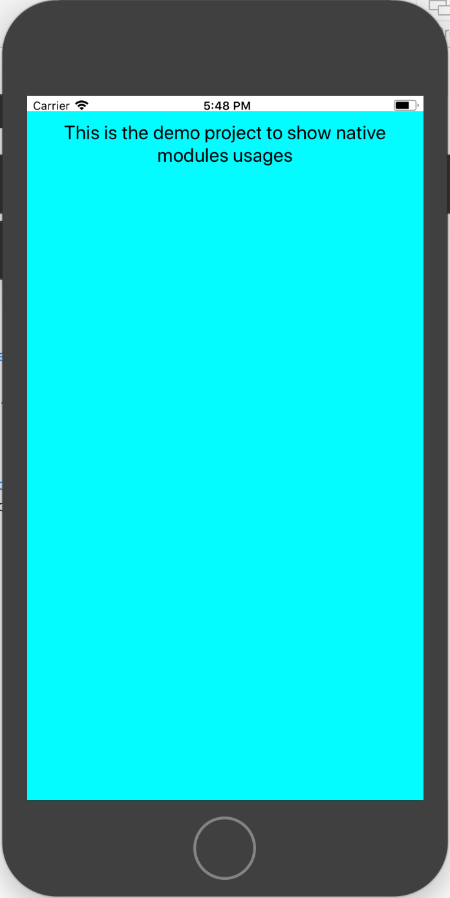

slidenumbers: true
autoscale: true
build-lists: true


# React Native - Native Modules


---

# About me

* Vladimir Ivanov - Lead Software Engineer
* Primary Skill: Android
* React Native Experience > 1 year

---

# Why?

* Access platform features
* Use already existing code
* Implement performance-critical parts(like encryption) 

---


# React Native Architecture


---


# Let’s build a module! 

---

# Figure out what needs to be implemented


* Android
* iOS


---

# Expose native code: Android

* Register a package in ReactNativeHost
* Create package
* Create module
* Expose module from package
* Expose method

---

# Android app components

* Activity
* BroadcastReceiver
* Service
* ContentProvider
* Application


---

# AndroidManifest


```xml

<manifest
	xmlns:android="http://schemas.android.com/apk/res/android" 
	package="com.example.package"
>
	<uses-permission android:name=“android.permission.INTERNET”/>

	<application
		android:name=".MainApplication">

		<activity android:name=“.MainActivity”/>

	</application>
	…
</manifest>

```

---

# AndroidManifest

```xml, [.highlight: 3,4,8]

<manifest package="com.example.package">
	…
	<application
		android:name=".MainApplication">

		<activity android:name=“.MainActivity”/>

	</application>
	…
</manifest>

```

---



---

# Register a package in ReactNativeHost


```java

package com.facebook.react;

public interface ReactApplication {

  ReactNativeHost getReactNativeHost();
}


```

---

# Register a package in ReactNativeHost


```kotlin, [.highlight: 1,6]

class MainApplication : Application(), ReactApplication {
	
	override fun getReactNativeHost(): ReactNativeHost {
		return mReactNativeHost
	}
}

```

---

# Register a package in ReactNativeHost


```kotlin, [.highlight: 3-5]

class MainApplication : Application(), ReactApplication {
	
	override fun getReactNativeHost(): ReactNativeHost {
		return mReactNativeHost
	}
}

```

---

# Register a package


```kotlin, [.highlight: 3-11]

class MainApplication : Application(), ReactApplication {

	private val mReactNativeHost = object : ReactNativeHost(this) {
		
		override fun getPackages(): List<ReactPackage> {
			return Arrays.asList(
					MainReactPackage(),
					NativeLoggerPackage()
			)
		}

	}

	override fun getReactNativeHost(): ReactNativeHost {
		return mReactNativeHost
	}
}

```


---

# Register a package


```kotlin, [.highlight: 8]

class MainApplication : Application(), ReactApplication {

	private val mReactNativeHost = object : ReactNativeHost(this) {
		
		override fun getPackages(): List<ReactPackage> {
			return Arrays.asList(
					MainReactPackage(),
					NativeLoggerPackage()
			)
		}

	}

	override fun getReactNativeHost(): ReactNativeHost {
		return mReactNativeHost
	}
}

```

---

## Application should implement ReactApplication

---

# Application should implement ReactApplication

```java, [.highlight: 3-7]

public class ReactActivityDelegate {

  protected ReactNativeHost getReactNativeHost() {
    return ((ReactApplication) getPlainActivity().getApplication())
		.getReactNativeHost();
  }

}

```

---


---


---

# Expose native code: Android

* Register a package in ReactNativeHost :white_check_mark:
* Create package
* Create module
* Expose module from package
* Expose method

---


# Implementing package

```kotlin
class NativeLoggerPackage : ReactPackage {

	override fun createNativeModules(reactContext: ReactApplicationContext): List<NativeModule> 
	{
		return Arrays.asList<NativeModule>(NativeLoggerModule())
	}

	override fun createViewManagers(reactContext: ReactApplicationContext): List<ViewManager<*, *>> 
	{
		return emptyList<ViewManager<*, *>>()
	}
}
```

---

# Implementing package

```kotlin, [.highlight: 2-6]
class NativeLoggerPackage : ReactPackage {

	override fun createNativeModules(reactContext: ReactApplicationContext): List<NativeModule> 
	{
		return Arrays.asList<NativeModule>(NativeLoggerModule())
	}

	override fun createViewManagers(reactContext: ReactApplicationContext): List<ViewManager<*, *>> 
	{
		return emptyList<ViewManager<*, *>>()
	}
}
```

---

# Expose native code: Android

* Register a package in ReactNativeHost :white_check_mark:
* Create package :white_check_mark:
* Create module
* Expose module from package
* Expose method

---

# Implementing module

```kotlin

class NativeLoggerModule : BaseJavaModule() {

	override fun getName(): String {
		return "NativeLogger"
	}
}

```
---

# Implementing module with Application context

```kotlin
class NativeLoggerModule(context : ReactApplicationContext) 
			: ReactContextBaseJavaModule(context) {

	override fun getName(): String {
		return "NativeLogger"
	}
}
```

---

# Expose native code: Android

* Register a package in ReactNativeHost :white_check_mark:
* Create package :white_check_mark:
* Create module :white_check_mark:
* Expose module from package :white_check_mark:
* Expose method

---

# Exposing a method to javascript

```kotlin, [.highlight: 7-10]
class NativeLoggerModule : BaseJavaModule() {

	override fun getName(): String {
		return "NativeLogger"
	}

	@ReactMethod
	fun logTheObject() {
		Log.d(name, “Method called”)
	}
}

```

---

# Passing params to the method

```java

Boolean -> Bool
Integer -> Number
Double -> Number
Float -> Number
String -> String
Callback -> function
ReadableMap -> Object
ReadableArray -> Array

```

---

# Passing params to the method

```java, [.highlight: 6,7,8]
Boolean -> Bool
Integer -> Number
Double -> Number
Float -> Number
String -> String
Callback -> function
ReadableMap -> Object
ReadableArray -> Array
```

---

# Passing params to the method


```kotlin

@ReactMethod
fun logTheObject(map: ReadableMap) {
	val value = map.getString("key1")
	Log.d(name, "key1 = " + value)
}

```

---

# Passing params to the method


```kotlin

@ReactMethod
fun logTheArray(array: ReadableArray) {
	val size = array.size()
	for (index in 0 until size) {
		val value = array.getInt(index)
		Log.d(name, "array[$index] = $value")
	}
}

```


---

# Passing params to the method

```kotlin

@ReactMethod
fun logTheMapAndArray(map: ReadableMap, array: ReadableArray): Boolean {
	logTheObject(map)
	logTheArray(array)
	return true
}

```

---

# Usage in js

```js

import { NativeModules } from 'react-native';
const nativeModule = NativeModules.MyModule;

```

---

# Usage in js

```js

import { NativeModules } from 'react-native';
const nativeModule = NativeModules.MyModule;

export const log = () => {
    nativeModule.logTheMapAndArray(
        { key1: 'value1' },
        ['1', '2', '3']
    );

};


```


---


---

# Getting the result back

```js

import { NativeModules } from 'react-native';
const nativeModule = NativeModules.MyModule;

export const log = () => {
    const result = nativeModule.logTheMapAndArray(
        { key1: 'value1' },
        ['1', '2', '3']
    );

};

```

---

# Getting the result back

```kotlin

@ReactMethod
fun logWithCallback(map: ReadableMap, array: ReadableArray, callback: Callback) {
	logTheObject(map)
	logTheArray(array)
	callback.invoke("Logged")
}

```

---

# Getting the result back

```js, [.highlight: 8]

import { NativeModules } from 'react-native';
const nativeModule = NativeModules.MyModule;

export const log = () => {
    const result = nativeModule.logWithCallback(
        { key1: 'value1' },
        [1, 2, 3],
        (message) => { console.log(`[NativeLogger] message = ${message}`) }
    );
};


```

---

# Getting the result back

```js, [.highlight: 5,6]

import { NativeModules } from 'react-native';
const nativeModule = NativeModules.MyModule;

export const log = async () => {
    const result = await nativeModule.logAsync('Logged value');
    console.log(`[NativeModule] results = ${result}`);
};


```

---

```kotlin
@ReactMethod
fun logAsync(value: String, promise: Promise) {
	Log.d(name, "Logging value: " + value)
	try {
		Thread.sleep(5000)
	} catch (e: InterruptedException) {
		e.printStackTrace()
	}

	promise.resolve("Promise done")
}
```

---

# Expose native code: Android

* Register a package in ReactNativeHost :white_check_mark:
* Create package :white_check_mark:
* Create module :white_check_mark:
* Expose module from package :white_check_mark:
* Expose method :white_check_mark:

---


---


# Expose native code: iOS

* Create BridgeModule
* Expose a method
* ???
* PROFIT!!111

---

# Create BridgeModule

```objectivec

#import <Foundation/Foundation.h>
#import <React/RCTBridgeModule.h>

@interface NativeLogger : NSObject<RCTBridgeModule>

@end

```

---

# NativeLogger.m

```objectivec


#import <Foundation/Foundation.h>
#import "NativeLogger.h"

@implementation NativeLogger {
  
}

RCT_EXPORT_MODULE();

```

---

# NativeLogger.m

```objectivec, [.highlight: 9]


#import <Foundation/Foundation.h>
#import "NativeLogger.h"

@implementation NativeLogger {
  
}

RCT_EXPORT_MODULE();

```

---

# NativeLogger.m

```objectivec, [.highlight: 9]


#import <Foundation/Foundation.h>
#import "NativeLogger.h"

@implementation NativeLogger {
  
}

RCT_EXPORT_MODULE(NativeLogger);

```

---

# Passing params to the method

```objectivec

string -> (NSString*)
number -> (NSInteger*, float, double, CGFloat*, NSNumber*)
boolean -> (BOOL, NSNumber*)
array -> (NSArray*)
object -> (NSDictionary*)
function -> (RCTResponseSenderBlock)

```

---

# NativeLogger.m

```objectivec


RCT_EXPORT_METHOD(logTheObject:(NSDictionary*) map)
{
  NSString *value = map[@"key1"];
  NSLog(@"[NativeModule] %@", value);
}

```

---

# NativeLogger.m

```objectivec


RCT_EXPORT_METHOD(logTheArray:(NSArray*) array)
{
  for (id record in array) {
    NSLog(@"[NativeModule] %@", record);
  }
}

```


---

# NativeLogger.m

```objectivec

RCT_EXPORT_METHOD(log:(NSDictionary*) map 
		withArray:(NSArray*)array 
		andCallback:(RCTResponseSenderBlock)block)
{
  NSLog(@"Got the log");
  NSArray* events = @[@"Logged"];
  block(@[[NSNull null], events]);
}

```


---

# NativeLogger.m

```objectivec

RCT_REMAP_METHOD(logAsync,
                 logAsyncWith:(NSString*)value
                 withResolver:(RCTPromiseResolveBlock)resolve
                 rejecter:(RCTPromiseRejectBlock)reject)
{
  NSLog(@"[NativeModule] %@", value);
  NSArray* events = @[@"Logged"];
  resolve(events);
}

```

---

# Bridge performance


---

# Bridge performance


Call with object:         

493 ops/sec ±1.83% 

(133 runs sampled) 

---

# Bridge performance

Call with large array(1000 integers):         

76.41 ops/sec ±1.54% (135 runs sampled) 

(133 runs sampled) 

---

# Posting events from native to JS


---

# Posting events from native to JS

* Android
* iOS

---
# Posting events from native to JS - Android

* Create a native module 
* Subscribe for network change events
* Post the changes to JS

---

# JS Handling

```js

componentWillMount() {                                                           
    const self = this;                                                           
    Monitoring.initModule();                                                     
    emitter.addListener('MonitoringNetworkStateChanged', 
		(networkState) => {                              
        	self.setState({ online: networkState === 'Connected' })               
    	});                                                                          
}  

componentWillUnmount() {                     
    emitter.removeAllListeners('MonitoringNetworkStateChanged')    
}                                                                                

```
---

# JS Handling

```js, [.highlight: 1-3]

componentWillMount() {                                                           
    const self = this;                                                           
    Monitoring.initModule();                                                     
    emitter.addListener('MonitoringNetworkStateChanged', 
		(networkState) => {                              
        	self.setState({ online: networkState === 'Connected' })               
    	});                                                                          
}  

componentWillUnmount() {                     
    emitter.removeAllListeners('MonitoringNetworkStateChanged')    
}                                                                                

```
---

# JS Handling

```js, [.highlight: 4]

componentWillMount() {                                                           
    const self = this;                                                           
    Monitoring.initModule();                                                     
    emitter.addListener('MonitoringNetworkStateChanged', 
		(networkState) => {                              
        	self.setState({ online: networkState === 'Connected' })               
    	});                                                                          
}  

componentWillUnmount() {                     
    emitter.removeAllListeners('MonitoringNetworkStateChanged')    
}                                                                                

```
---

# JS Handling

```js, [.highlight: 5-7]

componentWillMount() {                                                           
    const self = this;                                                           
    Monitoring.initModule();                                                     
    emitter.addListener('MonitoringNetworkStateChanged', 
		(networkState) => {                              
        	self.setState({ online: networkState === 'Connected' })               
    	});                                                                          
}  

componentWillUnmount() {                     
    emitter.removeAllListeners('MonitoringNetworkStateChanged')    
}                                                                                

```
---

# JS Handling

```js, [.highlight: 10-12]

componentWillMount() {                                                           
    const self = this;                                                           
    Monitoring.initModule();                                                     
    emitter.addListener('MonitoringNetworkStateChanged', 
		(networkState) => {                              
        	self.setState({ online: networkState === 'Connected' })               
    	});                                                                          
}  

componentWillUnmount() {                     
    emitter.removeAllListeners('MonitoringNetworkStateChanged')    
}                                                                                

```
---

# JS Handling

```js

const Monitoring = NativeModules.Monitoring;

const emitter = Platform.OS === 'android'
    ? DeviceEventEmitter
    : new NativeEventEmitter(Monitoring);                                                                              

```

---

# JS Handling

```javascript

render() {

	return (
		<View style={styles.container}>
			{!this.state.online && 
				<View style={styles.networkStatus}>
					<Text>Device is offline!</Text>
				</View>
			}
			<Text style={styles.welcome}>
				This is the demo project to show native modules usages
			</Text>
		</View>
	);
}                                                                                                                                                     


```

---



---


---


# Network Monitoring Module

```kotlin
class MonitoringModule(reactContext: ReactApplicationContext?) 
	: ReactContextBaseJavaModule(reactContext) {

}

```


---

# Network Monitoring Module

```kotlin, [.highlight: 4]
class MonitoringModule(reactContext: ReactApplicationContext?) 
	: ReactContextBaseJavaModule(reactContext) {

	private var reactNativeContext = reactContext;

}

```


---

# Network Monitoring Module

```kotlin, [.highlight: 4,5,6]
class MonitoringModule(reactContext: ReactApplicationContext?) 
	: ReactContextBaseJavaModule(reactContext) {

	private var reactNativeContext = reactContext;
	private lateinit var networkStateReceiver 
		: NetworkStateReceiver
}

```

---

# Network Monitoring Module

```kotlin, [.highlight: 2-3]


@ReactMethod
public fun initModule() {
	networkStateReceiver = NetworkStateReceiver();
	reactNativeContext?.registerReceiver(networkStateReceiver, 
		IntentFilter("android.net.conn.CONNECTIVITY_CHANGE"))
}


```


---

# Network Monitoring Module

```kotlin, [.highlight: 4]


@ReactMethod
public fun initModule() {
	networkStateReceiver = NetworkStateReceiver();
	reactNativeContext?.registerReceiver(networkStateReceiver, 
		IntentFilter("android.net.conn.CONNECTIVITY_CHANGE"))
}


```

---

# Network Monitoring Module

```kotlin, [.highlight: 5-6]


@ReactMethod
public fun initModule() {
	networkStateReceiver = NetworkStateReceiver();
	reactNativeContext?.registerReceiver(networkStateReceiver, 
		IntentFilter("android.net.conn.CONNECTIVITY_CHANGE"))
}

```

---

# Network Monitoring Module

```kotlin, [.highlight: 1, 16]

internal inner class NetworkStateReceiver : BroadcastReceiver() {

	override fun onReceive(context: Context?, intent: Intent?) {

		val extras = intent.extras
			
		val ni = extras.get(ConnectivityManager.EXTRA_NETWORK_INFO) as NetworkInfo
		if (ni.state == NetworkInfo.State.CONNECTED) {
			notifyNetStateChanged("Connected")
		}
			
		if (extras.getBoolean(ConnectivityManager.EXTRA_NO_CONNECTIVITY, java.lang.Boolean.FALSE)) {
			notifyNetStateChanged("Disconnected")
		}
	}
}

```
---

# Network Monitoring Module

```kotlin, [.highlight: 3, 15]

internal inner class NetworkStateReceiver : BroadcastReceiver() {

	override fun onReceive(context: Context?, intent: Intent?) {

		val extras = intent.extras
			
		val ni = extras.get(ConnectivityManager.EXTRA_NETWORK_INFO) as NetworkInfo
		if (ni.state == NetworkInfo.State.CONNECTED) {
			notifyNetStateChanged("Connected")
		}
			
		if (extras.getBoolean(ConnectivityManager.EXTRA_NO_CONNECTIVITY, java.lang.Boolean.FALSE)) {
			notifyNetStateChanged("Disconnected")
		}
	}
}

```
---

# Network Monitoring Module

```kotlin, [.highlight: 5-10]

internal inner class NetworkStateReceiver : BroadcastReceiver() {

	override fun onReceive(context: Context?, intent: Intent?) {

		val extras = intent.extras
			
		val ni = extras.get(ConnectivityManager.EXTRA_NETWORK_INFO) as NetworkInfo
		if (ni.state == NetworkInfo.State.CONNECTED) {
			notifyNetStateChanged("Connected")
		}
			
		if (extras.getBoolean(ConnectivityManager.EXTRA_NO_CONNECTIVITY, java.lang.Boolean.FALSE)) {
			notifyNetStateChanged("Disconnected")
		}
	}
}

```
---

# Network Monitoring Module

```kotlin, [.highlight: 12-14]

internal inner class NetworkStateReceiver : BroadcastReceiver() {

	override fun onReceive(context: Context?, intent: Intent?) {

		val extras = intent.extras
			
		val ni = extras.get(ConnectivityManager.EXTRA_NETWORK_INFO) as NetworkInfo
		if (ni.state == NetworkInfo.State.CONNECTED) {
			notifyNetStateChanged("Connected")
		}
			
		if (extras.getBoolean(ConnectivityManager.EXTRA_NO_CONNECTIVITY, java.lang.Boolean.FALSE)) {
			notifyNetStateChanged("Disconnected")
		}
	}
}

```
---

# Network Monitoring Module

```kotlin

internal inner class NetworkStateReceiver : BroadcastReceiver() {

	…

	private fun notifyNetStateChanged(state: String) {
		reactNativeContext
				?.getJSModule(DeviceEventManagerModule.RCTDeviceEventEmitter::class.java)
				?.emit("MonitoringNetworkStateChanged", state)
	}
}

```
---

# Network Monitoring Module

```js, [.highlight: 1]

const Monitoring = NativeModules.Monitoring;

componentWillMount() {
	const self = this;
	Monitoring.initModule();
	emitter.addListener('MonitoringNetworkStateChanged', (state) => {
		self.setState({ online: state === 'Connected' })
   	});
}


```
---

# Network Monitoring Module

```js, [.highlight: 3,9]

const Monitoring = NativeModules.Monitoring;

componentWillMount() {
	const self = this;
	Monitoring.initModule();
	emitter.addListener('MonitoringNetworkStateChanged', (state) => {
		self.setState({ online: state === 'Connected' })
   	});
}


```
---

# Network Monitoring Module

```js, [.highlight: 4,5]

const Monitoring = NativeModules.Monitoring;

componentWillMount() {
	const self = this;
	Monitoring.initModule();
	emitter.addListener('MonitoringNetworkStateChanged', (state) => {
		self.setState({ online: state === 'Connected' })
   	});
}


```
---

# Network Monitoring Module

```js, [.highlight: 6,7,8]

const Monitoring = NativeModules.Monitoring;

componentWillMount() {
	const self = this;
	Monitoring.initModule();
	emitter.addListener('MonitoringNetworkStateChanged', (state) => {
		self.setState({ online: state === 'Connected' })
   	});
}


```

---

# What’s the maintainability problem here? 

---

# Network Monitoring Module

```kotlin, [.highlight: 3,4]

internal inner class NetworkStateReceiver : BroadcastReceiver() {

	private val networkStateChangeEvent = "EVENT_NETWORK_STATE_CHANGED"
	private val networkStateChange = "MonitoringNetworkStateChanged"

	override fun getConstants(): Map<String, Any>? {
		val constants = HashMap<String, Any>()
		constants.put(networkStateChangeEvent, networkStateChange)
		return constants
	}

	private fun notifyNetStateChanged(state: String) {
		reactNativeContext
				?.getJSModule(DeviceEventManagerModule.RCTDeviceEventEmitter::class.java)
				?.emit(networkStateChange, state)
	}
}

```
---

# Network Monitoring Module

```kotlin, [.highlight: 6-10]

internal inner class NetworkStateReceiver : BroadcastReceiver() {

	private val networkStateChangeEvent = "EVENT_NETWORK_STATE_CHANGED"
	private val networkStateChange = "MonitoringNetworkStateChanged"

	override fun getConstants(): Map<String, Any>? {
		val constants = HashMap<String, Any>()
		constants.put(networkStateChangeEvent, networkStateChange)
		return constants
	}

	private fun notifyNetStateChanged(state: String) {
		reactNativeContext
				?.getJSModule(DeviceEventManagerModule.RCTDeviceEventEmitter::class.java)
				?.emit(networkStateChange, state)
	}
}

```
---

# Network Monitoring Module

```kotlin, [.highlight: 12-16]

internal inner class NetworkStateReceiver : BroadcastReceiver() {

	private val networkStateChangeEvent = "EVENT_NETWORK_STATE_CHANGED"
	private val networkStateChange = "MonitoringNetworkStateChanged"

	override fun getConstants(): Map<String, Any>? {
		val constants = HashMap<String, Any>()
		constants.put(networkStateChangeEvent, networkStateChange)
		return constants
	}

	private fun notifyNetStateChanged(state: String) {
		reactNativeContext
				?.getJSModule(DeviceEventManagerModule.RCTDeviceEventEmitter::class.java)
				?.emit(networkStateChange, state)
	}
}

```
---

# Network Monitoring Module

```js, [.highlight: 1]

const Monitoring = NativeModules.Monitoring;
const EventName = Monitoring.EVENT_NETWORK_STATE_CHANGED;

```
---

# Network Monitoring Module

```js, [.highlight: 2]

const Monitoring = NativeModules.Monitoring;
const EventName = Monitoring.EVENT_NETWORK_STATE_CHANGED;

```

---

# Network Monitoring Module

```js, [.highlight:7-10]

const Monitoring = NativeModules.Monitoring;
const EventName = Monitoring.EVENT_NETWORK_STATE_CHANGED;

componentWillMount() {
	const self = this;
	Monitoring.initModule();
	emitter.addListener(EventName, (e) => {
		self.setState({ online: e === 'Connected' })
   	});
}


```
---

# Network Monitoring Module

```js, [.highlight: 3]

const Monitoring = NativeModules.Monitoring;
const EventName = Monitoring.EVENT_NETWORK_STATE_CHANGED;
const ConnectedState = Monitoring.CONNECTED;

```

---

# Network Monitoring Module

```js, [.highlight: 5-7]


componentWillMount() {
	const self = this;
	Monitoring.initModule();
	emitter.addListener(EventName, (networkState) => {
		self.setState({ online: networkState === ConnectedState })
	});
}


```

---

# Network Monitoring Module

```js, [.highlight: 6]


componentWillMount() {
	const self = this;
	Monitoring.initModule();
	emitter.addListener(EventName, (networkState) => {
		self.setState({ online: networkState === ConnectedState })
	});
}


```

---

# Posting events from native to JS - iOS

* Create 
* Subscribe for network change events

---

# Native Monitoring Module

```objectivec

#import "React/RCTEventEmitter.h"
#import <React/RCTBridgeModule.h>

@interface Monitoring : RCTEventEmitter
@end

```

---

# Native Monitoring Module

```objectivec, [.highlight: 1-3]

@implementation Monitoring {
  Reachability* reachability;
}

RCT_EXPORT_MODULE();

const NSString* networkStateChanged = @"MonitoringNetworkStateChanged";
const NSString* stateConnected = @"Connected";
const NSString* stateDisconnected = @"Disconnected";

```
---

# Native Monitoring Module

```objectivec, [.highlight: 5]

@implementation Monitoring {
  Reachability* reachability;
}

RCT_EXPORT_MODULE();

const NSString* networkStateChanged = @"MonitoringNetworkStateChanged";
const NSString* stateConnected = @"Connected";
const NSString* stateDisconnected = @"Disconnected";

```
---

# Native Monitoring Module

```objectivec, [.highlight: 7-9]

@implementation Monitoring {
  Reachability* reachability;
}

RCT_EXPORT_MODULE();

const NSString* networkStateChanged = @"MonitoringNetworkStateChanged";
const NSString* stateConnected = @"Connected";
const NSString* stateDisconnected = @"Disconnected";

```

---

# Native Monitoring Module

```objectivec

- (NSDictionary *)constantsToExport
{
    return @{
        @"EVENT_NETWORK_STATE_CHANGED": networkStateChanged,
        @"CONNECTED": stateConnected,
        @"DISCONNECTED": stateDisconnected
    };
}

```
---

# Native Monitoring Module

```objectivec

const NSString* networkStateChanged = @"MonitoringNetworkStateChanged";

- (NSArray<NSString *> *)supportedEvents
{
  return @[networkStateChanged];
}

```
---

# Native Monitoring Module

```objectivec

RCT_EXPORT_METHOD(initModule)
{
  [[NSNotificationCenter defaultCenter] addObserver:self 
		selector:@selector(handleNetworkChange:) 
		name:kReachabilityChangedNotification 
		object:nil];

  reachability = [Reachability reachabilityForInternetConnection];
  [reachability startNotifier];
}

```
---

# Native Monitoring Module

```objectivec, [.highlight: 1]

- (void)handleNetworkChange:(NSNotification *)notice
{
  NetworkStatus remoteHostStatus = [reachability currentReachabilityStatus];
  
  if(remoteHostStatus == NotReachable) {
    [self sendEventWithName:networkStateChanged body:stateDisconnected];
  }
  else if (remoteHostStatus == ReachableViaWiFi) {
    [self sendEventWithName:networkStateChanged body:stateConnected];
  }
}

```
---

# Native Monitoring Module

```objectivec, [.highlight: 1-3,11]

- (void)handleNetworkChange:(NSNotification *)notice
{
  NetworkStatus remoteHostStatus = [reachability currentReachabilityStatus];
  
  if(remoteHostStatus == NotReachable) {
    [self sendEventWithName:networkStateChanged body:stateDisconnected];
  }
  else if (remoteHostStatus == ReachableViaWiFi) {
    [self sendEventWithName:networkStateChanged body:stateConnected];
  }
}

```
---

# Native Monitoring Module

```objectivec, [.highlight: 5-7]

- (void)handleNetworkChange:(NSNotification *)notice
{
  NetworkStatus remoteHostStatus = [reachability currentReachabilityStatus];
  
  if(remoteHostStatus == NotReachable) {
    [self sendEventWithName:networkStateChanged body:stateDisconnected];
  }
  else if (remoteHostStatus == ReachableViaWiFi) {
    [self sendEventWithName:networkStateChanged body:stateConnected];
  }
}

```
---

# Native Monitoring Module

```objectivec, [.highlight: 8-10]

- (void)handleNetworkChange:(NSNotification *)notice
{
  NetworkStatus remoteHostStatus = [reachability currentReachabilityStatus];
  
  if(remoteHostStatus == NotReachable) {
    [self sendEventWithName:networkStateChanged body:stateDisconnected];
  }
  else if (remoteHostStatus == ReachableViaWiFi) {
    [self sendEventWithName:networkStateChanged body:stateConnected];
  }
}

```

---

# Summary

* Creating a native module is easy
* Both native and js realms are fast
* Bridging is slow, avoid passing it 
* Interaction is bidirectional

---


# Useful links

* https://facebook.github.io/react-native/docs/native-modules-ios.html 
* https://github.com/peggyrayzis/react-native-create-bridge
* https://github.com/facebook/react-native/issues/10504
