slidenumbers: true
autoscale: true
build-lists: true
footer: @vvsevolodovich

## Бекенд без бекенд-разработчиков


---

# [fit] Vladimir Ivanov

* Архитектор решений @ EPAM Systems
* Certified Google Cloud Architect
* Опыт AWS 


---

# Сегодня Узнаем 

* Зачем нужен бекенд
* Как обычно делают проекты
* Что такое BaaS
* Какие крупные предложения есть на рынке
* Какие есть нишевые предложения
* Сравним по цене и возможностям

---


---

# Делаем Todo лист и быстро! А еще

* Синхронизацию между клиентами
* Для всего мира
* И очень производительно! 

---


---

# Бери Кубернетес!

---


---

## Кубернетес - это оркестратор контейнеров

### Или сложная и мутная хрень для бекенда

---

# Что такое бекенд?

---

# REST controller

```swift

protocol AccountApiClient {
    func makeToken() -> AnyPublisher<ApiClient.MakeTokenResponse, Error>
    
    func validateUser(
        username: String,
        password: String,
        token: String
    ) -> AnyPublisher<ApiClient.ValidateUserResponse, Error>
    
    func makeSession(token: String) -> AnyPublisher<ApiClient.MakeSessionResponse, Error>
}

```

---

# Зачем нужен бекенд?

---

# Зачем нужен бекенд?

* Хранить/преобразовывать/отдавать данные пользователю
* Регистрировать/Аутентифицировать пользователей
* Слать нотификации/проводить платежи

---

# Хранить данные

* Картинки и видео
* Реляционные данные
* Нереляционные данные

---

# Преобразовывать данные

* Нужна логика(код)
* Нужно ходить в базу
* Нужно отдавать клиенту(мобиле)

---

# Регистрировать/Аутентифицировать пользователей

* Хранить пользователей в базе
* Проверять логин/пароль/токен
* Подтверждать регистрацию(смс, емейл)

---

# Нотификации и Платежи

* Пинать APNS/FCM, когда есть новые данные
* Проверять платежки от Apple/Google

---

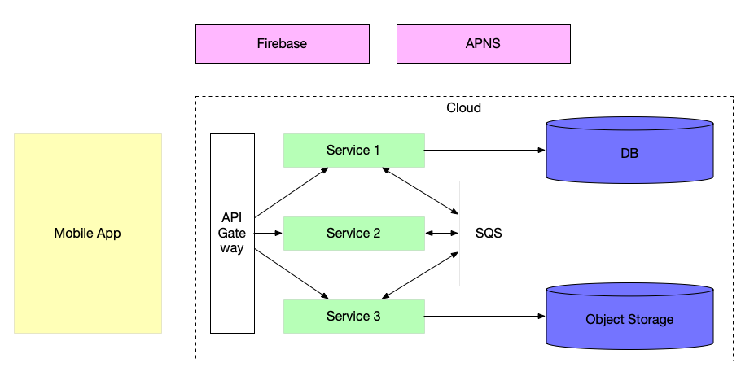

---

# А еще 

* Разворачивать базу
* Разворачивать код
* Поднимать, если упало
* Бэкапить
* Мониторить
* Оплачивать доменные имена/хостинг


---

# Хорошо, что есть Baas!

## (Backend as a Service)

---


---

# Крупные игроки

* AWS AppSync
* Google Firebase
* Azure Mobile Apps

---

# AWS AppSync


https://aws.amazon.com/appsync/

---


---

# Как создать

---

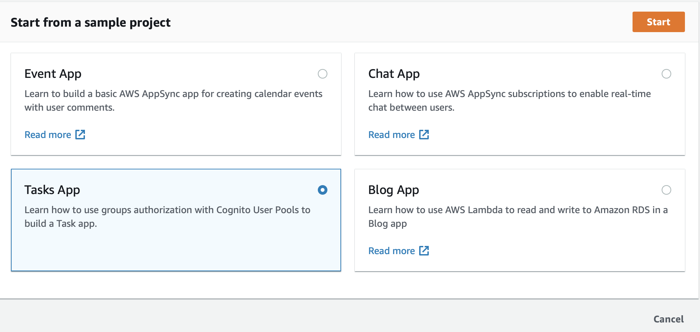

---

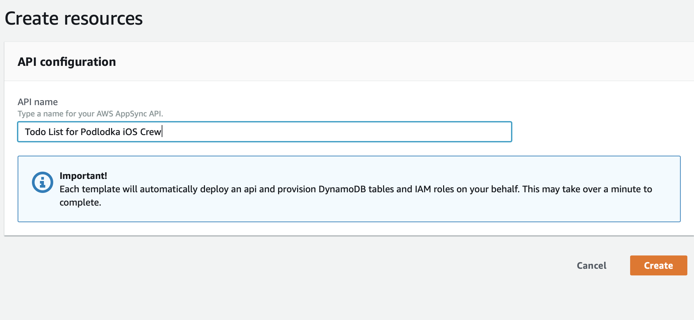


---

# Что дают

* API Url
* ~Функции(интеграция с AWS Lambda)
* User Pool в AWS Cognito
* DynamoDB таблицы(NoSQL Data Store)
* Бинарное хранилище
* Кэширование
* Логи
* WAF(Web Application Firewall)
* Мониторинг

---

# Что не дают

* Сразу кодить на бекенде - доступен только Apache Velocity

---

# Цены

* $4 на 1 миллион запросов
* $2 на 1 миллион обновлений
* $0.08 на 1 миллион минут соединения с AWS AppSync

---

# На первый год есть бесплатный лимит

250к запросов + 250к апдейтов + 600к минут

---

# Как считать

2,500 юзеров * 1,000 todo * $4.00 за миллион операций = $10.00

---

# Как считать

2,500 юзеров * 1,000 todo * $4.00 за миллион операций = $10.00
2,500 юзеров * 1,500 минут использования * $0,08 за миллион минут = $0.30

---

# Как считать

2,500 юзеров * 1,000 todo * $4.00 за миллион операций = $10.00
2,500 юзеров * 1,500 минут использования * $0,08 за миллион минут = $0.30
2,500 юзеров * 1,000 todo * $2.00 за миллион полученных апдейтов = $5.00

# ~15 долларов в месяц

---

# Плюсы

* Легкий сетап :thumbsup:
* Отличная документация :thumbsup: 
* Простой вход в AWS :thumbsup: 
* много бесплатного лимита(на первый год) :thumbsup: 

---

# Минусы

* Не хватает креш репортинга и аналитики :thumbsdown:
* Просят кредитку на старте :thumbsdown:

---


---

# Как создать

---


---

# Что дают

* API Url
* Функции
* Аутентификацию
* Firestore(NoSQL Data Store)
* Синхронизацию в реальном времени
* Бинарное хранилище(для фотографий/видео/etc.)
* Машинное обучение
* Креши
* Test Lab
* Аналитика
* A/B testing
* Remote-config
* Dynamic Links

---


---

# Короче, до фига

---

# Что не дают

## Писать функции на чем-то кроме JS

---

# Как считать

* Не надо считать, воспользуйтесь калькулятором

Для 2500 юзеров использование будет бесплатным

https://firebase.google.com/pricing

---


---

# Плюсы

* Легкий сетап :thumbsup:
* Не просят кредитку :thumbsup:
* Очень богатое предложение одного сервиса :thumbsup:
* Знаком многим разработчикам :thumbsup:
* Много бесплатного лимита :thumbsup:
* Удобный калькулятор :thumbsup:
* SDK подо все :thumbsup:

---

# Минусы 

* Что-то накодить можно только на JS
* Очень сложный прайсинг

---

# Azure Mobile Apps


---

# Azure Mobile Apps

* Push Notifications
* Управление пользователями через Active Directory
* Оффлайн
* Интеграция с социальными сетями
* Easy Tables(no code)
* Node.JS/.Net App Services

https://stvansolano.github.io/2016/08/15/Getting-your-next-app--with-azure-mobile-apps/

---


---

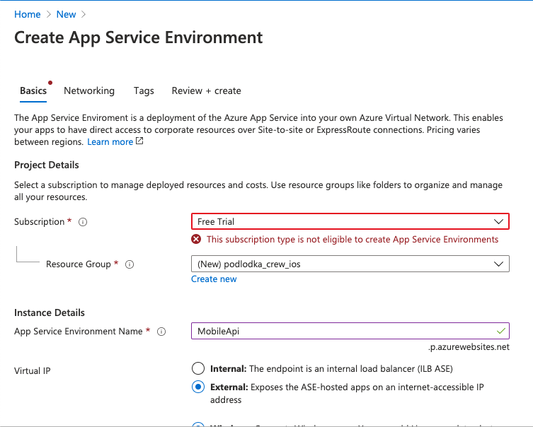

---

# Продукта больше нет

---

# Short break
## Синхронизация данных

---

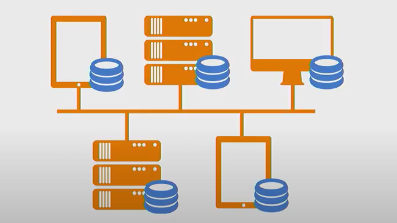

---

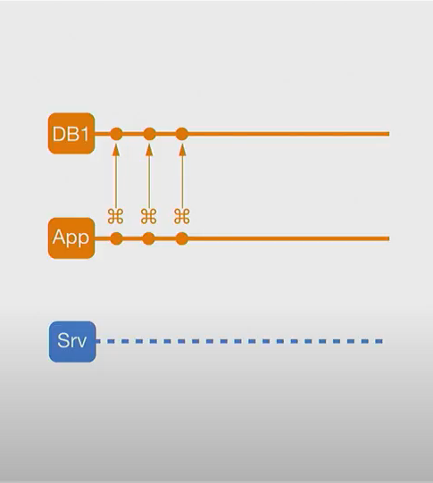
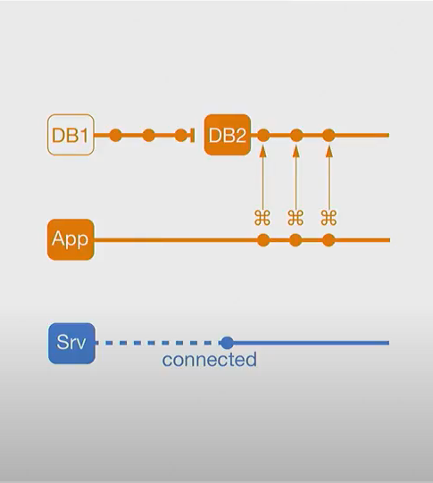

---


---

# CRDT

## Conflict-free Replicated Data Type

---

# Игроки поменьше

* iCloud
* Realm
* Appcelerator
* Back4App
* Backendless

---


---

# Как создать

* Включить CloudKit в Xcode
* Создать схему
* Начать писать данные
* Подписаться на обновления

---

# Что дают

* iOS SDK
* JS SDK
* NoSQL database
* Binary Storage

---

# что не дают

* Собственно, все остальное

---

# Плюсы

* Пишем напрямую :thumbsup:
* Простая интеграция :thumbsup:
* Огромные бесплатные лимиты :thumbsup:

---

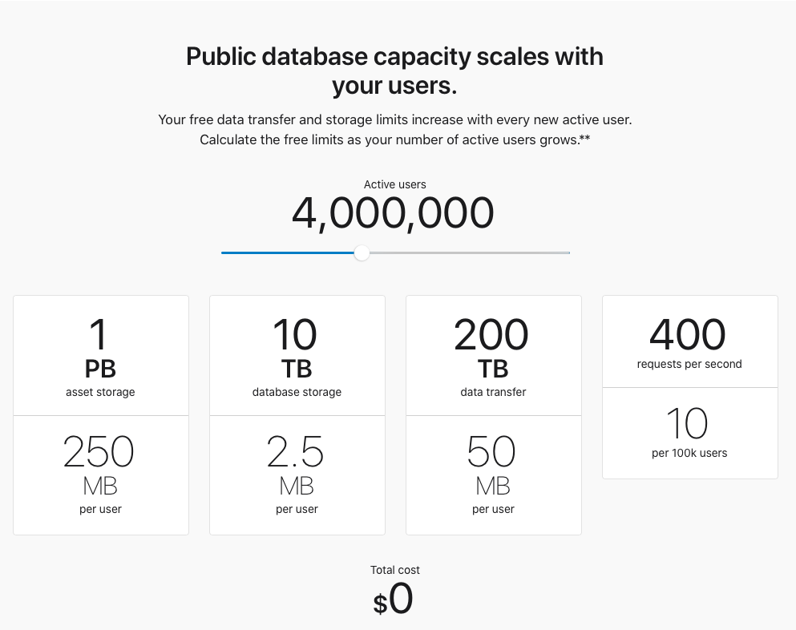

---

# Минусы

* Есть только синхронизация данных =(

---


---

# Как создать

---

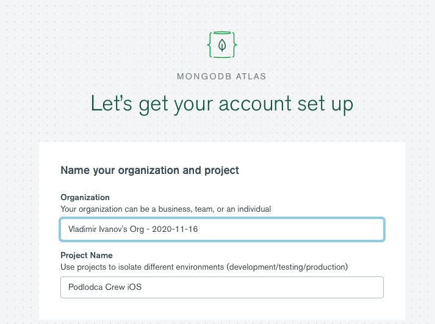

---

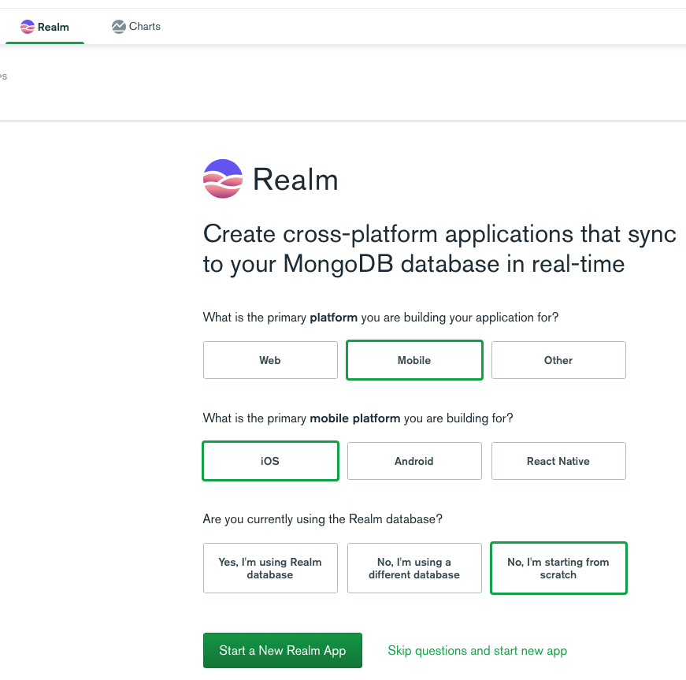

---

# Что дают

* User signup/sign-in 
* Google/Facebook Integration
* NoSQL хранилище(Mongo, че) 
* GraphQL API
* Functions
* Push Notifications
* Secret Management
* Логи
* Синхронизацию данных

---

# Что не дают

* Своей инфраструктуры - используют GCP/AWS/Azure под капотом
* Бинарного хранилища

---

# Плюсы

* Легкий сетап :thumbsup:
* Не просят кредитку :thumbsup:
* Поддерживают совместное редактирование документов :thumbsup::thumbsup::thumbsup: [^1]

[^1]: https://www.youtube.com/watch?v=mlkpf-TP9wQ

---

# Минусы

* Нет Pay-as-you-Go :thumbsdown:
* Довольно куцое предложение по сравнению с другими сервисами

---

# Как считать

Для 2500 тысяч пользователей хватит Free Tier.
Для объема данных > 10GB 57$ в месяц

---

# Appcelerator

* Бывший Titanium
* SDK in JS
* + Mobile Backend services

---

# Что дают

* API Connector
* API Runtime
* Push notifications
* Object store
* User Management
* NoSQL DB
* Analytics

---

# Минусы

* JS
* Pricing

---

# Как считать 

## минимальный pricing от $21

---

# Back4App

---

# Что дают

* API Management
* Push Notifications
* Analytics
* Jobs
* Logs
* Remote Config
* REST/GraphQL console
* In-browser IDE
* Sign-up/Sign-in
* Facebook/Twitter login

---

# Что не дают

* Object storage

---

# Плюсы

* Очень простой сетап
* Не просят кредитку
* Удобная веб-консоль
* Пойдет быстро наклепать апишку на JS 

---

# Минусы 

* Микроскопический бесплатный лимит
* Нормальный tier начинается от 40 баксов в месяц
* Куцые возможности

---

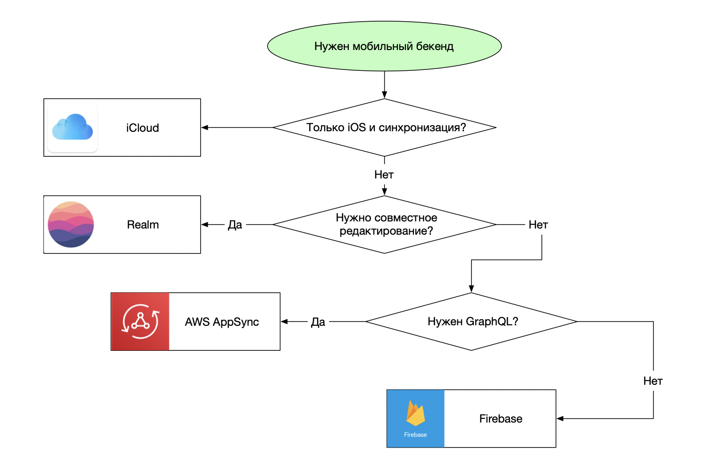

---

# Выводы

* Бекенд можно буквально накликать за 10 минут
* Можно не думать про масштабирование и все прочее
* Выбор сервисов большой, но хороших всего 3
* Не знаешь, что брать - бери Firebase 

---

# [fit] Vladimir Ivanov

* https://vvsevolodovich.dev :pencil:
* https://twitter.com/vvsevolodovich :bird:


