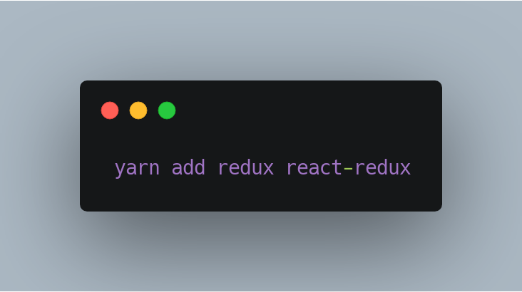
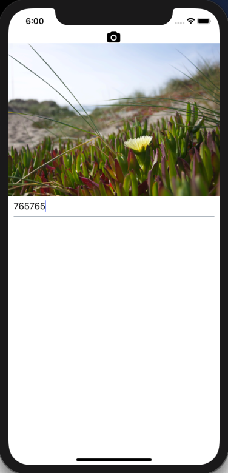
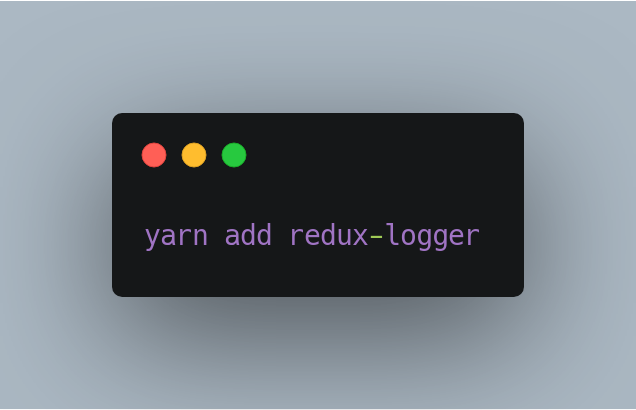
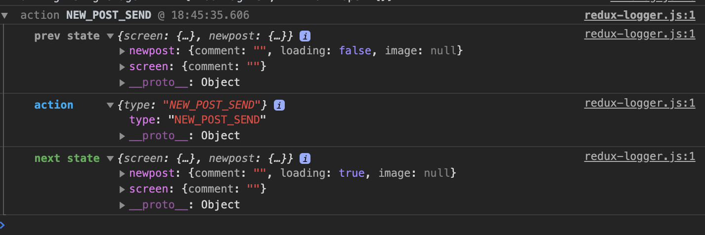

# Подключаем Redux

---

# Видно? Слышно?

---

# Владимир Иванов

* Solution Architect at EPAM Systems
* Ex React-Native Mentoring Program Global Curator


---

# План

* Вопросы по ДЗ
* Подключение Redux
* Новый экран на Redux
* Отладка с помощью Redux Logger
* Итоги

---

# Вопросы по ДЗ

---

# Подключение Redux

---

# Redux in a nutshell

* Store
* Actions
* Reducers


---

# Store

---



---

```js, [.highlight: 1-2]

import {createStore} from 'redux';
import {Provider} from 'react-redux';

const store = createStore();

const AppContainer = () => (
  <Provider store={store}>
    ...
  </Provider>
);
export default AppContainer;
```

---

```js, [.highlight: 4]

import {createStore} from 'redux';
import {Provider} from 'react-redux';

const store = createStore();

const AppContainer = () => (
  <Provider store={store}>
    ...
  </Provider>
);
export default AppContainer;
```

---

```js, [.highlight: 6-10]

import {createStore} from 'redux';
import {Provider} from 'react-redux';

const store = createStore();

const AppContainer = () => (
  <Provider store={store}>
    ...
  </Provider>
);
export default AppContainer;
```

---

# Reducers

---

# Reducers

* Pure functions
* Modify state
* Should be added to the store 

---

```js
import {EDIT_COMMENT} from '../actions/ScreenActions';

const defaultState = {
  comment: '',
};

export default (state = defaultState, action) => {
  switch (action.type) {
    case EDIT_COMMENT:
      return {...state, comment: action.payload.comment};
    default:
      return state;
  }
};
```

---

```js, [.highlight: 1]
import {EDIT_COMMENT} from '../actions/ScreenActions';

const defaultState = {
  comment: '',
};

export default (state = defaultState, action) => {
  switch (action.type) {
    case EDIT_COMMENT:
      return {...state, comment: action.payload.comment};
    default:
      return state;
  }
};
```

---
```js, [.highlight: 3-5]
import {EDIT_COMMENT} from '../actions/ScreenActions';

const defaultState = {
  comment: '',
};

export default (state = defaultState, action) => {
  switch (action.type) {
    case EDIT_COMMENT:
      return {...state, comment: action.payload.comment};
    default:
      return state;
  }
};
```
---

```js, [.highlight: 7-14]
import {EDIT_COMMENT} from '../actions/ScreenActions';

const defaultState = {
  comment: '',
};

export default (state = defaultState, action) => {
  switch (action.type) {
    case EDIT_COMMENT:
      return {...state, comment: action.payload.comment};
    default:
      return state;
  }
};
```

---

```js

const store = createStore(ScreenReducer);

```


---

# Actions

---

```js

export const EDIT_COMMENT = 'EDIT_COMMENT';

export const editComment = text => {
  return {type: EDIT_COMMENT, payload: {comment: text}};
};

```

---

# What's left?

---


---

# UI Connection

---

# New component...

---

```js

import {connect} from 'react-redux';

```

---

```js

class ConnectedComment extends React.Component {
  render() {
    const {comment, setComment} = this.props;
    return (
      <View>
        {comment && (
          <Text h4 style={{alignSelf: 'center'}}>
            {comment}
          </Text>
        )}
        <Input
          value={comment}
          onChangeText={setComment}
          placeholder="Комментарий"
          containerStyle={{marginBottom: 20}}
        />
      </View>
    );
  }
}

```
---

```js, [.highlight: 3, 13]

class ConnectedComment extends React.Component {
  render() {
    const {comment, setComment} = this.props;
    return (
      <View>
        {comment && (
          <Text h4 style={{alignSelf: 'center'}}>
            {comment}
          </Text>
        )}
        <Input
          value={comment}
          onChangeText={setComment}
          placeholder="Комментарий"
          containerStyle={{marginBottom: 20}}
        />
      </View>
    );
  }
}

```
---

```js

const mapStateToProps = state => {
  return {comment: state.screen.comment};
};

```
---

```js

export default connect(
  mapStateToProps,
  dispatch => {
    setComment: value => {
      return dispatch(editComment(value));
    };
  },
)(ConnectedComment);

```

---

# New Post Screen



---

# State

Chosen Photo
Comment
Loading(for future use)

---

# NewPostActions.js


```js

export const NEW_POST_SET_COMMENT = 'NEW_POST_SET_COMMENT';

export const setNewPostComment = text => {
  return { type: NEW_POST_SET_COMMENT, payload: {comment: text}};
};

```
---


# NewPostActions.js


```js

export const NEW_POST_SET_COMMENT = 'NEW_POST_SET_COMMENT';
export const NEW_POST_SEND = 'NEW_POST_SEND';

export const setNewPostComment = text => {
  return { type: NEW_POST_SET_COMMENT, payload: {comment: text}};
};

export const publishPost = () => {
  return { type: NEW_POST_SEND };
};

```
---


# NewPostActions.js


```js

export const NEW_POST_SET_COMMENT = 'NEW_POST_SET_COMMENT';
export const NEW_POST_SEND = 'NEW_POST_SEND';
export const NEW_POST_SEND_DONE = 'NEW_POST_SEND_DONE';

export const setNewPostComment = text => {
  return { type: NEW_POST_SET_COMMENT, payload: {comment: text}};
};

export const publishPost = () => {
  return { type: NEW_POST_SEND };
};


export const finishPublishing = () => {
  return { type: NEW_POST_SEND_DONE };
}

```
---

# newpost.js

```js
import {
  NEW_POST_SET_COMMENT,
  NEW_POST_SEND,
  NEW_POST_SEND_DONE,
} from '../actions/NewPostActions';
```

---

# newpost.js

```js

import {
  NEW_POST_SET_COMMENT,
  NEW_POST_SEND,
  NEW_POST_SEND_DONE,
} from '../actions/NewPostActions';


const defaultState = {
  comment: '',
  loading: false,
  image: null,
};
```

---


# newpost.js

```js
export default (state = defaultState, action) => {
  switch (action.type) {
    case NEW_POST_SET_COMMENT:
      return {...state, comment: action.payload.text};
    case NEW_POST_SEND:
      return {...state, loading: true};
    case NEW_POST_SEND_DONE:
      return {...defaultState};
  }
  return state;
};
```

---

# Debugging...

---



---

```js
import {applyMiddleware, createStore} from 'redux';
import logger from 'redux-logger';

const store = createStore(
	reducers, 
	applyMiddleware(logger)
);

```
---

# How to use

* Open localhost:8081/debugger-ui
* Open console
* Ensure you're actually debugging your app
* Enjoy!

---



---


---

# Middleware 

* Listen for actions
* Call API
* Store data
* Show notifications
* Transform actions
* Generally, any side effects

---

# Resume

* Как подключить редакс
* Набросали экшны-редьюсеры для нового экрана
* Выяснили, как использовать redux-logger
* Узнали о middleware

 
