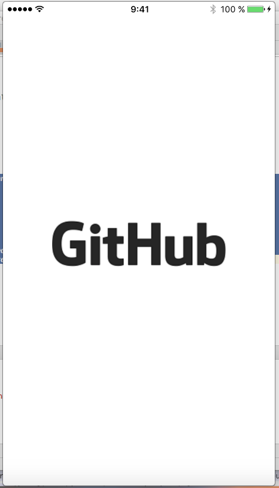
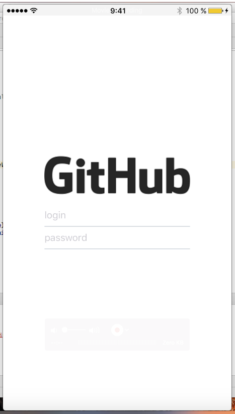
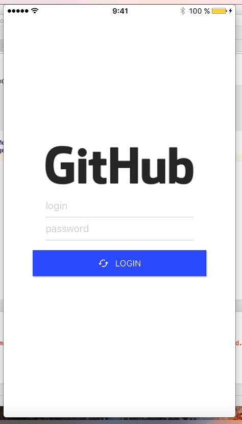

slidenumbers: true
autoscale: true
build-lists: true

# React Native: Crossplatform fast dive


---

#About me

* Vladimir Ivanov - Lead software engineer
* More than 6 years in Android development
* Wide interest in Mobile technologies
* Happy father of a wonderful son

——-

# Why not crossplatform?

1. Lack of specialists
2. UX concerns
3. God damn javascript

---

# Why crossplatform?

1. Cheap development
2. because rapid
3. 3x faster than native approach
4. Native UX, at last

——-


# How is was to dive a year ago?

1. Install node
2. Install android/ios sdk
3. For android: install java, download platforms, emulators, build tools
4. Learn React Native
5. ???
6. PROFIT!11

——-

# How it is now?

1. Install node
2. Learn React Native
3. [create-react-native-app](https://github.com/react-community/create-react-native-app)
4. Done

——-

Let’s dive


——-

# Simple start

```sh

$ brew install node

```

——-

# Simple start

```sh

$ brew install node
$ npm install -g create-react-native-app

```

——-

# Simple start

```sh

$ brew install node
$ npm install -g create-react-native-app
$ create-react-native-app github

```

——-

# Simple start

```sh

$ brew install node
$ npm install -g create-react-native-app
$ create-react-native-app github
$ cd github

```

——-

# Simple start

```sh

$ brew install node
$ npm install -g create-react-native-app
$ create-react-native-app github
$ cd github
$ npm start


```

——-


# What we get 

```sh

$ ls -l


```

——-


# What have we got 

```sh

$ ls -l

App.js
App.test.js
README.md
app.json
node_modules
package.json


```

——-

# App.js

```js

import React from 'react';
import { Text, View } from 'react-native';

export default class App extends React.Component {
  render() {
    return (
      <View style={{ flex: 1, justifyContent: 'center', alignItems: 'center' }}>
        <Text>Hello, world!</Text>
      </View>
    );
  }
}

```


——-


——-


# App.js

```js

import React from 'react';

```

——-

# App.js


<sub>`import React from 'react’;`</sub>

```js

import { Text, View } from 'react-native';

```

——-


# App.js


<sub>`import React from 'react’;`</sub>
<sub>`import { Text, View } from 'react-native’;`</sub>

```js

export default class App extends React.Component {

}

```

——-


# App.js


<sub>`import React from 'react’;`</sub>
<sub>`import { Text, View } from 'react-native’;`</sub>

<sub>`export default class App extends React.Component {`</sub>

```js

	render() {
		
	}
}
```

——-


# App.js


<sub>`import React from 'react’;`</sub>
<sub>`import { Text, View } from 'react-native’;`</sub>

<sub>`export default class App extends React.Component {`</sub>

```js

	render() {
		return (
      		<View style={{ flex: 1, justifyContent: 'center', alignItems: 'center' }}>
        		<Text>Hello, world!</Text>
      		</View>
    	);
	}
}
```

——-

# App.js

```js

import React from 'react';
import { Text, View } from 'react-native';

export default class App extends React.Component {
  render() {
    return (
      <View style={{ flex: 1, justifyContent: 'center', alignItems: 'center' }}>
        <Text>Hello, world!</Text>
      </View>
    );
  }
}

```

——-

# App.js

<sub>`<View style={{ flex: 1, justifyContent: 'center', alignItems: 'center' }}>`</sub>

```js
<View style={styles.container}>
```
——-

# App.js

```js

return (
  <View style={styles.container}>
     …
  </View>
);

…

const styles = {
 container: {
   flex: 1,
   justifyContent: 'center',
   alignItems: 'center'
 }
};

```

——-

# App.js

```xml

<Text style={{ color: '#F00' }}>
	Hello, world!
</Text>

```


——-

# Let’s make something more interesting


——-

# How?

1. React page is a component tree
2. Each piece of UI should be a component

——-

# 4 main components 

1. Logo
2. Inputs
3. Submit button
4. Optional message 


——-

# Logo component 

```js

import React from 'react';
import {Image, View} from "react-native";

export default Logo = () => (
    <View style={{alignItems: 'center'}}>
        <Image
            source={require('./../../../GitHub-Logo.png')}
        />
    </View>
);

``` 

——-

# Logo component 

```js

export default Logo = () => (
    …
);

``` 

——-

# Components can be 

1. Functional - no lifecycle, no state, only JSX
2. Class based - lifecycle, state, usage in redux, etc.

——-


# Logo component


<sub>`export default Logo = () => (`</sub>

```xml
	<View style={{alignItems: 'center'}}>
        	<Image
            		source={require('./../../../GitHub-Logo.png')}
        	/>
	</View>
```

<sub>`);`</sub>

——-



——-

# Login inputs

1. Render login input
2. Render password input(as hidden)
3. Pass somehow login and password to submit function

——-


# Login inputs

```js 

import React from 'react';
import {View} from ‘react-native’;
import {FormInput} from 'react-native-elements';

```

```xml

export default LoginInputs = ({ onChangeValue }) => (
    <View style={{ margin: 16 }}>
        <FormInput
            placeholder='login'
            onChangeText={(value) => {
                onChangeValue('login', value);
            }}
        />
        <FormInput
            secureTextEntry
            placeholder='password'
            onChangeText={(value) => {
                onChangeValue('password', value);
            }}
        />
    </View>
);


``` 
 
——-


# Login inputs

```js 

import React from 'react';
import {View} from ‘react-native’;
import {FormInput} from 'react-native-elements';

``` 
 
——-


# Login inputs

```js 

import React from 'react';
import {View} from ‘react-native’;


```

<sub>`import {FormInput} from 'react-native-elements’`</sub>; 
 
——-


# Login inputs


<sub>`import React from 'react’;`</sub>
<sub>`import {View} from ‘react-native’;`</sub>


```js 

import {FormInput} from 'react-native-elements’;
 
```

——-

# Login inputs

```js 

export default LoginInputs = ({ onChangeValue }) => (

```
```xml
    <View style={{ margin: 16 }}>
        <FormInput
            placeholder='login'
            onChangeText={(value) => {
                onChangeValue('login', value);
            }}
        />
        <FormInput
            secureTextEntry
            placeholder='password'
            onChangeText={(value) => {
                onChangeValue('password', value);
            }}
        />
    </View>
);


``` 
 

——-

# Login inputs

```js 

export default LoginInputs = ({ onChangeValue }) => (
	…
);


``` 


——-

# Login inputs

<sub>`export default LoginInputs = ({ onChangeValue }) => (`</sub>

```xml 

	<View style={{ margin: 16 }}>
        <FormInput
            placeholder='login'
            onChangeText={(value) => {
                onChangeValue('login', value);
            }}
        />
        <FormInput
            secureTextEntry
            placeholder='password'
            onChangeText={(value) => {
                onChangeValue('password', value);
            }}
        />
    </View>);

``` 
<sub>`);`</sub>

——-


# Login inputs

<sub>`export default LoginInputs = ({ onChangeValue }) => (`</sub>

```xml 

	<View style={{ margin: 16 }}>
        	{ … }
	</View>);


``` 

<sub>`);`</sub>

——-

# Login inputs

<sub>`<View style={{ margin: 16 }}>`</sub>


```xml

        <FormInput
            placeholder='login'
            onChangeText={(value) => {
                onChangeValue('login', value);
            }}
        />
        <FormInput
            secureTextEntry
            placeholder='password'
            onChangeText={(value) => {
                onChangeValue('password', value);
            }}
        />


```
<sub>`</View>);`</sub>


——-

# Login inputs

<sub>`<View style={{ margin: 16 }}>`</sub>


```xml

        <FormInput
            placeholder='login'
            onChangeText={(value) => {
                onChangeValue('login', value);
            }}
        />
        <FormInput />


```
<sub>`</View>);`</sub>


——-

# Login inputs

<sub>`<View style={{ margin: 16 }}>`</sub>

```xml
		<FormInput />
        <FormInput
            secureTextEntry
            placeholder='password'
            onChangeText={(value) => {
                onChangeValue('password', value);
            }}
        />


```
<sub>`</View>);`</sub>

——-

# LoginScreen.js

```js

render() {
        const {container} = styles;

        return (
```
```xml
    	        <View style={container}>
         	       <Logo />
          	       <LoginInputs …/>
            	</View>
```
```js
        )
    }

```

——-

# 



——-

# Login inputs

## Value propagation 

——-

# Component state

1. Each class based component has state
2. State is no more than a javascript object
3. Updating state is async, but this is not really important now
4. Updating state happens with this.setState() function


——-

# Saving login and password to screen state

```js 

…

class LoginScreen extends Component {

    state = { error: null };
… 
}

```
——-

# Saving login and password to screen state

```js 

…

class LoginScreen extends Component {

    state = { error: null };

    onChangeValue = (prop, value) => {
        this.setState({ [prop]: value });
    };

… 
}

```

——-


# Saving login and password to screen state

```js 

{ login: ‘v’ }
{ login: ‘vl’ }
{ login: ‘vli’ }

…

{ login: ‘vlivanov’, password: ’1’ }
{ login: ‘vlivanov’, password: ’12’ }
…
{ login: ‘vlivanov’, password: ’123abc123’ }

```

——-


# Submit button

```xml

<Button
 	raised
 	title='LOGIN'
 	backgroundColor="#00F"
 	icon={{name: 'cached'}}
 	onPress={this.doLogin}
/>

```

——-

# LoginScreen.js

```js

    render() {

        return (
```
```xml
            <View style={container}>
                <Logo />
                <LoginInputs onChangeValue={…}/>
                <Button
                    …
                />
           </View>
```
```js
        )
    }

```

——-


# 




——-


# Submit button

```xml

<Button
 	…
 	onPress={this.doLogin}
/>

```


——-


# Submit button

```js

  doLogin = async () => {
      const { login, password } = this.state;
      let result = await loginAsync(login, password);
      this.setState({ 
		loggedIn: result.error === undefined, 
		error:  result.error 
      });
  };

```


——-


# Submit button

```js

  doLogin = async () => {
      const { login, password } = this.state;
		…
  };

```


——-


# Submit button

```js

  doLogin = async () => {
      const { login, password } = this.state;
      let result = await loginAsync(login, password);
		…
  };

```


——-


# Submit button

```js

  doLogin = async () => {
      const { login, password } = this.state;
      let result = await loginAsync(login, password);
      this.setState({ 
		loggedIn: result.error === undefined, 
		error:  result.error 
      });
  };

```

——-

# loginAsync

```js
export const loginAsync = async (login, password) => {
    let base64 = encode(`${login}:${password}`);
    try {
        let result = await fetch('https://api.github.com/user', {
            method: 'GET',
            headers: {
                'Accept': 'application/json',
                'Content-Type': 'application/json',
                'Authorization': 'Basic ' + base64
            },
        });
        if (result.status === 200) {
            return {
                user: JSON.parse(result._bodyInit),
                auth: base64
            };
        } else {
            return { error: `Failed to login with ${result.status}` };
        }
    } catch (error) {
        console.log("[LoginActions] error = " + JSON.stringify(error));
        return { error: `Failed to login with ${result.error}` };
    }
};
```

——-

# loginAsync

```js
export const loginAsync = async (login, password) => {
    let base64 = encode(`${login}:${password}`);
    …
};
```

——-

# loginAsync

```js
export const loginAsync = async (login, password) => {
    let base64 = encode(`${login}:${password}`);
    try {
        let result = await fetch('https://api.github.com/user', …);
        …
    } catch (error) {
        …
    }
};
```


——-

# loginAsync

```js
export const loginAsync = async (login, password) => {
    let base64 = encode(`${login}:${password}`);
    try {
        let result = await fetch('https://api.github.com/user', {
            method: 'GET',
            headers: {
                'Accept': 'application/json',
                'Content-Type': 'application/json',
                'Authorization': 'Basic ' + base64
            },
        });
        …
    } catch (error) {
        …
    }
};
```


——-


# loginAsync

```js
export const loginAsync = async (login, password) => {
    let base64 = …
    try {
        let result = await fetch('https://api.github.com/user', …);
        if (result.status === 200) {
            return {
                user: JSON.parse(result._bodyInit),
                auth: base64
            };
        } 
	…
    } catch (error) {
        …
    }
};
```

——-

# loginAsync

```js
export const loginAsync = async (login, password) => {
    let base64 = …;
    try {
        let result = await fetch('https://api.github.com/user', …);
        if (result.status === 200) {
            return { … }
        } else {
            return { error: `Failed to login with ${result.status}` };
        }
    } catch (error) {
        return { error: `Failed to login with ${error}` };
    }
};
```

——-


# LoginScreen.js

```js

    render() {
        const {container, successMessage, errorMessage} = styles;

        return (
```
```xml
            <View style={container}>
                <Logo />
                <LoginInputs …/>
                <Button
                    …
                />
                {this.state.loggedIn && <Text style={successMessage}>Logged in!</Text>}
                {this.state.error && <Text style={errorMessage}>{this.state.error}</Text>}
            </View>
```
```js
        )
    }

```


——-

# doLogin

<sup>`doLogin = async () => {`</sup>
    <sup>`    const { login, password } = this.state;`</sup>
    <sup>`    let result = await loginAsync(login, password);`</sup>

```js
 this.setState({ 
	loggedIn: result.error === undefined, 
	error:  result.error 
 });
```    

<sup>`};`</sup>

——-

# 


——-

# Немного статистики

- 153 строки
- 1 Час времени разработки


——-

# Полезные ссылки

- https://facebook.github.io/react-native/docs/getting-started.html
- https://www.udemy.com/the-complete-react-native-and-redux-course/
- https://expo.io
- https://css-tricks.com/snippets/css/a-guide-to-flexbox/

——-

# Вопросы?
