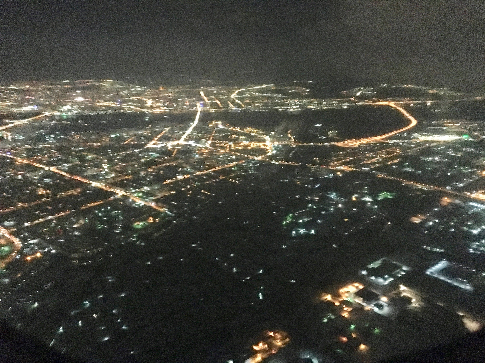

# How to stop worrying and start doing public talks?

---

# Agenda

* Why public speaking?
* Hard skills vs Soft Skills
* Public speaking in your career
* What to start with
* Talk preparation
* Travelling

---

# Why public speaking

---

---

# Hard skills vs Soft Skills

---

---

# Public speaking in your career

---

---

# What to start with

---

---

# Talk preparation

---

---

# Travel

---

# Contact me!

Vladimir_Ivanov4
	@epam.com

* epa.ms/vvsevolodovich
* epa.ms/medium
* mobiusconf.com/

