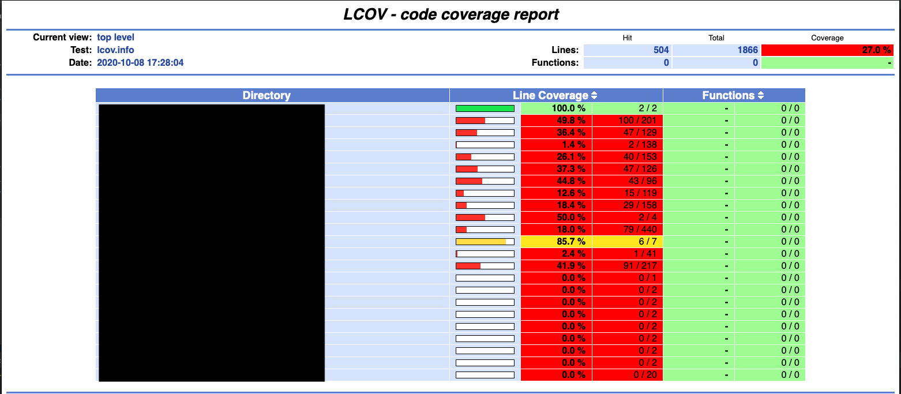
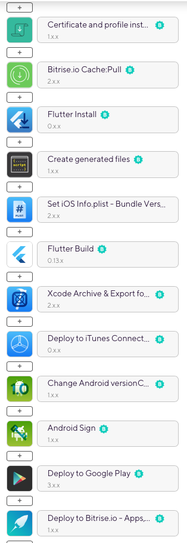

slidenumbers: true
autoscale: true
build-lists: true

# Tweaking Flutter Pipelines


---

# [fit] Vladimir Ivanov

* Solution Architect @ EPAM Systems
* Experienced in native Android, React-Native, Flutter


---

# Introduction about Flutter

* Cross-platform framework
* Uses Dart 
* Inspired by React and other declarative UI frameworks

---

# What we want

* Fast deployment
* High quality
* All together

---

# What we have

* Stakeholders get a new build each day
* No errors from static analysis
* Unit test coverage is 45% and increasing

---

# What we have... in Bitrise

* PR verification pipeline
* Dev build for Android&iOS
* QA, Staging and production builds for Android&iOS

---

# PR verification 

* installing dependencies + code generation
* Flutter test
* Flutter analyze(ignoring infos)
* Lcov installation
* Test coverage
* Deploying coverage


---

```sh

flutter analyze
Analyzing typecheck...                                                  
No issues found! (ran in 2.1s)

```

---

# analysis_options.yaml

```yaml

analyzer:
  strong-mode:
    implicit-dynamic: false

```

---

# BTW

* flutter analyze returns 1 for info messages

---

# Wrap the flutter analyze

```sh

#!/bin/sh
OUTPUT="$(flutter analyze)"
echo "$OUTPUT"
echo
if grep -q "error •" <<< "$OUTPUT"; then
    echo "flutter analyze found errors"
    exit 1
else
    echo "flutter analyze didn't find any errors"
    exit 0
fi

```

---

# Dart uses code generation

* Serialization(built_value, json_annotation)
* State management libraries(i.e. mobx)

---

# Script example

```sh
#!/usr/bin/env bash


flutter pub get
flutter packages pub run build_runner build --delete-conflicting-outputs

```

---

# Test coverage

* Flutter generates lcov.info file
* The file is properly read by Github/Gitlab, but not by bitrise(it gets junit though)
* To display coverage we need an html format
* We also want to monitor for the test coverage dropping below some threshold
* Test coverage is calculated only against files under tests
* Test coverage doesn't work for function and branch coverage

---



---

# [fit] What we do

---

# flutter "test" doesn't generate json

---

flutter "pub" "global" "activate" "junitreport"
flutter "test" "--machine" | tojunit "--output" "./flutter_junit_test_results.xml"

---

# lcov installation

brew "reinstall" "lcov"

---

# How to maintain minimal coverage

* Or not less than previous coverage(how do you even do it?)
* Minimal coverage

---

# You need to have check_coverage package[^1]

[^1]: which we developed on our own, hope to open source it

---

# Build

* Set iOS bundle versions
* Xcode archive
* Deploy to iTunes connect
* Change android version code
* Android Sign
* Deploy to Google Play



---

# Bundle versions

* Somehow you need to bump the build number, otherwise iTunes Connect/Google Play reject builds
* Committing manually is complex and error prone
* Let Bitrise do it for you with built-in steps

---

# Deploy to stores

* CD in a nutshell
* Run the task as frequently as you need
* Optionally notify Slack/MS Teams/whatever about a new build

---

# Results

* High quality
* Fast and easy deployments

---

# [fit] Vladimir Ivanov

* https://vvsevolodovich.dev
* https://twitter.com/vvsevolodovich

