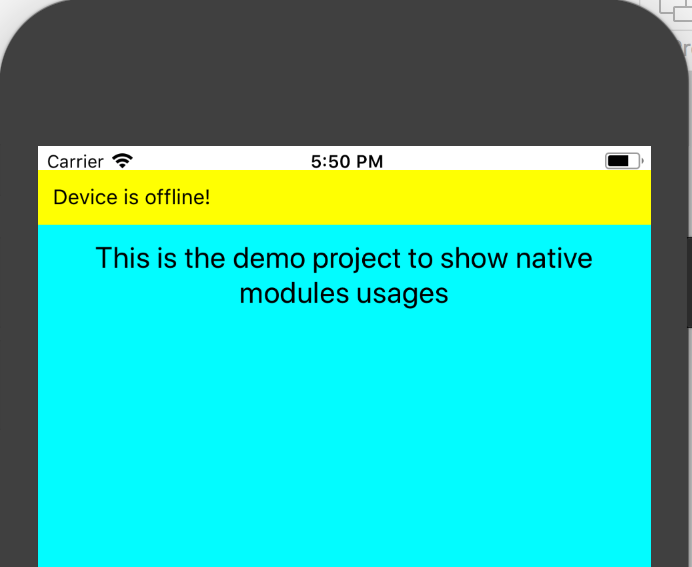

footer: *<EPAM> | Confidential*
slidenumbers: true
slidecount: true
autoscale: true
build-lists: true


# Unveiling full power of the mobile device with React Native 


---

# Confidential information

This presentation has been prepared by EPAM Systems, Inc. solely its EPAM Software Engineering Conference. This presentation or the information contained herein may not be reproduced or used for any other purpose. This presentation includes highly confidential and proprietary information and is delivered on the express condition that such information will not be disclosed to anyone except persons the recipient organization who have a need to know solely for the purpose described above. No copies of this presentation will be made, and no other distribution will be made, without the consent of EPAM. Any distribution of this presentation to any other person, in whole or in part, or the reproduction of this presentation, or the divulgence of any of its contents is unauthorized.

---

# Disclaimer

Everything presented here is a product of production experience and research findings and provided as is. However, you can use it as we did. 

---

# About me

* Vladimir Ivanov - Lead Software Engineer
* Primary Skill: Android
* React Native Experience > 2 year

---

# Agenda

* What is the profit?
* Implementing Android Native Module
* Implementing iOS Native Module
* Passing data from native to RN
* How it looks like

---

# What is the profit?

---

# What is the profit?

* React Native is View
* JS performance for UI is good; bad otherwise
* Purpose of having mobile application is system features access 

---

# System features

* Accelerometer
* Notifications
* Bluetooth
* Other connectivity

---


# React Native Architecture


---


# Performance

---


---


# Performance

1. RSA js implementation requires ~5000 ms
2. Same implementation in java(Kotlin) requires ~500 ms
3. 10x times 

---

# Implementing Android Native Module

---


# Omitting some boilerplate...

---

# Implementing module

```kotlin

class EncryptionModule : BaseJavaModule() {

	override fun getName(): String {
		return "Encryption"
	}
}

```
---

# Implementing module with Application context

```kotlin
class EncryptionModule(context : ReactApplicationContext) 
			: ReactContextBaseJavaModule(context) {

	override fun getName(): String {
		return "Encryption"
	}
}
```

---

# Exposing a method to javascript

```kotlin, [.highlight: 7-10]
class EncryptionModule : BaseJavaModule() {

	override fun getName(): String {
		return "Encryption"
	}

	@ReactMethod
	fun calculateKeys() {
		Log.d(name, "calculating the encryption keys")
	}
}

```

---

# Exposing a method to javascript

```kotlin
@ReactMethod
fun calculateKeys(promise: Promise) {
    val exponent = "10001"
    try {
        val keyPair = generateKeyPair(KEY_LENGTH, exponent)

        val map = createMap(keyPair)

        promise.resolve(map)
    } catch (e: Exception) {
        CrashAnalytics.notify(e)
        Log.e(TAG, "Failed to put public key to json", e)
        promise.reject("failed to generate json", e)
    }

}
```

---

```kotlin, [.highlight: 1]
internal fun createMap(keyPair: KeyPair): WritableMap {
    val rsaKeyPair = keyPair.convertToPublicPrivatePair()
    val pubKey = rsaKeyPair.pubKey
    val privKey = rsaKeyPair.privKey

    val map = Arguments.createMap()
    map.putString("pubKey", pubKey)
    map.putString("privKey", privKey)
    return map
}

```

---

```kotlin, [.highlight: 2-4]
internal fun createMap(keyPair: KeyPair): WritableMap {
    val rsaKeyPair = keyPair.convertToPublicPrivatePair()
    val pubKey = rsaKeyPair.pubKey
    val privKey = rsaKeyPair.privKey

    val map = Arguments.createMap()
    map.putString("pubKey", pubKey)
    map.putString("privKey", privKey)
    return map
}

```

---

```kotlin, [.highlight: 6-9]
internal fun createMap(keyPair: KeyPair): WritableMap {
    val rsaKeyPair = keyPair.convertToPublicPrivatePair()
    val pubKey = rsaKeyPair.pubKey
    val privKey = rsaKeyPair.privKey

    val map = Arguments.createMap()
    map.putString("pubKey", pubKey)
    map.putString("privKey", privKey)
    return map
}
```

---

# Passing params to the method

```java

Boolean -> Bool
Integer -> Number
Double -> Number
Float -> Number
String -> String
Callback -> function
ReadableMap -> Object
ReadableArray -> Array
Promise -> Promise

```

---

# Passing params to the method

```java, [.highlight: 6,7,8,9]
Boolean -> Bool
Integer -> Number
Double -> Number
Float -> Number
String -> String
Callback -> function
ReadableMap -> Object
ReadableArray -> Array
Promise -> Promise

```

---

# Usage in js

```js, [.highlight: 1-4]

// @flow

import { NativeModules } from 'react-native'
const nativeModule = NativeModules.Encryption

type KeyPair = { pubKey: string, privacy: string } 

export const calculateKeys = async (): Promise<KeyPair> => {
    console.log('[encryption] Calling the native module')
    return await nativeModule.calculateKeys()
};


```

---

# Usage in js

```js, [.highlight: 6]

// @flow

import { NativeModules } from 'react-native'
const nativeModule = NativeModules.Encryption

type KeyPair = { pubKey: string, privKey: string } 

export const calculateKeys = async (): Promise<KeyPair> => {
    console.log('[encryption] Calling the native module')
    return await nativeModule.calculateKeys()
};


```

---

# Usage in js

```js

// @flow

import { NativeModules } from 'react-native'
const nativeModule = NativeModules.Encryption

type KeyPair = { pubKey: string, privacy: string } 

export const calculateKeys = async (): Promise<KeyPair> => {
    console.log('[encryption] Calling the native module')
    return await nativeModule.calculateKeys()
};


```

---

# Implementing iOS Native Module

---


---


---

# Expose native code: iOS

* Some boilerplate is required
* However Swift module is the core

---

# Create BridgeModule

```swift

#import Foundation


@objc(EncryptionModule)
class EncryptionModule : NSObject {
  @objc func calculateKeys(
		      resolver resolve: RCTPromiseResolveBlock,
                      rejecter reject: RCTPromiseRejectBlock) -> Void {
    NSLog("[encryption] %@", "calculating keys")
  }
}

@end

```

---

# EncryptionModule.m

```objectivec

#import "RCTBridgeModule.h"

@interface RCT_EXTERN_MODULE(EncryptionModule, NSObject)

RCT_EXTERN_METHOD(calculateKeys
                  resolver:(RCTPromiseResolveBlock)resolve
                  rejecter:(RCTPromiseRejectBlock)reject
                  )

// ... other methods

@end

```

---

# Passing params to the method

```swift

string -> (NSString)
number -> (NSInteger, float, double, CGFloat, NSNumber)
boolean -> (BOOL, NSNumber)
array -> (NSArray)
object -> (NSDictionary)
function -> (RCTResponseSenderBlock)
Promise -> RCTPromiseResolveBlock, RCTPromiseRejectBlock

```

---

# Bridge performance


---

# Bridge performance


Call with object:         

493 ops/sec ±1.83% 

(133 runs sampled) 

---

# Bridge performance

Call with large array(1000 integers):         

76.41 ops/sec ±1.54% (135 runs sampled) 

(133 runs sampled) 

---

# Passing data from native to RN

---

# Posting events from native to JS - Android

* Subscribe in JS
* Create a native module 
* Subscribe for network change events
* Post the changes to JS

---

# JS Handling

```js, [.highlight: 1-3]

componentWillMount() {                                                           
    const self = this;                                                           
    Monitoring.initModule();                                                     
    emitter.addListener('MonitoringNetworkStateChanged', 
		(networkState) => {                              
        	self.setState({ online: networkState === 'Connected' })               
    	});                                                                          
}  

componentWillUnmount() {                     
    emitter.removeAllListeners('MonitoringNetworkStateChanged')    
}                                                                                

```
---

# JS Handling

```js, [.highlight: 4]

componentWillMount() {                                                           
    const self = this;                                                           
    Monitoring.initModule();                                                     
    emitter.addListener('MonitoringNetworkStateChanged', 
		(networkState) => {                              
        	self.setState({ online: networkState === 'Connected' })               
    	});                                                                          
}  

componentWillUnmount() {                     
    emitter.removeAllListeners('MonitoringNetworkStateChanged')    
}                                                                                

```
---

# JS Handling

```js, [.highlight: 5-7]

componentWillMount() {                                                           
    const self = this;                                                           
    Monitoring.initModule();                                                     
    emitter.addListener('MonitoringNetworkStateChanged', 
		(networkState) => {                              
        	self.setState({ online: networkState === 'Connected' })               
    	});                                                                          
}  

componentWillUnmount() {                     
    emitter.removeAllListeners('MonitoringNetworkStateChanged')    
}                                                                                

```
---

# JS Handling

```js, [.highlight: 10-12]

componentWillMount() {                                                           
    const self = this;                                                           
    Monitoring.initModule();                                                     
    emitter.addListener('MonitoringNetworkStateChanged', 
		(networkState) => {                              
        	self.setState({ online: networkState === 'Connected' })               
    	});                                                                          
}  

componentWillUnmount() {                     
    emitter.removeAllListeners('MonitoringNetworkStateChanged')    
}                                                                                

```

---

# JS Handling

```js

const emitter = Platform.OS === 'android' 
	? DeviceEventEmitter 
	: new NativeEventEmitter(Monitoring)

```

---

# Network Monitoring Module

```kotlin
class MonitoringModule(reactContext: ReactApplicationContext?) 
	: ReactContextBaseJavaModule(reactContext) {

}

```


---

# Network Monitoring Module

```kotlin, [.highlight: 4]
class MonitoringModule(reactContext: ReactApplicationContext?) 
	: ReactContextBaseJavaModule(reactContext) {

	private var reactNativeContext = reactContext;

}

```


---

# Network Monitoring Module

```kotlin, [.highlight: 4,5,6]
class MonitoringModule(reactContext: ReactApplicationContext?) 
	: ReactContextBaseJavaModule(reactContext) {

	private var reactNativeContext = reactContext;
	private lateinit var networkStateReceiver 
		: NetworkStateReceiver
}

```

---

# Network Monitoring Module

```kotlin, [.highlight: 2-3]


@ReactMethod
public fun initModule() {
	networkStateReceiver = NetworkStateReceiver();
	reactNativeContext?.registerReceiver(networkStateReceiver, 
		IntentFilter("android.net.conn.CONNECTIVITY_CHANGE"))
}


```


---

# Network Monitoring Module

```kotlin, [.highlight: 4]


@ReactMethod
public fun initModule() {
	networkStateReceiver = NetworkStateReceiver();
	reactNativeContext?.registerReceiver(networkStateReceiver, 
		IntentFilter("android.net.conn.CONNECTIVITY_CHANGE"))
}


```

---

# Network Monitoring Module

```kotlin, [.highlight: 5-6]


@ReactMethod
public fun initModule() {
	networkStateReceiver = NetworkStateReceiver();
	reactNativeContext?.registerReceiver(networkStateReceiver, 
		IntentFilter("android.net.conn.CONNECTIVITY_CHANGE"))
}

```

---

# Network Monitoring Module

```kotlin, [.highlight: 1, 16]

internal inner class NetworkStateReceiver : BroadcastReceiver() {

	override fun onReceive(context: Context?, intent: Intent?) {

		val extras = intent.extras
			
		val ni = extras.get(ConnectivityManager.EXTRA_NETWORK_INFO) as NetworkInfo
		if (ni.state == NetworkInfo.State.CONNECTED) {
			notifyNetStateChanged("Connected")
		}
			
		if (extras.getBoolean(ConnectivityManager.EXTRA_NO_CONNECTIVITY, java.lang.Boolean.FALSE)) {
			notifyNetStateChanged("Disconnected")
		}
	}
}

```
---

# Network Monitoring Module

```kotlin, [.highlight: 3, 15]

internal inner class NetworkStateReceiver : BroadcastReceiver() {

	override fun onReceive(context: Context?, intent: Intent?) {

		val extras = intent.extras
			
		val ni = extras.get(ConnectivityManager.EXTRA_NETWORK_INFO) as NetworkInfo
		if (ni.state == NetworkInfo.State.CONNECTED) {
			notifyNetStateChanged("Connected")
		}
			
		if (extras.getBoolean(ConnectivityManager.EXTRA_NO_CONNECTIVITY, java.lang.Boolean.FALSE)) {
			notifyNetStateChanged("Disconnected")
		}
	}
}

```
---

# Network Monitoring Module

```kotlin, [.highlight: 5-10]

internal inner class NetworkStateReceiver : BroadcastReceiver() {

	override fun onReceive(context: Context?, intent: Intent?) {

		val extras = intent.extras
			
		val ni = extras.get(ConnectivityManager.EXTRA_NETWORK_INFO) as NetworkInfo
		if (ni.state == NetworkInfo.State.CONNECTED) {
			notifyNetStateChanged("Connected")
		}
			
		if (extras.getBoolean(ConnectivityManager.EXTRA_NO_CONNECTIVITY, java.lang.Boolean.FALSE)) {
			notifyNetStateChanged("Disconnected")
		}
	}
}

```
---

# Network Monitoring Module

```kotlin, [.highlight: 12-14]

internal inner class NetworkStateReceiver : BroadcastReceiver() {

	override fun onReceive(context: Context?, intent: Intent?) {

		val extras = intent.extras
			
		val ni = extras.get(ConnectivityManager.EXTRA_NETWORK_INFO) as NetworkInfo
		if (ni.state == NetworkInfo.State.CONNECTED) {
			notifyNetStateChanged("Connected")
		}
			
		if (extras.getBoolean(ConnectivityManager.EXTRA_NO_CONNECTIVITY, java.lang.Boolean.FALSE)) {
			notifyNetStateChanged("Disconnected")
		}
	}
}

```
---

# Network Monitoring Module

```kotlin

internal inner class NetworkStateReceiver : BroadcastReceiver() {

	…

	private fun notifyNetStateChanged(state: String) {
		reactNativeContext
				?.getJSModule(DeviceEventManagerModule.RCTDeviceEventEmitter::class.java)
				?.emit("MonitoringNetworkStateChanged", state)
	}
}

```

---

# What’s the maintainability problem here? 

---

# Constants

- But we can export constant names from modules


---

# Network Monitoring Module

```js, [.highlight: 1]

const Monitoring = NativeModules.Monitoring;
const EventName = Monitoring.EVENT_NETWORK_STATE_CHANGED;

```
---

# Network Monitoring Module

```js, [.highlight: 2]

const Monitoring = NativeModules.Monitoring;
const EventName = Monitoring.EVENT_NETWORK_STATE_CHANGED;

```

---

# Network Monitoring Module

```js, [.highlight:7-10]

const Monitoring = NativeModules.Monitoring;
const EventName = Monitoring.EVENT_NETWORK_STATE_CHANGED;

componentWillMount() {
	const self = this;
	Monitoring.initModule();
	emitter.addListener(EventName, (e) => {
		self.setState({ online: e === 'Connected' })
   	});
}


```
---

# Network Monitoring Module

```js, [.highlight: 3]

const Monitoring = NativeModules.Monitoring;
const EventName = Monitoring.EVENT_NETWORK_STATE_CHANGED;
const ConnectedState = Monitoring.CONNECTED;

```

---

# Network Monitoring Module

```js, [.highlight: 5-7]


componentWillMount() {
	const self = this;
	Monitoring.initModule();
	emitter.addListener(EventName, (networkState) => {
		self.setState({ online: networkState === ConnectedState })
	});
}


```

---

# Network Monitoring Module

```js, [.highlight: 6]


componentWillMount() {
	const self = this;
	Monitoring.initModule();
	emitter.addListener(EventName, (networkState) => {
		self.setState({ online: networkState === ConnectedState })
	});
}


```


---


# How it looks like

---


---




---

# Summary

---

# Summary

* Creating a native module is easy
* Both native and js realms are fast
* Bridging is slow, avoid passing it 
* Interaction is bidirectional

---


# Useful links

* https://facebook.github.io/react-native/docs/native-modules-ios.html 
* https://github.com/peggyrayzis/react-native-create-bridge
* https://github.com/facebook/react-native/issues/10504

---

# mobiusconf.com/cfp

---


