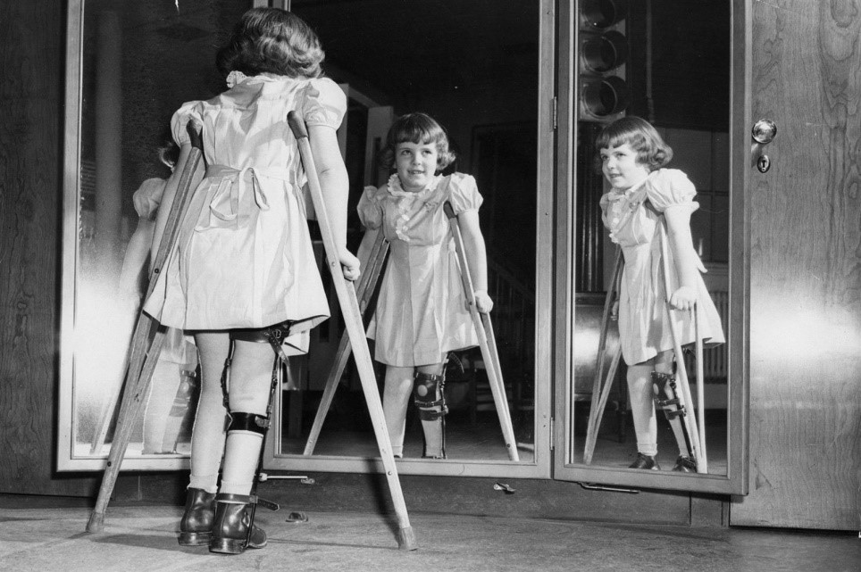

build-lists: true

# Vaccinations

---

# У кого есть дети? 

---

# Кто привит от гриппа? 

---

# Кто думает, что от прививки можно заразиться? 

---

# Один случай на ~1 000 000

---

---

# Иммунитет

* Базы
* Эвристика
* Никакой облачной синхронизации 

---

# Самоа

---

# Вакцина - это часть вирусов или мертвые вирусы

---

# или живые невирулентные вирусы

---

---

# Последствия вакцины

* Желательные
* Нежелательные

---

# Аутизм

---

# Фальсификации

* Эндрю Вэйкфилд

---

---

# Риски

- смерть от заболевания

## 

- осложнения
	1. с проблемами иммунитета
	1. c наличием текущего заболевания 

---

# Осложнения: 0.000001
# Вероятность смерти: 0.00016

---

# 1 vs 160

---

# Коллективный иммунитет

---

