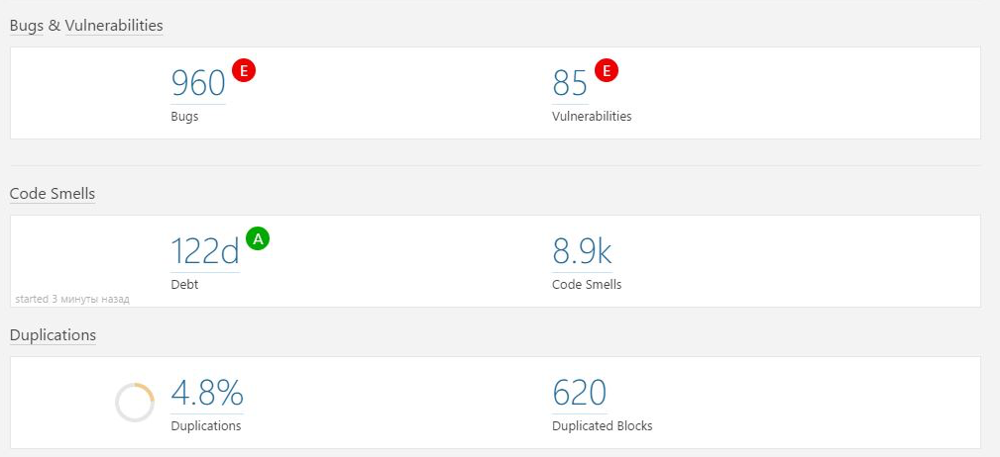
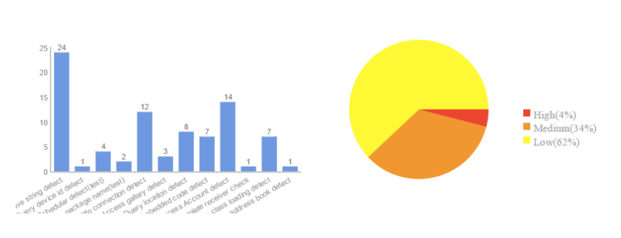
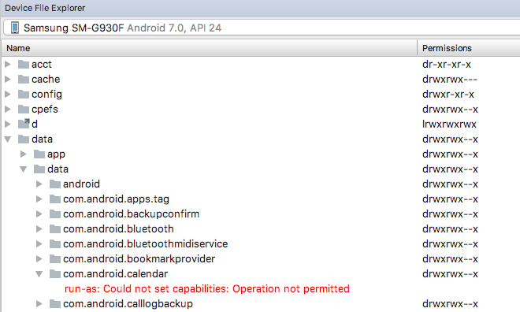

slidenumbers: true
autoscale: true
build-lists: true


---


# Strategy of drastic improvements in a software project


---

# About me

* Vladimir Ivanov - Lead Software Engineer in EPAM
* More than 7 years of Android apps development
* More than 15 published applications
* Wide interest in mobile technologies


---


# What is legacy?

* Not written by us

——-

# What is legacy?

~~Not written by us~~

——-

# What is legacy?

~~Not written by us~~
No architecture or bad architecture


——-

# What is legacy?

~~Not written by us~~
No architecture or bad architecture
No structure or a code mess

——-

# What is legacy?

~~Not written by us~~
No architecture or bad architecture
No structure or a code mess
WTF per hour > 9000

——-

# How to measure the legacy?

——-

# How to measure the legacy?

$$L$$ = T$$ * $$H [^1]

[^1]: 
 	T - hours of tech debt, H - developer’s rate per hour


——-

# How to measure T?

——-

# What is technical debt? 

* Errors and vulnerabilities
* Maintainability problems
* Code duplications
* Low test coverage

———

# Measurement tools 

SonarQube

——




———


# Measurement tools  


SonarQube
MobSF/Akana/Whatever Security Analysis tool

——



——-


# Measurement tools  


SonarQube
MobSF/Akana/Whatever Security Analysis tool
Architecture analysis tool

——

# Measurement tools 

SonarQube
MobSF/Akana/Whatever Security Analysis tool
~~Architecture analysis tool~~

——

# What’s an architecture? 

The set of structures needed to reason about the system, which comprises software elements, relations among them, and properties of both. [^2]


[^2]: 
 	Software Architecture in Practice, 3rd Edition, Bass, Clements, Kazman, Addison-Wesley

——-

# What the hell it means? 

* Architecture is a key to the system properties, an end user is concerned about
* Or product owner thinks so
* There are no bad or good architectures; there are ones that fit the target system properties

——-

# When you need to think about an architecture? 

* No need to if you try the technology
* No need to if you create a one-time script
* You definitely need to in all the other cases

———

# What are our target properties? 

* Performance
* Localization
* Offline work
* Testability
* Extendability

——-

# Testability

* Arguments and return values are explicit
* The dependencies are explicit
* The dependencies are changeable in tests

——-

# Extendability

* The changes are inevitable
* How much do the changes cost:
  - How much do the changes-making mechanism cost?
  - How much do the change making without the mechanism cost?

——-

# Extendability

For N similiar changes approx. equation is: 

$$ N $$ * $$ ChangeCost $$ <= $$ MechanismCost $$ + $$ N $$ * ( $$ Change2Cost $$ )

——-

# What are our target properties? 

* Performance
* Localization
* Offline work
* Testability
* Extendability

——-

# What architecture provides those properties? 

* Clean architecture

——-


——-


——-

# What architecture provides those properties? 

* Clean architecture
* Google Android architecture


——-


——-

# What architecture provides those properties? 

* Clean architecture
* Google Android architecture
* VIPER

——-


# What’s in common?


——-


# What’s in common?


> In strictly layered architectures the current layer may access only the one layer below [^3]


[^3]: 
 	Software Architecture in Practice, 3rd Edition, Bass, Clements, Kazman, Addison-Wesley

——

# GreenDao Example

0. 4 databases
1. 30 tables
2. 278 classes for data access
3. 20,000 LOC
4. 0% test coverage in fact

——-


——

# Entity example

```java

public class Entity {

	private String name;
	private Long id;

	…

	public String getName();
	…

}

```

——

# Entity request example

```java
	@AutoFactory
	public class GetEntityRequest extends SqlRequest {

		@Override
		protected String[] getColumns() {
			return new String[] {
				F + “.” + ID_FIELD + “ AS “ + F_ID_FIELD,
				F + “.” + NAME_FIELD + “ AS “ + F_NAME_FIELD,
				…
				STORAGE + “.” + ID_FIELD + “ AS “ + STORAGE_ID_FIELD,
				…
				SYNC + “.” + ID_FIELD + “ AS “ + SYNC_ID_FIELD,
				…

			}
		}
	}
```


——

# Entity request example

```java
	@Override
	public Entity createEntity() {
		if (!cursor.moveToFirst()) {
			return null;
		}
		
		…
		String name = cursor.getString(cursor.getColumnIndex(F_NAME_FIELD));
		…
		return new Entity(id, name, …); 
	}
```

——-


# Entity request example 

```java, [.highlight: 1,2]
	@AutoFactory
	public class GetEntityRequest extends SqlRequest {
		…
	}
```

——

# Entity request example 

```java, [.highlight: 1, 2, 6-10]
	@AutoFactory
	public class GetEntityRequest extends SqlRequest {
		…
	}

	@Generated
	public class GetEntityRequestFactory {
		public GetEntityRequest create() {
			return new GetEntityRequest();
		}
	} 
```

——


# Request call

```java

public class MyEntityActivity extends Activity { 

	@Inject GetEntityRequestFactory requestFactory;

	@Override
	protected void onCreate(Bundle instance) {
		super.onCreate(instance);
		Entity entity = requestFactory.create().createEntity();
		show(entity);
	}
}

```


——

# What are the issues?

0. Disk access on the UI thread 
1. A lot of boilerplate
2. Presenation layer accesses the data hardening the unit-testing
3. The data model is unknown


——


——-

# Extracting the layer

1. Separate module
2. Unit-test covered 100%


——-

# Why?

1. Getting to know the data model
2. Providing guarantees it works
3. Protect of incorrect changes
4. Actually speed up the build process

——-

# Getting to know the data model

——-

# Getting to know the data model

Stetho [^4]

[^4]:  	http://facebook.github.io/stetho/

——-

# Getting to know the data model

Stetho [^4]
or Android file Explorer

[^4]:  	http://facebook.github.io/stetho/

——-

# Getting to know the data model

Stetho [^4]
or Android file Explorer
Db files

[^4]:  	http://facebook.github.io/stetho/

——-

# Getting to know the data model

Stetho [^4]
or Android file Explorer
Db files
sqldelight [^5]

[^4]:  	http://facebook.github.io/stetho/

[^5]:	https://github.com/square/sqldelight

——-


# Stetho

```java

compile 'com.facebook.stetho:stetho:1.5.0'

```

——-

# Stetho


```java
public class MyApplication extends Application {
  …
  public void onCreate() {
    super.onCreate();
    …
    Stetho.initializeWithDefaults(this);
  }
}
```

——-


——-



——-


# sqldelight

```groovy
buildscript {
  repositories {
    mavenCentral()
  }
  dependencies {
    classpath 'com.squareup.sqldelight:gradle-plugin:0.6.1'
  }
}

apply plugin: 'com.squareup.sqldelight'

```

——-

# sqldelight

```sql
CREATE TABLE entity (
  _id INTEGER NOT NULL PRIMARY KEY AUTOINCREMENT,
  name TEXT NOT NULL
);
```

——-


# sqldelight

```java
public class Entity {

  private Long id;

  private String name;

  public Long getId() { … }
  public String getName() { … }
);
```


——-


# sqldelight

```java

@Table(name = “Entity”)
public class Entity {

  @Column(name = “_id”)
  private Long _id;

  @Column(name = “NAME”)
  private String name;

  public Long getId() { … }
  public String getName() { … }
);
```

——-

# Methodology called CIDR

——-


——-


# Integration into the app - CIDR!

1. Create unit test
2. Implement
3. Deprecate
3. Replace


——-

# Integration into the app - CIDR!

1. Create unit test

——


# Create unit test

```java
@Override
protected void onCreate(Bundle instance) {
	super.onCreate(instance);
	Entity entity = requestFactory.create().createEntity();
	show(entity);
}
```

——-


# Create unit test

```java, [.highlight: 4]
@Override
protected void onCreate(Bundle instance) {
	super.onCreate(instance);
	Entity entity = requestFactory.create().createEntity();
	show(entity);
}
```


——-


# Create unit test

```java, [.highlight: 4,5]
@Override
protected void onCreate(Bundle instance) {
	super.onCreate(instance);
	GetEntityRequest request = requestFactory.create();
	Entity entity = request.createEntity();
	show(entity);
}
```

——-

# Create unit test

```java
 	
@VisibleForTesting
protected Entity loadEntity() {
	return requestFactory.create().createEntity();
}
```

——-

# Create unit test

```java
 	
@VisibleForTesting
protected Observable<Entity> loadEntity() {
	return Single.fromCallable(() -> {
		requestFactory.create().createEntity()
	});
}
```

——-

# Create unit test

```java, [.highlight: 4,7-9]
@Override
protected void onCreate(Bundle instance) {
	super.onCreate(instance);
	loadEntity()
		.subscribeOn(Schedulers.io())
		.observeOn(AndroidSchedulers.mainThread());
		.subscribe({entity, throwable} -> {
			show(entity);
		});
		
}
```

——-

# Create unit test

```java, [.highlight: 4]
@Override
protected void onCreate(Bundle instance) {
	super.onCreate(instance);
	viewModel.loadEntity()
		.subscribeOn(Schedulers.io())
		.observeOn(AndroidSchedulers.mainThread());
		.subscribe({entity, throwable} -> {
			show(entity);
		});
		
}
```


——-

# Create unit test

```java
@Test
public void shouldLoadEntity() {
	ViewModel viewModel = new ViewModel();
		
	viewModel.loadEntity()
		.subscribe({entity, throwable} -> {
			checkEntity(entity);
		});
		
}
```

——-

# Create unit test

```java
 	
public void checkEntity(Entity entity) {
	assertEquals(NAME, entity.getName());
	assertEquals(ID, entity.getId());
	…
}
```

——

# Integration into the app - CIDR!

1. Create unit test
2. Implement


——-

# Implement

```java
 	
public interface EntityDAO {
		
	Observable<Entity> loadEntity();
}
```

——-

# Implement

```java
 	
public class ViewModel {

	@Inject EntityDao entityDao;
		
	public Observable<Entity> loadEntity() {
		return entityDao.loadEntity();
	}
}
```


——-

# Implement

```java
 	
public class GreenDaoEntityDAO implements EntityDAO {
		
	public Observable<Entity> loadEntity() {
		RxDao<DbEntity> rxDao = daoSession.getEntityDao().rx();
		return rxDao.load();
	}
}
```

——-

# Problem №1

1. Database object is not convenient to use in presentation 
2. More likely there are Entity and DbEntity.
3. What to do? 

——-

# Converters!

——-

# Converters

```java 	
public class GreenDaoEntityDAO implements EntityDAO {
		
	public Observable<Entity> loadEntity() {
		RxDao<DbEntity> rxDao = daoSession.getEntityDao().rx();
		return rxDao.load().flatMap(dbEntity -> convert(dbEntity));
	}
		
}
```

——-

# Converters

```java, [.highlight: 5]
 	
public class GreenDaoEntityDAO implements EntityDAO {
		
	public Observable<Entity> loadEntity() {
		RxDao<DbEntity> rxDao = daoSession.getEntityDao().rx();
		return rxDao.load().flatMap(dbEntity -> convert(dbEntity));
	}
		
}
```

——-

# Problem №2

1. Junior developers doesn’t know anything about your architecture

——-

# Imagine one needs application module data…

```java, [.highlight: 4,6]
 	
public class GreenDaoEntityDAO implements EntityDAO {
		
	public Observable<Entity> loadEntity() {
		String userId = ApplicationSettings.getUserId();
		RxDao<DbEntity> rxDao = daoSession.getEntityDao().rx();
		return rxDao.load(userId).flatMap(dbEntity -> convert(dbEntity));
	}
		
}
```

——-

# Imagine one needs application module data…

——-

# This is the reason to

* Mode the layer into separate module
* Cover it with unit-tests
* Ship binary

——

# Integration into the app - CIDR!

1. Create unit test
2. Implement
3. Deprecate

——-

# Deprecate

```java, [.highlight: 1-4,6,8]

/**
 * @deprecated Please, use {@link EntityDao#loadEntity()}
 */
@Deprecated
@AutoFactory
public class GetEntityRequest {
...
}

```

——-

# Integration into the app - CIDR!

1. Create unit test
2. Implement
3. Deprecate
4. Replace


——-

# Final statistics


0. 4 databases
1. 30 tables
2. 84 data access classes (against 278)
3. 7400 LOC including tests (against 20,000 without ones)
4. 100% test coverage in fact (against 0%)


——-


——-

# What are the target goals reached? 

* Performance :white_check_mark:
* Localizable
* Offline work :white_check_mark:
* Testability :white_check_mark:
* Extendability :white_check_mark:

——-


# Where to apply CIDR approach? 

* Refactoring the network layer
* Moving to MVVM
* Basically introducing the new layer

——-

# Where not to apply? 

* Security
* Tools and utility classes
* Any cross-component code 

---

# Links

* https://www.amazon.com/Software-Architecture-Practice-3rd-Engineering/dp/0321815734
* https://twitter.com/vvsevolodovich :bird:
* https://medium.com/@dzigorium :pencil:
* https://mobiusconf.com/

---


