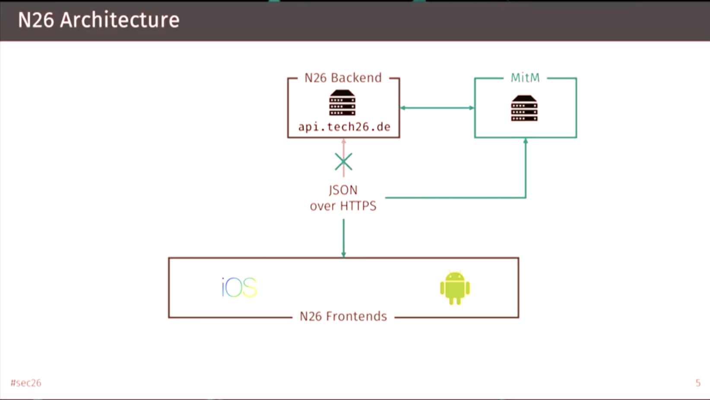
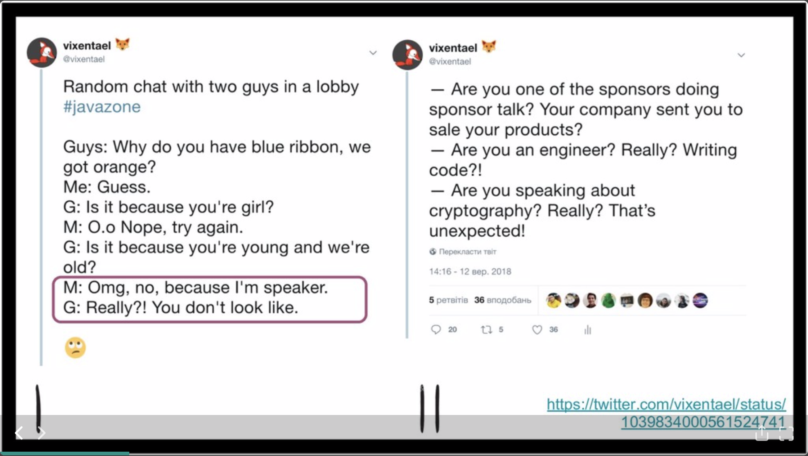
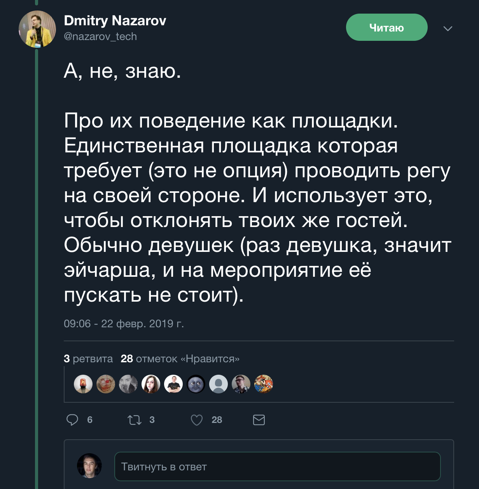

footer: *<EPAM>*
slidenumbers: true
slidecount: true
autoscale: true
build-lists: true
slide-transition: true

---

# Vernon Kidd, Therac-25 and Nancy Liveson

---

# About me

* Vladimir Ivanov
* Designing Mobile-centric solutions for living

[.build-lists: false]

---

# We're in a disaster

---

# What is IT-Industry?

* The sum of companies providing information and data based products and services added by IT-departments of other companies.

---

# What is great about our industry?

* We are growing despite Brexit, the US - China trade wars and others[^2]
* The developers are paid far from minimum wages(3000 vs 330) [^3]
* The remote style is conquering the world

[^2]: https://www.gartner.com/en/newsroom/press-releases/2019-01-28-gartner-says-global-it-spending-to-reach--3-8-trillio

[^3]: https://salaries.dev.by

---

# However

---

# However

* Security is a disaster
* Quality is a concern
* Bad diversity and inclusion

---

# Security

---

# Security

* Data breaches potentially affected __> 1 billion users in 2018__
* New breaches happen literally every day
* Mobile application security is a big concern since 2011

---

---

---

# N26

* Same app for verification
* Exposed secret information in the API
* All powerful Support
* No notification about secrets changes

---

# Luckily everything is fixed, but impression...

---

# Firebase misconfiguration

* __2.6 million__ plaintext passwords and user IDs
* __4 million+__ PHI records
* __25 million__ GPS location records
* __50,000__ financial records including banking, payment and Bitcoin transactions
* __4.5 million+__ Facebook, LinkedIn, Firebase, and corporate data store user tokens.

---

# Vulnerabilities in Android

* Download provider allows for accessing all downloads(which can be used to hijack OTA update)
* Accessing protected data(like CookieData)[^7]

[^7]: https://ioactive.com/multiple-vulnerabilities-in-androids-download-provider-cve-2018-9468-cve-2018-9493-cve-2018-9546/

---

# IoT

---

Top IoT hacks of 2018[^3]

* Mirai Botnet
* Jeep car hijacking
* Owlet wifi Heart Monitor for Babies
* Tesla stealing[^4]
* Teledildonic

[^3]: https://www.iotforall.com/infamous-iot-hacks/

[^4]: https://www.theverge.com/2018/10/22/18008514/tesla-model-s-stolen-key-fob-hack-watch-video

---

---

# Conclusion #1: We don't pay enough attention to the security.

---

# Quality

---

---

# Business insider

* Two popups
* 25% of content is visible
* The page restarts on accepting cookies
* Debug output on the page

---

# Frenchkit

---

# Twitter App

* Newsfeed still lags on Samsung S9
* 8 cores are still not enough for twitter for smooth scroll!

---

# Conclusion #2: Our apps are unstable, slow, creepy looking, lack functionality or become incredibly complex.

---

# Inclusion 

---

---

# If you lack diversity in your product teams, you're unable to build proper products

---

# Terms

* Inclusivity - ability of a group to include different people
* Diversity - property of a group including different people

---

# Gender diversity

* Because it affects everybody.
* It's not about social justice, wage gap, etc.

---

# Some stats

* Women occupy __7%__ of programming jobs in Russia, __20%__ in USA[^5]
* Stackoverflow.com audience is only __9%__ women [^6] 

[^5]: Different sources, like https://www.ncwit.org/sites/default/files/resources/womenintech_facts_fullreport_05132016.pdf , https://habr.com/en/company/moikrug/blog/329018/

[^6]: https://insights.stackoverflow.com/survey/2019#demographics

---

# More stats...

One large-scale study found that after about 12 years, approximately __50 percent of women had left their jobs in STEM fields—mostly in computing or engineering (Glass, Sassler, Levitte & Michelmore, 2013)__. As Figure 1.6 indicates, only about 20 percent of women working in other non-STEM professional occupations left their fields during the 30-year span covered by the study. __Women in STEM also were more likely to leave in the first few years of their career than women in non-STEM professions__.[^6]

[^6]: https://www.ncwit.org/sites/default/files/resources/womenintech_facts_fullreport_05132016.pdf

---

# Somehow we push away women

---

---

# Death by a thousand cuts

https://speakerdeck.com/vixentael/a-death-by-thousand-cuts?slide=5

---

---

---

---

# Some guys even claim the girls are weaker in logical thinking...

---

# Because they don't win the checkmate tournaments in 20th century! *Facepalm*

---

---

---

# Conclusion #3 : Despite having insufficient developers we push away a group with most potential, which is plain stupid

---

# Conclusion #3 : Despite having insufficient developers we push away a group with most potential, which is plain stupid

BTW, there are agism, race prejudice and other problems, but gender is a worldwide thing. 

---

# If it's not enough...

https://tonsky.me/blog/disenchantment/

---

# Life is Suffering

---

# Amusement?

---

# Responsibility

<!--

# Those are the problems of the industry.

Ask yourself: do want to be treated as not a brilliant engineer because you have a work schedule?
Do you want your female coworker treated unrespectfully on a conference? 
Do you want your data downloadable in a public telegram channel? 

-->
---

# Slay a dragon![^10]

[^10]: https://en.wikipedia.org/wiki/Princess_and_dragon

---

# But how?

---

# You make yourself strong, and knowledge and skill is your sword.

---

# Pass a security training

* https://training.cossacklabs.com/
* https://asap.kaspersky.com/en/

---

# Read a damn book!

* iOS Application Security[^15]
* Android Security Internals[^16]
* Serious Crypto от @veorq
* Cryptography Engineering от @schneierblog

[^15]: https://nostarch.com/iossecurity

[^16]: https://nostarch.com/androidsecurity

---

# Attend to a damn course!

* On udacity for example[^11]

[^11]: https://www.udacity.com/course/applied-cryptography--cs387

---

# Encourage women and underrepresented folks

* Cut the unacceptable behavior
* Give women voice
* Help WomenWhoCode, WomenInTech, InfluenceHER and other communities

---

# Fight for quality

* Require a UX engineer
* Use dogfooding
* Do not hesitate to object

---

# Attend to a damn course!

* In Udemy for example[^12]

[^12]: https://www.udemy.com/sketchdesign/?altsc=381850

---

# So

* Get ownership for your product[^13]
* Standup for quality, security, inclusivity and other issues
* Learn 
* Make the world around you a better place, at least not worse

[^13]: https://www.amazon.com/Extreme-Ownership-U-S-Navy-SEALs-ebook/dp/B00VE4Y0Z2

---

---

# Me

* https://twitter.com/vvsevolodovich :bird:
* https://medium.com/@dzigorium :pencil:
* https://mobiusconf.com/cfp

